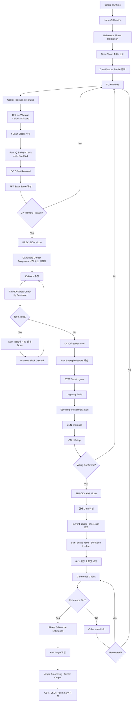
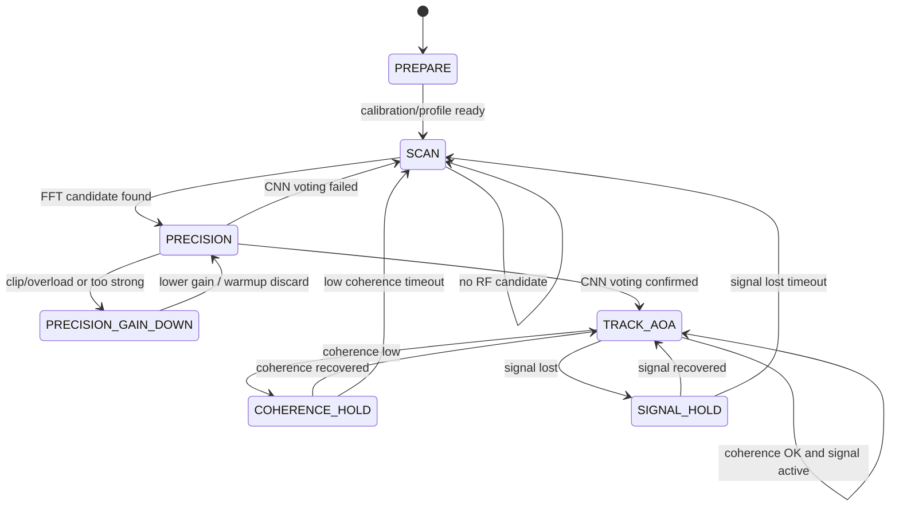

# SDR 기반 비인가 드론 RF 신호 탐지 및 AoA 추정 모듈

Pluto+ SDR 기반 2.4GHz RF 신호를 이용해 Wi-Fi / Bluetooth / Background와 구분되는 **조종기 기원 uplink-side RF activity**를 탐지하고, 2채널 IQ 데이터의 위상차를 이용해 도래각(AoA, Angle of Arrival)을 추정하는 캡스톤 프로젝트입니다.

본 프로젝트는 고가의 통합 대드론 장비 전체를 구현하는 것이 아니라, 그중 **RF 탐지 계층**에 해당하는 핵심 기능을 저비용 SDR 장비와 소프트웨어 신호처리 파이프라인으로 구현하는 것을 목표로 합니다.

본 시스템의 주 실행 흐름은 live viewer가 아니라 **CLI 기반 scan/runtime pipeline**입니다. Live viewer는 RF 패턴 확인, gain profile 저장, CNN/AoA 디버깅을 위한 보조 실험 도구로 사용합니다.

```text
사전 준비
Noise Calibration → Phase Calibration → Gain Phase Table → Gain Feature Profile

본 실행
CLI Scan Runtime → FFT Sweep → Candidate Band → Precision CNN Voting
→ Coherence Check → AoA Sector Estimation → Result Logging
```

---

## 1. 프로젝트 개요

### 1.1 목표

2.4GHz 대역 RF 신호를 수신하여 드론 운용과 관련된 **조종기 기원 uplink-side RF activity**를 탐지하고, 수신 신호의 방향 정보를 함께 제공하는 RF 기반 탐지 프로토타입을 구현합니다.

주요 목표는 다음과 같습니다.

- Pluto+ SDR을 이용한 2.4GHz RF 신호 수신
- RX0/RX1 2채널 IQ 데이터 처리
- FFT 기반 scan mode로 신호가 존재하는 후보 대역 탐색
- 후보 대역에서 STFT spectrogram 생성
- CNN voting 기반 uplink-side RF activity / NonDrone 판정
- 조종기 기원 RF activity를 통한 드론 운용 가능성 탐지
- Coherence 기반 AoA 신뢰도 검증
- RX0/RX1 위상차 기반 도래각(AoA) 추정
- Robust phase calibration 및 gain-dependent phase table 구축
- Gain feature profile 기반 수신 세기 상태 관리
- Real-time viewer를 통한 RF 패턴 확인 및 실험 디버깅
- 향후 Raspberry Pi 등 엣지 장치 배포 가능성 검토

### 1.2 하드웨어 구성

| 부품 | 역할 |
|---|---|
| Pluto+ SDR | 2채널 IQ 수신 |
| 2.4GHz 안테나 ×2 | RX0/RX1 위상차 기반 AoA 추정 |
| 신호발생기 | AoA phase calibration 및 각도 검증 |
| 노트북 | 신호처리, CNN 추론, CLI runtime / viewer 실행 |
| 드론 / 조종기 | 실측 RF 데이터 수집 대상 |
| Python 실행 환경 | 전체 pipeline 실행 및 결과 저장 |

---

## 2. 현재 구현 기준

### 2.1 처리 단위

전체 pipeline의 기본 처리 단위는 **block**입니다.

| 항목 | 값 |
|---|---:|
| Sample rate | 5 MSPS |
| 기본 center frequency | 2.45 GHz 실험 중심 |
| Block size | 16,384 samples |
| Block time | 약 3.28 ms |
| Channel count | 2 channels |
| SDR input | Pluto+ SDR |
| AoA calibration tone | 2452 MHz 권장 |
| AoA reference gain | 30 dB |

```yaml
# configs/receiver.yaml 예시
source_type: sdr
sample_rate: 5000000
center_freq: 2450000000
block_size: 16384
num_samples: 16384
num_channels: 2

sdr:
  uri: ip:192.168.2.1
  channels: [0, 1]
  center_freq: 2450000000
  sample_rate: 5000000
  rf_bandwidth: 5000000
  gain_control_mode: manual
  gain: 30
  warmup_reads: 4
  retune_warmup_reads: 4

# configs/scan.yaml 핵심값
scan:
  scan_blocks: 4
  min_pass_blocks: 2
```

### 2.2 입력 소스

입력 소스는 `configs/receiver.yaml`의 `source_type`으로 선택합니다.

| source_type | 설명 |
|---|---|
| `sim` | synthetic IQ 신호 생성 |
| `file` | 저장된 IQ 파일 재생 |
| `sdr` | Pluto+ SDR 실측 입력 |

---

## 3. 전체 Pipeline 구조

본 프로젝트의 pipeline은 단순히 `Receiver → 전처리 → CNN → AoA`로 한 번에 흐르는 구조가 아니라, **사전 준비 단계**와 **runtime 상태 전이 단계**로 나뉩니다.

가장 중요한 원칙은 다음과 같습니다.

```text
1. Noise calibration과 phase calibration은 runtime 중간이 아니라 실행 전 준비 단계에서 수행한다.
2. Scan mode는 FFT 기반으로 후보 대역을 찾는 단계이며, CNN/AoA를 바로 수행하지 않는다.
3. AoA는 독립적으로 항상 도는 branch가 아니라, 후보 대역이 CNN voting을 통과한 뒤에만 진입하는 정밀 추정 단계이다.
4. 절대세기 feature는 CNN 입력용 normalization 이후 값에서 계산하지 않는다.
```



### 3.1 단계별 역할

| 단계 | 목적 | 주요 처리 |
|---|---|---|
| Before Runtime | 실행 전 기준값 확보 | noise calibration, phase calibration, gain phase table, gain feature profile |
| Scan Mode | 신호가 있는 후보 대역 탐색 | FFT scan score, threshold, candidate detection |
| Precision Mode | 후보 대역 정밀 판정 | raw feature 확인, STFT, CNN inference, voting |
| Track / AoA Mode | 확정 후보의 방향 추정 | phase offset 보상, coherence check, phase difference, angle / sector |
| Viewer / Logging | 실험 확인 및 기록 | OpenCV viewer, CSV log, JSON, summary artifacts |

### 3.2 절대세기 feature 계산 위치

절대세기 feature는 CNN 입력용 normalization 이후 값에서 계산하지 않습니다.  
다만 모든 값을 완전히 같은 위치에서 계산하는 것은 아니며, 목적에 따라 다음처럼 구분합니다.

| 목적 | 계산 위치 | 예시 feature |
|---|---|---|
| Clip / overload 판단 | SDR에서 받은 raw IQ 기준 | `raw_abs_max`, overload flag |
| Gain-distance 비교 | DC offset 제거 후, amplitude normalization 전 IQ | `raw_abs_p99`, `raw_rms` |
| CNN 입력 | STFT 이후 log magnitude를 spectrogram normalization | `cnn_spectrogram` |
| AoA 계산 | RX0/RX1 위상 관계가 보존된 IQ | phase difference, coherence |

즉, `raw_abs_p99`, `raw_rms`는 CNN용 0~1 spectrogram에서 계산하지 않습니다. 이 값들은 gain과 거리 변화에 따른 수신 세기 상태를 보기 위한 값이므로, **DC offset 제거 후 amplitude normalization 전 IQ**를 기준으로 계산합니다.

### 3.3 주요 모듈

| 처리 | 모듈 |
|---|---|
| DC offset 제거 | `src/preprocess/dc_blocker.py` |
| Clip / raw feature 계산 | `src/viewer/raw_features.py` |
| IQ amplitude 정규화 | `src/preprocess/iq_normalizer.py` |
| RX0/RX1 gain mismatch 보정 | `src/preprocess/gain_matcher.py` |
| RX0/RX1 phase offset 추정/보정 | `src/preprocess/phaseoffset.py` |
| Robust phase calibration | `src/calibration/`, `scripts/calibrate_phase_offset_outdoor.py` |
| Gain phase table 생성 | `scripts/build_gain_phase_table.py` |
| Runtime RX1 위상 오프셋 보상 | `src/runtime/phase_calibration_runtime.py`, `src/viewer/aoa_runtime.py` |
| FFT / Scan score 계산 | `src/features/fft.py`, `src/scan/` |
| STFT spectrogram 생성 | `src/features/spectrogram.py` |
| Coherence 계산 | `src/aoa/coherence.py` |
| 위상차 계산 | `src/aoa/phase_diff.py` |
| AoA 변환 | `src/aoa/angle_estimator.py` |
| Pluto+ SDR 수신 | `src/receiver/pluto_receiver.py` |
| Real-time viewer runtime | `src/viewer/`, `scripts/live_rf_viewer.py` |

## 4. 본 실행 흐름: CLI Scan / Runtime Pipeline

본 프로젝트의 주 실행 흐름은 CLI 기반 scan/runtime pipeline입니다. Viewer는 이 흐름을 대체하는 프로그램이 아니라, 각 단계의 RF 패턴과 CNN/AoA 상태를 확인하기 위한 보조 도구입니다.

### 4.1 Runtime 상태 전이



### 4.2 전체 운영 순서

```text
[Before Runtime]
1. Noise calibration
2. Reference phase calibration
3. Gain-dependent phase table 준비
4. Gain feature profile 준비

[Runtime]
1. Scan mode에서 비교적 강한 초기 gain으로 2.4GHz 대역 sweep
2. 각 대역으로 retune한 뒤 4 block을 warmup/discard
3. 같은 대역에서 4 block을 실제 scan 판정용으로 수집
4. 각 block은 raw IQ safety check 후 DC offset을 제거하고 FFT score를 계산
5. 4 block 중 2 block 이상 threshold를 넘으면 후보 대역으로 판단
6. 후보 대역 발견 시 precision mode 진입
7. 후보 신호의 raw_abs_max / raw_abs_p99 / overload flag 확인
8. 입력이 너무 강하면 gain table에서 한 단계 낮추고 같은 대역 재확인
9. 적정 gain 조건에서 STFT spectrogram 생성
10. CNN voting으로 uplink-side RF activity 여부 판단
11. voting 실패 시 scan mode 복귀
12. voting 통과 시 Track / AoA mode 진입
13. current_phase_offset + gain_delta(current_gain) 적용
14. coherence가 충분하면 AoA angle 및 sector 계산
15. coherence가 낮으면 hold block 동안 추가 관찰
16. signal lost가 지속되면 scan mode 복귀
```

### 4.3 Runtime의 출력

| 출력 | 목적 |
|---|---|
| `summary.json` | block 또는 run 단위 결과 요약 |
| `scan_events.json` | scan 후보 대역 및 trigger 기록 |
| CSV log | 시간 순서별 feature, CNN, AoA, mode 상태 기록 |
| numpy artifacts | spectrogram, STFT, frame energy 등 분석용 중간 결과 |

## 5. Calibration 흐름

Calibration은 runtime 중간에 수행되는 branch가 아니라, **본 실행 전에 기준값을 확보하는 준비 단계**입니다. Runtime에서는 calibration을 새로 수행하는 것이 아니라, 저장된 calibration 결과를 로드하여 현재 gain 조건에 맞게 적용합니다.

### 5.1 Noise Calibration

Noise calibration은 scan mode와 energy/FFT threshold의 기준을 잡기 위한 단계입니다. 같은 gain이라도 실내/실외, 주변 Wi-Fi, 노트북 위치, 안테나 방향에 따라 noise floor가 달라질 수 있으므로 본 실행 전에 수행합니다.

```text
Noise Calibration
→ background block 수집
→ noise floor / FFT score 기준 계산
→ scan threshold 또는 energy threshold 설정
```

### 5.2 Reference Phase Calibration

RX0/RX1은 같은 정면 0도 신호를 받아도 SDR 내부 경로, 케이블 길이, 안테나 배치 차이 때문에 위상차가 0이 아닐 수 있습니다. 따라서 AoA 계산 전 reference gain에서 현재 phase offset을 측정해야 합니다.

```text
신호발생기 2452 MHz / 정면 0도
→ reference gain = 30 dB
→ robust phase calibration
→ current_phase_offset.json 저장
```

Runtime에서는 `current_phase_offset.json`을 로드하고, 현재 gain에 해당하는 gain phase delta를 더해 `phase_offset_to_apply`를 계산합니다. 이후 RX1에 위상 오프셋 보상을 적용합니다.

```python
rx1_compensated = rx1 * np.exp(-1j * phase_offset_to_apply)
```

README에서는 이 과정을 별도의 새로운 알고리즘처럼 `Phase Correction`이라고 부르기보다, **RX1 위상 오프셋 보상**으로 표현합니다.

### 5.3 Robust Phase Calibration

기존 단순 평균 방식은 멀티패스 또는 Wi-Fi 간섭 block이 섞이면 phase offset이 중간값으로 왜곡될 수 있습니다. 이를 개선하기 위해 다음 robust calibration 방식을 사용합니다.

```text
1. 총 200 block 수집
2. 초기 안정화용 앞 30 block discard
3. 남은 170 block 사용
4. block별 RX1-RX0 phase와 coherence-like 계산
5. coherence 기준 미달 block 제거
6. phase 분포에서 dominant cluster 선택
7. dominant cluster 내부 block만 coherence-weighted circular mean
8. phase_std, coherence_median, cluster_ratio 기반 quality 판정
9. current_phase_offset.json 저장
```

### 5.4 Calibration Quality

```text
OK:
- phase_std < 3°
- valid_blocks >= 100
- cluster_ratio >= 0.80
- coherence_median >= 0.70

WARNING:
- phase_std < 7°
- valid_blocks >= 50
- cluster_ratio >= 0.60
- coherence_median >= 0.55

FAIL:
- 위 조건 미달
```

`OK`는 AoA 보정값으로 사용할 수 있는 상태입니다. `WARNING`은 방향성 확인용으로는 사용할 수 있지만 정밀 각도값을 강하게 신뢰하면 안 됩니다. `FAIL`은 calibration을 다시 수행해야 하는 상태입니다.

### 5.5 Gain-dependent Phase Table

SDR gain 값이 바뀌면 내부 gain path 또는 수신 상태가 바뀌어 phase offset도 달라질 수 있습니다. 따라서 gain별 phase 변화량을 사전에 실외에서 측정하고, reference gain 대비 delta table로 저장합니다.

```text
[실외 사전 작업]
gain별 200 block 수집
→ 앞 30 block discard
→ dominant cluster phase 추출
→ reference gain=30 기준 delta 변환
→ gain_phase_table_2450.json 저장

[현장 시작]
gain=30, 0도에서 robust phase calibration
→ current_ref_phase_offset 저장

[실시간]
gain 변경 시
→ current_ref_phase_offset + gain_delta_table[current_gain]
→ RX1 위상 오프셋 보상 적용
```

중요한 점은 절대 phase offset을 영구 저장하는 것이 아니라, **기준 gain 대비 상대 변화량(delta)**을 저장한다는 것입니다.

## 6. Scan Mode: FFT 기반 후보 대역 탐색

Scan mode는 본 runtime pipeline의 시작점입니다. 이 단계에서는 CNN이나 AoA를 바로 수행하지 않고, 2.4GHz 대역을 sweep하면서 신호가 있는 후보 대역을 먼저 찾습니다.

```text
2.400 GHz → 2.405 GHz → 2.410 GHz → ... → 2.485 GHz
```

### 6.1 Scan 정책

현재 scan mode는 대역마다 다음 순서로 동작합니다.

```text
1. 각 center frequency로 SDR LO 설정
2. retune 직후 4 block을 warmup/discard
3. 같은 center frequency에서 4 block을 실제 scan 판정용으로 수집
4. 각 block에 대해 raw IQ safety check 수행
5. DC offset 제거 후 FFT score 또는 energy score 계산
6. threshold를 넘은 block 수 계산
7. 4 block 중 2 block 이상 통과하면 후보 대역으로 등록
8. 후보가 없으면 scan 계속
9. 후보가 있으면 우선순위가 높은 후보로 precision mode 진입
```

현재 권장 설정은 다음과 같습니다.

```yaml
# configs/receiver.yaml
sdr:
  warmup_reads: 4
  retune_warmup_reads: 4

# configs/scan.yaml
scan:
  scan_blocks: 4
  min_pass_blocks: 2
```

### 6.2 Retune warmup 정책

SDR 중심 주파수를 바꾸면 LO와 내부 RX buffer가 바로 안정된다고 가정하지 않습니다. 따라서 scan mode에서는 center frequency를 변경한 직후 몇 block을 읽고 버린 다음 scan score를 계산합니다.

현재 운영 정책은 단순하게 **4 block discard + 4 block scan**으로 통일합니다.

```text
center frequency 변경
→ 4 block discard
→ 4 block scan
→ 2 block 이상 통과 시 candidate
```

1 block은 5 MSPS, 16,384 samples 기준 약 3.28 ms이므로, 4 block discard는 약 13.1 ms입니다. 현재 단계에서는 scan 속도보다 retune 직후 안정성을 우선합니다.

### 6.3 Scan mode의 역할

| 항목 | 설명 |
|---|---|
| 목적 | 신호가 있는 후보 대역 탐색 |
| 입력 | RX0/RX1 IQ block |
| 주요 feature | FFT max power, FFT median, energy score |
| 판정 기준 | 4 block 중 2 block 이상 threshold 통과 |
| 출력 | candidate center frequency |
| 실패 시 | 다음 frequency로 계속 sweep |

Scan mode의 목적은 분류가 아니라 후보 탐색입니다. CNN inference와 AoA 계산은 후보 대역이 발견된 뒤 precision mode에서 수행합니다.

---

## 7. Precision Mode: STFT + CNN Voting 정책

Scan mode에서 후보 대역이 발견되면 해당 center frequency에 잠시 머물러 precision mode를 수행합니다.

### 7.1 Precision mode 흐름

```text
후보 center frequency 고정
→ precision_blocks 수집
→ 각 block을 STFT spectrogram으로 변환
→ CNN inference
→ positive vote 수 계산
→ 과반 이상이면 confirmed
→ 실패하면 scan mode 복귀
```

### 7.2 Voting 정책

RF burst는 순간적으로 들어왔다가 사라질 수 있으므로 1개 block 결과만으로 최종 판정하지 않습니다. 후보 대역에서 여러 block을 보고 voting으로 판단합니다.

```text
예시:
precision_blocks = 5
confirm_votes = 3

5 block 중 3 block 이상 positive
→ Confirmed uplink-side RF activity

5 block 중 2 block 이하 positive
→ 후보 기각
→ Scan Mode 복귀
```

### 7.3 Positive / Negative 해석

| 결과 | 해석 |
|---|---|
| Positive | 조종기 기원 uplink-side RF activity 가능성 있음 |
| Negative | Background / Wi-Fi / Bluetooth / 기타 NonDrone 가능성 높음 |
| Voting failed | 후보 대역으로 보기 어려우므로 scan mode 복귀 |

---

## 8. Track / AoA Mode: Coherence, Sector, 복귀 정책

CNN voting을 통과한 후보만 Track / AoA mode로 진입합니다. AoA는 두 채널이 같은 신호를 안정적으로 보고 있다는 전제가 있어야 하므로, phase difference를 계산하기 전에 coherence를 확인합니다.

### 8.1 Coherence 정책

```text
coherence >= threshold
→ 현재 gain에 맞는 RX1 위상 오프셋 보상 적용
→ phase difference 계산
→ AoA angle 계산
→ angle smoothing
→ sector 변환

coherence < threshold
→ 즉시 포기하지 않고 hold block 동안 추가 관찰
→ hold 기간 안에 coherence가 회복되면 Track / AoA 유지
→ 계속 낮으면 AoA 신뢰 불가로 판단하고 scan mode 복귀
```

초기 README 정책에서는 coherence가 낮을 때 자동 gain up을 본 정책으로 넣지 않습니다. Coherence low의 원인이 신호 약함이 아니라 멀티패스, 간섭, 포화, 채널 정렬 문제일 수 있기 때문입니다. Adaptive gain recovery는 향후 실험 옵션으로만 검토합니다.

### 8.2 Signal lost 정책

Precision 또는 Track / AoA mode에서 신호가 잠깐 약해질 수 있으므로, 신호가 사라졌다고 즉시 scan mode로 복귀하지 않습니다.

```text
signal lost
→ lost_count 증가
→ hold 기간 동안 같은 center frequency 유지
→ 신호 회복 시 lost_count reset
→ lost_count가 threshold 이상이면 scan mode 복귀
```

### 8.3 Sector 표현

AoA 결과는 순간 angle 하나로만 해석하지 않고 sector로 표현합니다. 초기 구현은 5-sector를 기본으로 하고, 실측 오차 분포가 충분히 쌓이면 7-sector로 확장할 수 있습니다.

5-sector 예시:

| Sector | 예시 각도 범위 |
|---|---:|
| Left-2 | angle < -30° |
| Left-1 | -30° ~ -10° |
| Middle | -10° ~ +10° |
| Right-1 | +10° ~ +30° |
| Right-2 | angle > +30° |

7-sector 확장 예시:

| Sector | 예시 각도 범위 |
|---|---:|
| Far Left | angle < -45° |
| Left-2 | -45° ~ -30° |
| Left-1 | -30° ~ -10° |
| Middle | -10° ~ +10° |
| Right-1 | +10° ~ +30° |
| Right-2 | +30° ~ +45° |
| Far Right | angle > +45° |

위 각도 범위는 고정값이 아니라, 실측 AoA 오차 분포와 안테나 배치에 따라 조정합니다.

### 8.4 Angle 안정화 정책

AoA angle은 block 단위 순간값을 그대로 사용하지 않고, 최근 K개 block의 angle을 이용해 안정화합니다.

```text
1. coherence threshold를 통과한 block만 angle buffer에 추가
2. 최근 K개 angle을 coherence-weighted circular smoothing으로 안정화
3. angle variance 또는 circular std가 기준 이하일 때 sector 확정
4. 분산이 크면 sector를 HOLD 또는 UNSTABLE로 표시
```

출력 예시:

```text
AoA angle        : +18.4°
Smoothed angle   : +15.7°
Sector           : Right-1
Stability        : OK
```

## 9. Gain Control Policy 및 Feature Profile 운용

### 9.1 Gain을 실험 조건으로 관리하는 이유

본 프로젝트에서 gain은 단순한 수신 세기 조절값이 아니라, scan 거리, CNN 입력 안정성, raw feature 비교, overload 판단, AoA phase table 적용에 영향을 주는 중요한 runtime 조건입니다.

Scan mode 시작 전에는 아직 어떤 신호가 들어올지 모르기 때문에 gain 적정성을 완벽히 판단하기 어렵습니다. 따라서 본 프로젝트는 낮은 gain에서 시작하지 않고, **실험적으로 안전하다고 확인한 비교적 강한 gain**에서 scan을 시작합니다.

단, 이는 SDR의 최대 gain을 무조건 사용하는 것을 의미하지 않습니다. 후보 신호가 관측된 뒤 절대세기 feature를 확인하고, 너무 강하게 들어오면 gain table에서 한 단계 낮춰 같은 후보 대역을 다시 확인합니다.

```text
핵심 정책:
적당히 강한 gain으로 후보 신호를 먼저 잡고,
후보 신호가 너무 강하면 raw feature를 보고 즉시 gain을 낮춘다.
```

### 9.2 Gain Feature Profile 준비

Gain feature profile은 선택 사항이 아니라, 본 runtime pipeline과 viewer가 함께 참조하는 기본 기준값입니다.

```text
Set gain = 25 / 30 / 35
→ 각 gain에서 N-block 수집
→ raw feature 계산
→ median / mean / std / p25 / p75 계산
→ gain별 대표 profile 저장
→ CSV와 JSON으로 기록
```

Gain feature profile은 scan 시작 전에 gain을 완벽히 결정하기 위한 것이 아닙니다. 실제로 의미 있는 비교는 후보 신호가 관측된 이후부터 가능합니다. 후보 신호가 잡힌 뒤 현재 raw feature가 기준 profile보다 과도하게 큰지, 너무 약한지, clip 위험이 있는지를 판단하는 기준표로 사용합니다.

초기 gain 판단의 핵심 feature는 다음 세 가지로 제한합니다.

```text
raw_abs_p99
raw_rms
overload flag 또는 raw_abs_max
```

`frame_power_p99` 등 추가 feature는 저장과 사후 분석에는 활용하되, 초기 gain up/down 조건에는 직접 포함하지 않습니다.

### 9.3 저장 파일

```text
outputs/viewer/gain_feature_profiles.csv
outputs/viewer/gain_feature_profiles_latest.json
```

CSV 파일은 실험 기록 및 사후 분석용입니다. 여러 번 저장한 gain profile이 누적되므로, 나중에 거리/gain/feature 관계를 그래프로 분석하거나 실험 조건을 비교할 때 사용합니다.

JSON 파일은 최신 gain별 profile table입니다. 이 파일은 viewer 전용 파일이 아니라, CLI 기반 scan/runtime pipeline과 live viewer가 함께 참조할 수 있는 runtime reference입니다.

### 9.4 Gain table step 운용

Runtime에서 gain은 임의의 1 dB 단위로 계속 조절하지 않고, 사전에 phase table과 feature profile이 준비된 gain 후보 안에서 이동합니다.

예시:

```text
사용 gain 후보: 25 / 30 / 35 dB
초기 scan gain: 안전하다고 확인한 비교적 강한 gain
Gain down: 35 → 30 → 25
```

이 방식은 CNN이 학습한 1~2 m 수집 조건의 raw feature 분포와 runtime 후보 신호의 raw feature를 맞추기 위한 것입니다. 즉 gain table은 거리 자체를 정확히 추정하기 위한 표가 아니라, CNN 입력이 학습 조건과 유사한 수신 세기 영역에 들어오도록 조정하기 위한 운영 기준입니다.

### 9.5 Gain down 조건

후보 신호가 관측된 이후 다음 조건이면 gain을 한 단계 낮춥니다.

```text
- overload flag 발생
- raw_abs_max가 clip threshold 근처
- raw_abs_p99가 현재 gain profile 기준보다 과도하게 큼
- spectrogram이 포화되어 burst pattern이 뭉개짐
```

Gain down 이후에는 현재 후보 대역을 바로 버리지 않습니다.

```text
Gain down
→ SDR gain 적용
→ 4 block warmup/discard
→ 같은 center frequency에서 raw feature 재확인
→ 적정 gain이면 STFT / CNN voting 수행
```

Clip threshold는 SDR 출력 scale과 실측 raw feature 분포에 따라 달라지므로 README에서 고정 수치로 확정하지 않습니다. 실제 runtime에서는 config 값 또는 calibration/profile 기반 threshold로 관리합니다.

### 9.6 Gain up 조건

초기 runtime 정책에서는 gain up을 자동으로 강하게 사용하지 않습니다. 특히 coherence가 낮다는 이유만으로 gain을 올리지는 않습니다.

다만 향후 adaptive gain policy로 다음 조건을 검토할 수 있습니다.

```text
- 후보 신호는 존재함
- raw_abs_p99 / raw_rms가 기준 profile보다 낮음
- overload 위험이 없음
- phase table에 해당 gain이 존재함
```

현재 기본 정책은 다음과 같습니다.

```text
Scan mode:
비교적 강한 gain으로 후보 신호를 먼저 찾는다.

Precision mode:
후보 신호가 너무 강하면 gain table step 단위로 낮춘다.

AoA mode:
phase table에 포함된 gain에서만 신뢰 가능한 AoA 결과를 기록한다.
```

### 9.7 Reference gain 복귀 조건

```text
- 정밀 AoA 기록 전
- gain 변경 후 coherence 또는 phase 안정성이 나빠졌을 때
- 후보 추적 종료 후 scan mode로 복귀할 때
- calibration 기준 조건으로 다시 맞출 때
```

AoA 최종 기록은 가능하면 reference gain 또는 gain phase table에 포함된 gain에서 수행합니다. Phase table에 없는 gain은 최종 AoA 기록용으로 사용하지 않는 것을 원칙으로 합니다.

### 9.8 Gain 변경과 RX1 위상 오프셋 보상

Gain을 변경하면 현재 gain에 맞는 phase delta를 다시 적용해야 합니다.

```text
[Gain Change Requested]
→ Set SDR Gain
→ Warmup Blocks Discard
→ Lookup Gain Phase Delta
→ Update phase_offset_to_apply
→ RX1 위상 오프셋 보상 적용
→ Continue CNN / AoA Runtime
```

실시간 적용값은 다음과 같습니다.

```text
phase_offset_to_apply
= current_phase_offset + gain_delta(current_gain)
```

## 10. CNN 기반 RF 신호 분류

### 10.1 현재 분류 목적

현재 CNN은 STFT spectrogram을 입력으로 받아 **조종기 기원 uplink-side RF activity**와 NonDrone 계열 신호를 구분하는 실험 구조입니다.

초기에는 드론 기체 자체의 RF 신호 탐지를 목표로 접근했으나, 실험 과정에서 다음 현상이 확인되었습니다.

```text
드론 ON + 조종기 ON + 링크 상태
→ Drone-like 또는 Confirmed Drone

드론 OFF + 조종기 ON
→ 일정 시간 Drone-like로 탐지

드론 OFF + 조종기 OFF
→ NonDrone으로 전환
```

이는 현재 모델이 드론 기체 자체에서 방사되는 별도 downlink 신호보다, 조종기에서 발생하는 제어 신호, 탐색 burst, 페어링/재연결 burst 등 **controller-originated uplink-side RF activity**에 더 민감하게 반응한다는 것을 의미합니다.

### 10.2 탐지 대상

```text
탐지 대상:
드론 기체 자체의 downlink 신호가 아니라,
조종기에서 발생하는 uplink-side RF activity

포함되는 신호:
- 조종기 제어/명령 신호
- 드론 탐색 또는 페어링 시도 burst
- 재연결 또는 idle 상태에서 발생하는 controller-originated burst
```

### 10.3 데이터 전략

```text
Positive / Uplink-side RF activity:
- 조종기 ON
- 드론 탐색 또는 페어링 시도 상태
- 드론 ON + 조종기 ON + linked 상태
- 조종기 조작 또는 재연결 과정에서 발생하는 RF burst

Negative / NonDrone:
- 조종기 OFF + 드론 OFF
- Wi-Fi
- Bluetooth
- Background
- 기타 2.4GHz 주변 RF activity
```

즉, 현재 단계에서는 controller-only를 무조건 제거해야 할 오탐으로 보기보다, **드론 운용과 관련된 조종기 기원 RF activity**로 묶어 탐지하는 것이 더 현실적입니다.

---

## 11. Real-time Viewer: 보조 실험 도구

Real-time viewer는 본 runtime pipeline을 대체하는 메인 실행 흐름이 아니라, RF 패턴 확인, gain profile 저장, CNN/AoA 디버깅을 위한 보조 실험 도구입니다.

### 11.1 통합 viewer

최종 viewer 실행은 하나의 script에서 처리합니다.

```text
scripts/live_rf_viewer.py
```

지원 mode는 다음과 같습니다.

| mode | 목적 | 주요 기능 |
|---|---|---|
| `fast` | 고속 spectrogram 확인 | OpenCV 표시, CNN/AoA 없음 |
| `profile` | gain별 feature profile 저장 | N-block feature 수집, CSV/JSON 저장 |
| `cnn` | CNN 디버깅 | spectrogram + CNN inference + temporal smoothing |
| `aoa` | AoA 검증 | phase calibration, coherence, phase difference, angle |
| `full` | 통합 실험 | CNN + AoA + gain profile + logging |

### 11.2 기존 viewer 처리 방침

기존 viewer들은 새 `live_rf_viewer.py`가 안정화될 때까지 삭제하지 않습니다.

```text
scripts/live_cnn_spectrogram_viewer.py
→ legacy 유지, 기능 추가 중단

scripts/live_siggen_aoa_viewer.py
→ 신호발생기 검증용 legacy 유지 또는 live_rf_viewer --mode aoa로 대체

scripts/live_spectrogram_only_viewer.py
→ fast mode로 흡수
```

---

## 12. 실행 방법

### 12.1 가상환경 활성화

```bash
cd ~/projects/rf-drone-detection-capstone
source .venv/bin/activate
```

### 12.2 단일 block pipeline 실행

```bash
PYTHONPATH=. python scripts/run_pipeline.py
```

### 12.3 Robust Phase Calibration

```bash
PYTHONPATH=. python scripts/calibrate_phase_offset_outdoor.py \
  --uri ip:192.168.2.1 \
  --center-freq 2450000000 \
  --signal-freq 2452000000 \
  --sample-rate 5000000 \
  --gain 30 \
  --num-blocks 200 \
  --discard-blocks 30 \
  --warmup-reads 20 \
  --coherence-threshold 0.50 \
  --cluster-window-deg 5.0 \
  --memo "outdoor_0deg_1p5m_gain30_sig2452_robust"
```

### 12.4 Gain Phase Table 제작

```bash
PYTHONPATH=. python scripts/build_gain_phase_table.py \
  --uri ip:192.168.2.1 \
  --center-freq 2450000000 \
  --signal-freq 2452000000 \
  --sample-rate 5000000 \
  --gains 25,30,35 \
  --reference-gain 30 \
  --total-blocks 200 \
  --discard-blocks 30 \
  --warmup-reads 20 \
  --coherence-threshold 0.50 \
  --cluster-window-deg 5.0 \
  --output configs/calibration/gain_phase_table_2450.json \
  --memo "outdoor_0deg_1p5m_sig2452_gain_phase_table"
```

### 12.5 Scan Mode 실행

```bash
PYTHONPATH=. python scripts/run_scan.py
```

### 12.6 통합 Live Viewer 실행 예시

Fast mode:

```bash
PYTHONPATH=. python scripts/live_rf_viewer.py \
  --mode fast \
  --uri ip:192.168.2.1 \
  --center-freq 2450000000 \
  --sample-rate 5000000 \
  --gain 30 \
  --target-fps 10
```

Profile mode:

```bash
PYTHONPATH=. python scripts/live_rf_viewer.py \
  --mode profile \
  --uri ip:192.168.2.1 \
  --center-freq 2450000000 \
  --sample-rate 5000000 \
  --gain 30 \
  --target-fps 10 \
  --profile-blocks 20
```

Full debug mode:

```bash
PYTHONPATH=. python scripts/live_rf_viewer.py \
  --mode full \
  --uri ip:192.168.2.1 \
  --center-freq 2450000000 \
  --sample-rate 5000000 \
  --gain 30 \
  --target-fps 5 \
  --profile-blocks 20 \
  --cnn-backend dummy \
  --aoa-phase-calibration-json configs/calibration/current_phase_offset.json \
  --aoa-gain-phase-table configs/calibration/gain_phase_table_2450.json
```

---

## 13. 프로젝트 구조

주요 구조는 다음과 같습니다.

```text
rf-drone-detection-capstone/
├── README.md
├── requirements.txt
├── configs/
│   ├── aoa.yaml
│   ├── detect.yaml
│   ├── ml.yaml
│   ├── receiver.yaml
│   ├── scan.yaml
│   ├── ui.yaml
│   └── calibration/
│       ├── current_phase_offset.json
│       └── gain_phase_table_2450.json
│
├── scripts/
│   ├── run_pipeline.py
│   ├── run_scan.py
│   ├── calibrate_phase_offset_outdoor.py
│   ├── build_gain_phase_table.py
│   ├── live_rf_viewer.py
│   ├── live_cnn_spectrogram_viewer.py
│   ├── live_siggen_aoa_viewer.py
│   ├── live_spectrogram_only_viewer.py
│   └── train_model.py
│
├── src/
│   ├── aoa/
│   ├── calibration/
│   ├── runtime/
│   ├── receiver/
│   ├── features/
│   ├── preprocess/
│   ├── detect/
│   ├── ml/
│   ├── scan/
│   ├── viewer/
│   │   ├── state.py
│   │   ├── raw_features.py
│   │   ├── gain_profile_runtime.py
│   │   ├── cnn_runtime.py
│   │   ├── aoa_runtime.py
│   │   ├── opencv_renderer.py
│   │   └── logging.py
│   └── ui/
│
├── docs/
│   ├── command/
│   ├── planning/
│   ├── report/
│   └── experiments/
│
├── data/
├── models/
├── outputs/
└── tests/
```

---

## 14. 현재 개발 현황

| 모듈 | 상태 |
|---|---|
| 프로젝트 기본 구조 | 완료 |
| YAML 기반 설정 구조 | 완료 |
| SimReceiver / RawFileReceiver | 완료 |
| PlutoReceiver | 실측 연동 및 gain runtime control 구현 |
| DC offset 제거 | 완료 |
| Raw feature / overload branch | 구현 |
| IQ normalization | 완료 |
| Gain mismatch correction | 완료 |
| Phase offset estimation/correction | 완료 |
| Robust phase calibration | 구현 |
| Gain-dependent phase table | 구현, 실외 검증 필요 |
| Gain feature profile | 구현, runtime 기준값으로 사용 예정 |
| Runtime RX1 위상 오프셋 보상 | 구현 |
| FFT / Scan mode | 4 block warmup + 4 block scan 정책 적용 |
| Precision CNN voting policy | 정책 정리, 실측 검증 필요 |
| Coherence hold / signal lost return policy | 정책 정리, 구현 보강 필요 |
| FFT / STFT feature 계산 | 완료 |
| Dual-channel STFT branch | 완료 |
| Coherence gate | 완료 |
| Phase difference 계산 | 완료 |
| AoA 계산 | 구현 |
| AoA sector / smoothing policy | 정책 정리, 구현 예정 |
| Integrated live RF viewer | 리팩토링 진행 |
| CNN inference interface | 구현 |
| Uplink-side RF activity 데이터셋 | 보강 예정 |
| TFLite / Raspberry Pi 배포 | 추후 확장 |

---

## 15. 실험 운영 순서

권장 실험 순서는 다음과 같습니다.

```text
1. py_compile / import 검사
2. 신호발생기 2452 MHz 설정
3. reference gain=30에서 robust phase calibration
4. current_phase_offset.json quality OK 확인
5. gain 25/30/35 phase table 제작
6. gain 25/30/35 feature profile 제작
7. 신호발생기 정면 0도 AoA 검증
8. 좌우 ±10°, ±20° AoA 방향성 검증
9. scan mode에서 retune 후 4 block discard / 4 block scan 동작 확인
10. 4 block 중 2 block 이상 통과 시 후보 대역으로 잡히는지 확인
11. 후보 대역 precision CNN voting 확인
12. coherence hold / signal lost 복귀 정책 확인
13. 조종기 ON/OFF 조건에서 uplink-side RF activity 재현성 확인
14. NonDrone background / Wi-Fi / Bluetooth 데이터 보강
```

---

## 16. 현재 한계

### 16.1 CNN 모델 한계

현재 모델은 드론 기체 자체의 downlink 신호보다 조종기에서 발생하는 uplink-side RF activity에 반응하는 것으로 해석됩니다. 따라서 본 프로젝트의 결과는 드론 기체 단독 탐지가 아니라, 조종기 기원 RF activity를 통한 드론 운용 가능성 탐지로 설명하는 것이 적절합니다.

### 16.2 AoA 한계

2채널 위상차 기반 AoA는 다음 요소에 민감합니다.

- RX0/RX1 하드웨어 phase offset
- 케이블 길이 및 안테나 간격
- 신호원 정렬 오차
- 실내 멀티패스
- 주변 2.4GHz Wi-Fi / Bluetooth 간섭
- SDR gain 변경에 따른 phase response 변화

따라서 AoA는 먼저 신호발생기 기반으로 검증한 뒤, 드론 또는 조종기 신호에 적용해야 합니다.

### 16.3 Gain Table 한계

Gain phase table은 모든 환경에서 절대 보정을 보장하지 않습니다. 실외에서 측정한 gain별 상대 phase 변화량을 저장한 것이며, 현장 시작 시 reference gain에서 current phase calibration을 먼저 수행해야 합니다.

### 16.4 자동 Gain 정책 한계

초기 runtime에서는 coherence low 상황에서 자동 gain up을 본 정책으로 사용하지 않습니다. Gain 변경은 phase offset, coherence, CNN 입력 형태를 동시에 바꿀 수 있으므로, 실측 검증 전에는 보수적으로 적용합니다.

---

## 17. 다음 작업 계획

다음 작업은 다음과 같습니다.

1. Robust phase calibration 200 block 방식 실외 재검증
2. Gain 25 / 30 / 35 phase delta table 제작
3. Gain 25 / 30 / 35 feature profile 제작
4. 신호발생기 0도 / 좌우 각도 AoA 검증
5. AoA sector 기준 및 smoothing 정책 구현
6. Scan mode 4 block warmup / 4 block scan 정책 실측 검증
7. Precision mode CNN voting 정책 구현/검증
8. Coherence hold 및 signal lost 복귀 정책 구현/검증
9. 조종기 ON/OFF 조건에서 uplink-side RF activity 재현성 확인
10. Background / Wi-Fi / Bluetooth 등 NonDrone 데이터 보강
11. 조종기 기원 RF activity 기준으로 CNN 데이터셋 재정리
12. 실험 결과를 `docs/report/`에 정리

---

## 18. 기본 명령어

```bash
# 가상환경 활성화
cd ~/projects/rf-drone-detection-capstone
source .venv/bin/activate

# 단일 block pipeline 실행
PYTHONPATH=. python scripts/run_pipeline.py

# Scan mode 실행
PYTHONPATH=. python scripts/run_scan.py

# robust phase calibration
PYTHONPATH=. python scripts/calibrate_phase_offset_outdoor.py \
  --uri ip:192.168.2.1 \
  --center-freq 2450000000 \
  --signal-freq 2452000000 \
  --sample-rate 5000000 \
  --gain 30 \
  --num-blocks 200 \
  --discard-blocks 30 \
  --warmup-reads 20 \
  --coherence-threshold 0.50 \
  --cluster-window-deg 5.0

# gain phase table
PYTHONPATH=. python scripts/build_gain_phase_table.py \
  --uri ip:192.168.2.1 \
  --center-freq 2450000000 \
  --signal-freq 2452000000 \
  --sample-rate 5000000 \
  --gains 25,30,35 \
  --reference-gain 30 \
  --total-blocks 200 \
  --discard-blocks 30 \
  --warmup-reads 20 \
  --coherence-threshold 0.50 \
  --cluster-window-deg 5.0 \
  --output configs/calibration/gain_phase_table_2450.json

# integrated viewer fast mode
PYTHONPATH=. python scripts/live_rf_viewer.py \
  --mode fast \
  --uri ip:192.168.2.1 \
  --center-freq 2450000000 \
  --sample-rate 5000000 \
  --gain 30 \
  --target-fps 10

# integrated viewer profile mode
PYTHONPATH=. python scripts/live_rf_viewer.py \
  --mode profile \
  --uri ip:192.168.2.1 \
  --center-freq 2450000000 \
  --sample-rate 5000000 \
  --gain 30 \
  --target-fps 10 \
  --profile-blocks 20

# Git 저장
git status
git add README.md
git commit -m "docs: update README for CLI scan runtime policy"
git push
```

---

## 19. 현재 프로젝트 상태 요약

현재 프로젝트는 단순 아이디어 단계가 아니라, **RF 신호처리 pipeline, scan mode, 실시간 viewer, AoA 실험 도구, robust phase calibration 구조가 구현된 상태**입니다.

```text
2채널 IQ 입력
→ Noise / Phase / Gain phase table / Gain feature profile 준비
→ FFT 기반 scan mode
  - retune 후 4 block discard
  - 4 block scan / 2 block 이상 통과 시 후보
→ 후보 대역 precision CNN voting
→ coherence 기반 AoA 진입 판단
→ RX1 위상 오프셋 보상 + gain phase table 기반 AoA 계산
→ angle smoothing / sector 표현
→ 결과 저장 또는 scan mode 복귀
```

현재 CNN은 조종기 단독 조건에서도 RF activity를 탐지하므로, 프로젝트의 핵심 탐지 대상은 드론 기체 자체 downlink가 아니라 조종기 기원 uplink-side RF activity로 정리합니다.

다음 핵심 과제는 CLI scan/runtime 상태머신을 안정화하고, 신호발생기 기반 AoA 안정성 검증과 함께 실제 조종기 RF source의 방향 추정을 수행하는 것입니다.
