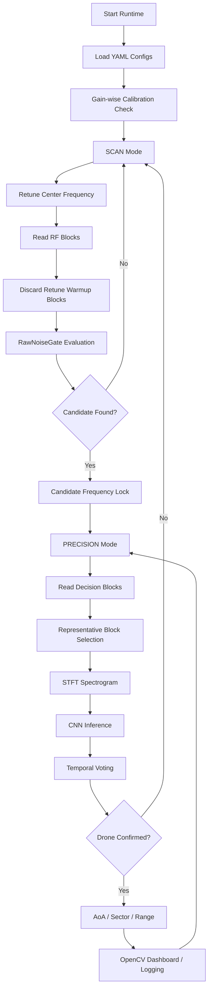

# SDR 기반 비인가 드론 RF 신호 탐지 및 AoA / Sector / Range 추정 시스템

Pluto+ SDR 기반 2.4GHz RF 신호를 이용해 주변 RF activity 중 드론 관련 신호를 탐지하고, 2채널 IQ 데이터의 위상차를 이용해 도래각(AoA, Angle of Arrival), 방향 sector, 그리고 실험적 coarse range class를 함께 제공하는 캡스톤 프로젝트입니다.

본 프로젝트는 고가의 통합 대드론 장비 전체를 구현하는 것이 아니라, 그중 **RF 탐지 계층**에 해당하는 핵심 기능을 저비용 SDR 장비와 소프트웨어 신호처리 파이프라인으로 구현하는 것을 목표로 합니다.

최종 시스템은 다음 흐름을 갖습니다.

```text
Gain-wise Calibration
→ RawNoiseGate 기반 Scan
→ Candidate Frequency Lock
→ Representative Block 기반 Precision CNN 판정
→ Temporal Voting / Precision Hold
→ Coherence 기반 AoA 신뢰도 검증
→ Fixed-bin Sector Estimation
→ Sector-specific Coarse Range Indication
→ OpenCV SCAN + PRECISION Dashboard
```

---

## 1. 프로젝트 개요

본 시스템은 2.4GHz 대역에서 수신되는 RF 신호를 분석하여 드론 조종기 또는 드론 관련 RF activity로 의심되는 신호를 탐지하고, 해당 신호의 방향 정보를 제공하는 RF 기반 탐지 프로토타입입니다.

핵심 목적은 다음과 같습니다.

- Pluto+ SDR을 이용한 2.4GHz RF 신호 수신
- RX0/RX1 2채널 IQ 데이터 기반 위상차 분석
- Gain-wise noise calibration 기반 RawNoiseGate 구축
- Scan mode에서 후보 주파수 탐색
- Candidate frequency에서 CNN 기반 정밀 판정
- Temporal voting 기반 드론 신호 확정
- Coherence 기반 AoA 신뢰도 검증
- Fixed-bin sector 기반 방향 안정화
- Sector별 raw feature 기반 coarse range class 표시
- OpenCV 기반 SCAN + PRECISION 통합 시연 UI 구현
- 향후 Raspberry Pi 등 엣지 장치 배포 가능성 검토

본 프로젝트는 단순히 “드론 여부”만 출력하는 것이 아니라, 다음 정보를 함께 제공합니다.

```text
- 탐지 여부
- 후보 주파수
- CNN Drone probability
- Temporal voting 상태
- AoA angle
- Locked sector
- Coherence
- Raw P99 / signal strength profile
- Experimental range class
- SCAN / PRECISION runtime state
```

---

## 2. 시스템 구성

### 2.1 하드웨어 구성

| 부품 | 역할 |
|---|---|
| Pluto+ SDR | 2채널 IQ 수신 |
| 2.4GHz 안테나 ×2 | RX0/RX1 위상차 기반 AoA 추정 |
| 신호발생기 | Phase/gain calibration 및 각도 검증 |
| 드론 / 조종기 | 실측 RF 데이터 수집 대상 |
| 노트북 | 신호처리, CNN 추론, OpenCV dashboard 실행 |
| Python 실행 환경 | 전체 pipeline 구동 및 결과 저장 |

### 2.2 기본 실험 조건

| 항목 | 값 |
|---|---:|
| RF 대역 | 2.4GHz ISM band |
| 기본 중심 주파수 | 2.45GHz 실험 중심 |
| Sample rate | 5 MSPS |
| Block size | 16,384 samples |
| Block time | 약 3.28 ms |
| Channel count | 2 channels |
| SDR input | Pluto+ SDR |
| Calibration gain sweep | 20 / 25 / 30 / 35 / 40 dB |
| Viewer update 기본값 | 20 blocks/update |
| Sector voting top-K | 5 blocks |

---

## 3. 최종 Runtime 구조

최종 runtime은 크게 세 단계로 구성됩니다.

```text
1. Before Runtime
   - Gain-wise noise calibration
   - Gain-wise phase/gain calibration
   - CNN model / YAML config 확인

2. Scan Mode
   - configs/scan.yaml 기반 주파수 sweep
   - 각 center frequency에서 RawNoiseGate 평가
   - 후보 주파수 candidate frequency 탐색

3. Precision Mode
   - candidate frequency에 lock
   - representative block 선택
   - STFT spectrogram 생성
   - CNN Drone / NotDrone 판정
   - temporal voting
   - coherence / AoA / sector / range dashboard 표시
```

### 3.1 전체 흐름



---

## 4. CLI 실행 구조

최종 실행은 `src.runtime.cli`를 중심으로 수행합니다.

```bash
PYTHONPATH=. python -m src.runtime.cli
```

CLI 메뉴는 다음과 같습니다.

```text
[c] status        : calibration / pipeline 현재 상태창
[n] noise         : gain-wise noise calibration
[p] phase         : gain-wise phase/gain calibration
[s] start         : 실제 Pluto+ OpenCV SCAN + PRECISION runtime 구동
[v] view/demo     : Pluto 없이 OpenCV UI demo 구동
[t] terminal-loop : 기존 terminal scan/runtime pipeline 구동
[d] dataset       : CNN dataset capture
[r] rf4           : RF4 single block inference
[q] quit/shutdown : receiver close 후 종료
```

### 4.1 주요 명령 설명

| 키 | 기능 | 설명 |
|---|---|---|
| `c` | Status | noise / phase calibration profile 존재 여부와 gain별 상태 확인 |
| `n` | Noise calibration | gain별 background noise profile 생성 |
| `p` | Phase/gain calibration | gain별 RX0/RX1 phase offset 및 gain correction 생성 |
| `s` | Real runtime | 실제 Pluto+ 기반 SCAN + PRECISION OpenCV runtime 실행 |
| `v` | UI demo | Pluto+ 없이 SCAN rail / PRECISION dashboard 화면만 확인 |
| `t` | Terminal loop | 기존 terminal 로그 기반 scan/runtime pipeline 실행 |
| `d` | Dataset capture | CNN 학습용 spectrogram / raw IQ 데이터 수집 |
| `r` | RF4 inference | 특정 주파수에서 RF4 binary CNN 단일 테스트 |
| `q` | Quit | CLI 종료 |

### 4.2 권장 실행 순서

현장 실험 또는 최종 시연 전에는 다음 순서로 진행합니다.

```text
1. c
   Calibration / pipeline 상태 확인

2. n
   장소 또는 gain 조건이 바뀌었으면 noise calibration 수행

3. p
   안테나, 케이블, RX 포트, gain 조건이 바뀌었으면 phase/gain calibration 수행

4. v
   Pluto+ 없이 OpenCV UI layout 확인

5. s
   Pluto+ 연결 후 실제 SCAN + PRECISION runtime 실행
```

---

## 5. OpenCV SCAN + PRECISION 통합 UI

최종 시연용 UI는 기존 부채꼴 AoA / Sector / Range dashboard를 precision mode 화면으로 유지하고, 왼쪽에 얇은 SCAN rail을 추가하는 방식으로 구성되었습니다.

```text
┌───────────────┬──────────────────────────────────────────────┐
│ SCAN RAIL     │              PRECISION MODE                  │
│               │                                              │
│ 2.465 GHz     │   기존 부채꼴 AoA / Sector / Range Dashboard  │
│ 2.460 GHz     │                                              │
│ 2.455 GHz ◆   │   CNN Result                                 │
│ 2.450 GHz     │   AoA Angle                                  │
│ 2.445 GHz     │   Locked Sector                              │
│               │   Coherence / Raw P99 / Range Class          │
└───────────────┴──────────────────────────────────────────────┘
```

### 5.1 SCAN 상태

SCAN mode에서는 왼쪽 SCAN rail이 초록색으로 활성화되고, 현재 sweep 중인 주파수 위치에 marker가 이동합니다.

```text
SCAN Mode
- SCAN rail border : green
- marker           : current frequency 위치에서 이동
- status           : SWEEPING
- precision panel  : 대기 상태
```

### 5.2 PRECISION 상태

후보 주파수가 발견되면 marker가 해당 주파수에 고정되고, SCAN rail은 회색으로 비활성화됩니다. 동시에 오른쪽 PRECISION dashboard가 노란색으로 활성화됩니다.

```text
PRECISION Mode
- SCAN rail border : gray
- marker           : locked frequency 위치에 고정
- status           : HANDOFF
- precision panel  : yellow active
```

이 구조를 통해 최종 시연에서 다음 상태 전환이 직관적으로 표현됩니다.

```text
주파수 sweep
→ candidate frequency 발견
→ SCAN marker lock
→ PRECISION mode 활성화
→ CNN / AoA / Sector / Range 표시
```

### 5.3 Scan 주파수 자동 반영

SCAN rail의 주파수 목록은 하드코딩하지 않고 `configs/scan.yaml`을 읽어 자동 생성합니다.

```yaml
scan:
  start_freq: 2435000000
  stop_freq: 2465000000
  step_freq: 5000000
```

예를 들어 위 설정에서는 다음과 같은 scan frequency list가 생성됩니다.

```text
2.435 GHz
2.440 GHz
2.445 GHz
2.450 GHz
2.455 GHz
2.460 GHz
2.465 GHz
```

따라서 scan 범위를 바꾸고 싶으면 UI 코드를 수정하지 않고 `configs/scan.yaml`만 수정하면 됩니다.

---

## 6. Calibration

### 6.1 Gain-wise Noise Calibration

Noise calibration은 gain별 background noise profile을 생성하여 runtime에서 신호 검출 기준으로 사용합니다.

```text
gain 20 / 25 / 30 / 35 / 40에서 noise block 수집
→ DC offset 제거
→ EnergyDetector 기준 frame energy 계산
→ gain별 noise_floor / threshold 계산
→ noise_by_gain_latest.json 저장
```

저장 경로:

```text
outputs/calibration/noise_by_gain_latest.json
```

Runtime threshold는 다음 방식으로 계산합니다.

```text
runtime_threshold = noise_floor * threshold_multiplier
```

Noise calibration은 다음 목적을 가집니다.

```text
1. scan mode에서 후보 주파수 탐색 기준 제공
2. background block이 CNN에 들어가는 것을 방지
3. gain별 raw signal strength 기준 통일
4. saturation / raw safety 상태 확인
```

### 6.2 Gain-wise Phase/Gain Calibration

AoA는 RX0/RX1 위상차를 이용하므로, 두 채널 간 고정 위상 오차와 gain mismatch를 보정해야 합니다.

```text
gain 20 / 25 / 30 / 35 / 40에서 calibration block 수집
→ DC offset 제거
→ RX0/RX1 gain mismatch 추정
→ RX1 gain correction 계산
→ RX1-RX0 phase offset 추정
→ coherence-like 품질 지표 계산
→ phase_gain_by_gain_latest.json 저장
```

저장 경로:

```text
outputs/calibration/phase_gain_by_gain_latest.json
```

Runtime에서는 현재 gain에 맞는 phase/gain profile을 조회하여 RX1에 보정합니다.

```python
rx1_gain_corrected = rx1 * gain_correction
rx1_compensated = rx1_gain_corrected * np.exp(-1j * phase_offset_rad)
```

---

## 7. RawNoiseGate

RawNoiseGate는 정규화된 spectrogram이 아니라 **DC 제거 후 raw IQ energy**를 기반으로 신호 존재 여부를 판단하는 1차 gate입니다.

역할은 다음과 같습니다.

```text
1. Scan 단계에서 후보 주파수 탐색
2. CNN 입력 전 background block 차단
3. Candidate verify에서 representative block 선택 기준 제공
4. Sector viewer에서 top-K 후보 block 선택 기준 제공
5. Raw P99 / frame power 등 range feature 계산의 기반 제공
```

핵심 설정 예시는 다음과 같습니다.

```yaml
raw_noise_gate:
  enabled: true
  noise_profile_path: outputs/calibration/noise_by_gain_latest.json
  detector_method: time_power
  frame_size: 1024
  hop_size: 512
  allow_nearest_gain: true
  threshold_source: noise_floor_times_yaml_multiplier
  threshold_multiplier: 5.0
  min_detection_ratio: 0.05
  block_cnn_on_fail: true
  block_aoa_on_fail: true
```

---

## 8. Scan Mode

Scan mode는 2.4GHz 대역을 sweep하면서 RF 신호가 있는 후보 주파수를 찾는 단계입니다. 이 단계에서는 CNN이나 AoA를 수행하지 않고, RawNoiseGate만 이용하여 가볍게 후보를 탐색합니다.

현재 scan 후보 생성 방식은 다음과 같습니다.

```text
각 center frequency로 retune
→ 8 blocks read
→ 앞 4 blocks discard
→ 뒤 4 blocks RawNoiseGate 평가
→ usable block 중 1개 이상 통과 시 candidate frequency로 저장
```

핵심 설정은 다음과 같습니다.

```yaml
scan_candidate:
  enabled: true
  blocks_per_freq: 8
  discard_blocks_after_tune: 4
  min_raw_gate_pass_count: 1
  max_candidates: 5
```

이 구조는 모든 주파수에서 무거운 CNN/AoA 연산을 수행하지 않고, RawNoiseGate를 통과한 후보 주파수에 대해서만 precision mode로 넘어가도록 설계되었습니다.

---

## 9. Candidate Verify / Precision Mode

Candidate verify는 scan mode에서 올라온 후보 주파수에 대해 CNN을 이용해 드론 관련 RF activity인지 정밀 확인하는 단계입니다.

현재 구조는 representative block selection 방식을 사용합니다.

```text
후보 주파수 진입
→ N개 decision block read
→ 각 block RawNoiseGate 평가
→ raw gate pass block 중 score_max가 가장 큰 block 선택
→ selected block 하나만 STFT/CNN 수행
→ CNN voting 1회 업데이트
```

설정 예시는 다음과 같습니다.

```yaml
candidate_verify:
  enabled: true
  representative_selection: true
  blocks_per_decision: 20
  select_policy: raw_gate_pass_score_max
  block_cnn_on_raw_gate_fail: true
  reset_temporal_on_raw_gate_fail: false
```

Representative block 방식을 사용하는 이유는 다음과 같습니다.

```text
1. 모든 block을 CNN에 넣으면 background block이 voting history에 섞일 수 있음
2. 드론 burst가 있는 block만 대표로 선택하면 CNN 판정이 안정화됨
3. raw gate pass + score_max 기준으로 가장 의미 있는 block을 선택할 수 있음
4. 실시간 연산량을 줄일 수 있음
```

---

## 10. CNN Inference / Temporal Voting

CNN branch는 STFT spectrogram을 입력으로 받아 Drone / NotDrone을 판정합니다.

기본 흐름은 다음과 같습니다.

```text
selected IQ block
→ DC offset removal
→ STFT spectrogram
→ 128 × 509 input
→ binary CNN inference
→ Drone probability
→ temporal voting update
```

단일 block CNN 결과만으로 Drone 확정을 내리지 않고, temporal voting을 사용합니다.

예시 정책:

```text
drone_prob >= threshold이면 raw Drone hit
최근 N개 decision 중 K개 이상 Drone hit이면 confirmed
```

이 방식은 순간적인 오탐이나 약한 background block에 의한 흔들림을 줄이기 위한 것입니다.

---

## 11. Precision Hold

Precision hold는 후보 주파수에서 드론 신호가 감지되었을 때 바로 scan으로 돌아가지 않고, 일정 시간 동안 해당 주파수에 머물면서 반복 분석하는 구조입니다.

```text
CNN raw hit 또는 candidate condition 발생
→ precision hold 진입
→ hold 중 representative analyze 반복
→ Drone hit 발생 시 hold 연장
→ 신호 약화 / timeout 시 scan mode 복귀
```

현재 entry 조건은 개발 단계에서는 다소 민감하게 설정되어 있습니다.

```text
raw_gate_passed == True
and drone_probability >= entry_probability_threshold
```

예시 설정:

```yaml
precision_hold:
  entry_screening:
    enabled: true
    precision_blocks: 5
    require_confirmed: false
    accept_raw_drone_hit: true
    entry_probability_threshold: 0.35
    require_raw_gate_passed: true
```

`entry_probability_threshold: 0.35`는 개발 단계용 값이며, 데이터 보강 후 0.65~0.80 범위에서 재튜닝할 수 있습니다.

---

## 12. AoA / Sector Estimation

AoA는 RX0/RX1 위상차를 이용해 계산합니다.

기본 식은 다음 개념을 따릅니다.

```text
phase difference
→ wavelength
→ antenna spacing
→ arcsin relation
→ AoA angle
```

단일 angle은 멀티패스나 순간 위상 흔들림에 민감하므로, 실험 viewer에서는 top-K 후보 block의 AoA를 sector vote로 묶어 안정화합니다.

```text
20 blocks/update
→ raw gate pass block 중 top-K 선택
→ top-K CNN raw 판정
→ Drone 후보 block만 AoA 후보로 사용
→ valid AoA 후보 sector vote
→ trusted consensus 발생 시 locked sector 갱신
```

### 12.1 Fixed-bin 7-sector

현재 내부 sector 구조는 다음과 같습니다.

| Sector | Angle range | 대표 label |
|---|---:|---:|
| LEFT_60_45 | -60° ~ -45° | -52.5° |
| LEFT_45_30 | -45° ~ -30° | -37.5° |
| LEFT_30_15 | -30° ~ -15° | -22.5° |
| CENTER | -15° ~ +15° | 0° |
| RIGHT_15_30 | +15° ~ +30° | +22.5° |
| RIGHT_30_45 | +30° ~ +45° | +37.5° |
| RIGHT_45_60 | +45° ~ +60° | +52.5° |

### 12.2 Dashboard 5-sector 표시

Dashboard의 거리 구간 표시는 7-sector를 5-sector로 단순화하여 표시합니다.

| 5-sector | 대응 7-sector | Range |
|---|---|---:|
| LEFT_OUTER | LEFT_60_45 + LEFT_45_30 | -60° ~ -30° |
| LEFT_INNER | LEFT_30_15 | -30° ~ -15° |
| CENTER | CENTER | -15° ~ +15° |
| RIGHT_INNER | RIGHT_15_30 | +15° ~ +30° |
| RIGHT_OUTER | RIGHT_30_45 + RIGHT_45_60 | +30° ~ +60° |

---

## 13. Coarse Range Class

본 프로젝트의 range 출력은 정확한 거리값 회귀가 아니라, sector별 raw feature 조합을 기반으로 한 **실험적 coarse range indication**입니다.

현재 range class는 다음과 같습니다.

| Range Class | 의미 | Dashboard 표시 |
|---|---|---|
| WITHIN_9M | 약 9m 이내 | 해당 sector 안쪽 cell 점등 |
| RANGE_9_TO_15M | 약 9m 초과 ~ 15m 이내 | 해당 sector 바깥쪽 cell 점등 |
| SECTOR_ONLY | sector는 신뢰되지만 거리 구간은 불안정 | sector 전체 점등 |

현재 range profile은 gain 35, center frequency 2.45GHz 조건의 sector profile CSV를 기반으로 생성한 experimental profile입니다. 따라서 다른 gain, 다른 center frequency, 다른 안테나 배치에서는 별도 profile 생성과 재검증이 필요합니다.

현재 생성된 profile의 sector별 feature는 다음과 같습니다.

| 5-sector | Feature | Reliability | 비고 |
|---|---|---|---|
| LEFT_OUTER | median_raw_p99 | HIGH | 단일 p99 기반 |
| LEFT_INNER | frame_power_p99 + ratio_framepower_to_rms2 | HIGH | power + ratio |
| CENTER | frame_power_p99 | MID | 단일 fp99 기반 |
| RIGHT_INNER | median_raw_p99 + ratio_p99_to_mean | HIGH | p99 + ratio |
| RIGHT_OUTER | raw_abs_mean + raw_abs_p99 + ratio_framepower_to_rms2 | HIGH | 3-feature 조합 |

---

## 14. 주요 실행 방법

### 14.1 Runtime CLI 실행

```bash
PYTHONPATH=. python -m src.runtime.cli
```

### 14.2 Pluto+ 기반 최종 OpenCV runtime

CLI에서 다음 키를 입력합니다.

```text
s
```

동작 흐름:

```text
configs/scan.yaml 로드
→ scan frequency list 생성
→ SCAN rail에서 sweep 표시
→ RawNoiseGate candidate 탐색
→ candidate frequency lock
→ PRECISION dashboard 활성화
→ CNN / AoA / Sector / Range 표시
```

### 14.3 Pluto+ 없는 UI demo

```text
v
```

`v` 모드는 실제 SDR, CNN, AoA 계산 없이 UI 동작만 확인하는 모드입니다.

검증 가능한 항목:

```text
- SCAN rail 표시
- configs/scan.yaml 기반 주파수 list 표시
- marker sweep
- candidate frequency lock demo
- SCAN green → gray 전환
- PRECISION dashboard 활성화 표시
- q / ESC 입력 시 CLI 복귀
```

### 14.4 기존 terminal scan loop

```text
t
```

OpenCV 없이 기존 terminal 로그 기반으로 scan/runtime pipeline을 확인하는 디버깅 모드입니다.

### 14.5 Sector profile 수집

```bash
PYTHONPATH=. python scripts/experimental/live_aoa_sector_experiment_capture.py \
  --gain 35 \
  --distance-m 6 \
  --true-angle-deg 0 \
  --capture-trusted-n 30 \
  --memo "sector_profile_g35"
```

### 14.6 Sector range profile 생성

```bash
PYTHONPATH=. python scripts/experimental/build_sector_range_profile.py
```

출력 예시:

```text
outputs/sector_range_profiles/gain35_cf2450000000_nearfar_profile.json
```

### 14.7 CSV replay dashboard

```bash
PYTHONPATH=. python scripts/experimental/replay_sector_profile_dashboard.py \
  --fps 2 \
  --only-trusted
```

---

## 15. 주요 파일 구조

### 15.1 Runtime

| 파일 | 역할 |
|---|---|
| `src/runtime/cli.py` | 최종 CLI entrypoint |
| `src/runtime/opencv_scan_precision_runtime.py` | Pluto+ 기반 SCAN + PRECISION OpenCV runtime |
| `src/runtime/scan_loop.py` | 기존 terminal scan/runtime loop |
| `src/runtime/raw_noise_gate.py` | RawNoiseGate runtime 평가 |
| `src/scan/scan_policy.py` | scan frequency list 생성 |
| `src/scan/precision_analyzer.py` | candidate 주파수 정밀 분석 |

### 15.2 Viewer / Dashboard

| 파일 | 역할 |
|---|---|
| `src/viewer/scan_rail.py` | OpenCV 왼쪽 SCAN rail 렌더링 |
| `scripts/experimental/test_scan_precision_rail_demo.py` | Pluto+ 없는 UI demo |
| `scripts/experimental/live_aoa_sector_dashboard.py` | 부채꼴 sector/range dashboard |
| `src/viewer/sector_range_estimator.py` | sector별 range class 계산 |
| `src/viewer/opencv_renderer.py` | OpenCV rendering 관련 모듈 |

### 15.3 Calibration / Config

| 파일 | 역할 |
|---|---|
| `configs/receiver.yaml` | SDR / receiver 설정 |
| `configs/scan.yaml` | scan range / precision hold 설정 |
| `configs/detect.yaml` | RawNoiseGate / candidate verify 설정 |
| `configs/ml.yaml` | CNN model / threshold / temporal voting 설정 |
| `configs/aoa.yaml` | AoA geometry / coherence / smoothing 설정 |
| `configs/aoa_sector.yaml` | sector bin / sector voting 설정 |
| `configs/ui.yaml` | OpenCV viewer / dashboard 설정 |

---

## 16. 주요 출력 파일

| 파일 또는 폴더 | 목적 |
|---|---|
| `outputs/calibration/noise_by_gain_latest.json` | gain-wise noise profile |
| `outputs/calibration/phase_gain_by_gain_latest.json` | gain-wise phase/gain profile |
| `outputs/runs/latest/scan_events.json` | 최신 scan event 결과 |
| `outputs/runs/latest/scan_events_cycle_*.json` | scan cycle별 event log |
| `outputs/runs/latest/scan_precision/` | candidate verify artifact |
| `outputs/aoa_sector_profiles/*.csv` | sector / distance profile capture 결과 |
| `outputs/sector_range_profiles/*.json` | sector별 coarse range profile |
| `outputs/runs/latest/opencv_scan_precision/` | OpenCV runtime precision artifact |

---

## 17. 현재 검증 결과

### 17.1 2026-06-06 Sector capture 검증

```text
1. trusted-only capture 기능이 정상 동작하였다.
2. true_angle_deg 라벨이 CSV에 저장되었다.
3. sector name을 범위 기반으로 바꾸어 결과 해석이 명확해졌다.
4. 오른쪽 방향에서는 CENTER → RIGHT_15_30 → RIGHT_30_45 → RIGHT_45_60로 자연스럽게 이동하였다.
5. 왼쪽 큰 각도에서는 LEFT_60_45 / LEFT_45_30 sector가 안정적으로 나타났다.
6. median_coherence는 대부분 0.997~1.000 수준으로 높게 유지되었다.
```

### 17.2 2026-06-07 Range dashboard / CSV replay 검증

```text
1. sector profile CSV 기반으로 WITHIN_9M / RANGE_9_TO_15M profile JSON을 생성하였다.
2. SectorRangeEstimator를 통해 sector별 feature 조합 기반 range class를 계산하였다.
3. 거리 구분이 불안정한 경우 SECTOR_ONLY로 처리하여 방향 정보는 유지하도록 하였다.
4. fan_v2 dashboard에서 sector grid와 range cell을 같은 polygon 좌표계로 그려 칸에 맞는 점등을 구현하였다.
5. CSV replay dashboard를 통해 저장된 distance_m / true_angle_deg 원본 라벨과 추정 결과를 동시에 확인할 수 있게 하였다.
```

### 17.3 2026-06-08 SCAN + PRECISION UI 검증

```text
1. CLI에서 v 입력 시 Pluto+ 없는 UI demo 실행 확인
2. SCAN rail 주파수 목록 자동 표시 확인
3. SCAN 상태에서 marker 이동 확인
4. PRECISION 상태에서 marker lock 확인
5. SCAN rail 초록색 활성화 / 회색 비활성화 전환 확인
6. 기존 precision 부채꼴 dashboard 유지 확인
7. OpenCV 창에서 q 또는 ESC 입력 시 CLI 복귀 확인
8. CLI에서 s 입력 시 실제 runtime 진입 구조 연결
```

실제 Pluto+ 기반 `s` runtime은 장비 연결 상태에서 최종 검증이 필요합니다.

---

## 18. 현재 한계

### 18.1 CNN 데이터 일반화 한계

드론 신호는 2.450GHz뿐 아니라 2.460GHz, 2.465GHz에서도 관측되었습니다. 따라서 다양한 center frequency, gain, 거리, 방향 조건에서 드론 spectrogram을 추가 수집하여 CNN 일반화 성능을 보강해야 합니다.

### 18.2 Threshold 안정화 필요

현재 일부 threshold는 개발 및 실험 편의를 위해 민감하게 설정되어 있습니다.

```text
entry_probability_threshold: 0.35
```

데이터 보강 후에는 다음 범위에서 재튜닝할 수 있습니다.

```text
0.65 ~ 0.80
```

### 18.3 Range class는 experimental 기능

현재 range class는 정확한 거리 추정기가 아닙니다. gain 35, 2.45GHz 조건에서 수집한 sector profile CSV를 기반으로 한 실험적 coarse range indicator입니다.

따라서 보고서와 발표에서는 다음 표현을 사용합니다.

```text
정확한 거리 추정기
X

sector-specific coarse range indicator
O
```

### 18.4 실제 환경 일반화 검증 필요

현재 profile은 특정 실험 조건에 기반합니다. 다음 조건이 바뀌면 재검증이 필요합니다.

```text
- gain
- center frequency
- antenna spacing
- antenna polarization
- receiver placement
- 실내/실외 환경
- 주변 Wi-Fi / Bluetooth 간섭
- 드론 조종기 위치와 자세
```

---

## 19. 다음 작업

### 19.1 실제 Pluto+ 기반 `s` runtime 최종 검증

```text
1. Pluto+ 연결
2. c로 calibration 상태 확인
3. 필요 시 n, p 수행
4. v로 UI demo 확인
5. s로 실제 SCAN + PRECISION runtime 실행
6. candidate frequency lock 확인
7. precision dashboard 표시 확인
8. q / ESC로 CLI 복귀 확인
```

### 19.2 CNN 데이터 보강

```text
1. 2.450GHz 드론 데이터 추가
2. 2.460GHz 드론 데이터 추가
3. 2.465GHz 드론 데이터 추가
4. gain 30 / 35 / 40 조건별 데이터 수집
5. background / Wi-Fi / Bluetooth negative 데이터 보강
```

### 19.3 Sector / Range 일반화 검증

```text
1. Leave-one-file-out 검증
2. Leave-one-angle-out 검증
3. 새로운 실험일 CSV replay
4. gain별 profile 분리
5. center frequency별 profile 분리
```

### 19.4 코드 구조 정리

현재 안정화 우선으로 viewer와 precision analyzer 내부에 유사한 representative selection 로직이 존재합니다. 추후 다음 모듈로 공통화할 수 있습니다.

```text
src/runtime/representative_block_selector.py
```

### 19.5 임베디드 배포를 위한 CNN 입력 해상도 최적화 방향

현재 CNN 입력은 STFT spectrogram 기준 `128 × 509` 크기를 사용한다. 모델 자체의 파라미터 수는 비교적 작지만, 입력 spectrogram의 해상도가 크기 때문에 convolution 연산량이 증가한다. 따라서 임베디드 배포 단계에서는 모델 구조 변경보다 먼저 입력 해상도 축소를 검토하는 것이 효과적이다.

현재 입력 크기는 다음과 같다.

```text
128 × 509 = 65,152 pixels
```

주파수 bin 수를 128개에서 64개로 줄이면 입력 크기는 다음과 같이 감소한다.

```text
64 × 509 = 32,576 pixels
```

즉, CNN 입력 면적이 약 50% 감소한다. Conv 연산량은 입력 feature map 크기에 크게 비례하므로, frequency bin을 64개로 줄이면 CNN 연산량도 상당히 줄어들 것으로 예상된다.

다만 이 경우 주파수 해상도는 낮아진다.

```text
현재 128-bin 기준:
5 MHz / 128 ≈ 39.1 kHz/bin

64-bin 기준:
5 MHz / 64 ≈ 78.1 kHz/bin
```

따라서 64-bin 입력은 연산량 측면에서는 유리하지만, Drone / NotDrone 분류 성능이 유지되는지 반드시 재학습과 검증을 통해 확인해야 한다.

### 최적화 실험 방향

입력 해상도 축소는 다음 순서로 진행한다.

```text
1. 기존 128×509 모델을 baseline으로 유지한다.
2. 기존 spectrogram을 frequency axis 기준으로 64×509로 downsample 또는 pooling한다.
3. 64×509 입력용 CNN을 재학습한다.
4. 기존 128×509 모델과 accuracy, FP_Drone, MissDrone, inference latency를 비교한다.
5. 성능 저하가 작으면 STFT 설정 자체를 nfft=64 기반으로 변경한다.
6. 이후 ONNX Runtime, TensorRT FP16, INT8 quantization을 순차적으로 적용한다.
```

초기 실험에서는 STFT 자체를 바로 변경하기보다, 기존 128-bin spectrogram을 64-bin으로 축소하여 학습 데이터를 새로 구성하는 방식이 안전하다. 이 방식은 기존 데이터셋을 재활용할 수 있고, 64-bin 입력이 분류 성능을 유지할 수 있는지 빠르게 검증할 수 있다.

성능이 유지된다면 최종 배포용 입력은 다음 후보를 검토한다.

```text
1차 후보: 64 × 509
2차 후보: 64 × 256
최종 배포 후보: 64 × 256 + ONNX/TensorRT FP16
```

결론적으로, 본 시스템의 임베디드 배포 최적화에서는 `128×509` 입력을 유지한 상태에서 단순히 모델만 가속하는 것보다, frequency bin을 64개로 줄여 CNN 입력 크기 자체를 줄이는 것이 가장 현실적인 1차 최적화 방향이다.


---

## 20. 프로젝트 의의

본 프로젝트는 단순한 CNN 분류기 또는 단순 RF energy detector가 아니라, 다음 요소를 하나의 runtime pipeline으로 통합했다는 점에서 의의가 있습니다.

```text
1. SDR 기반 RF 수신
2. Gain-wise noise calibration
3. RawNoiseGate 기반 scan candidate 탐색
4. Representative block 기반 CNN 정밀 판정
5. Temporal voting 기반 안정화
6. RX0/RX1 위상차 기반 AoA 추정
7. Coherence 기반 신뢰도 검증
8. Fixed-bin sector consensus
9. Sector-specific coarse range indication
10. OpenCV 기반 SCAN + PRECISION 통합 시연 UI
```

특히 최종 OpenCV UI는 시스템이 단순히 한 주파수만 분석하는 것이 아니라, 먼저 주파수 sweep을 통해 후보를 찾고, 해당 후보 주파수에서만 CNN/AoA/sector/range 분석을 수행한다는 점을 직관적으로 보여줍니다.

---
## 21. Future Work: RF 중심 하이브리드 드론 탐지 시스템 확장

본 프로젝트는 2.4GHz 대역의 컨트롤러 업링크 RF 신호를 이용하여 드론 의심 신호를 탐지하고, CNN 기반 판정과 AoA 기반 방향 추정을 통해 조종자 방향 정보를 도출하는 데 집중하였다.

그러나 실제 운용 환경에서는 드론의 운용 방식에 따라 RF 신호 특성이 달라질 수 있으며, 일부 자율형 무인기는 통신 신호가 약하거나 거의 존재하지 않을 수 있다. 따라서 향후 연구에서는 RF 탐지 범위를 다운링크 신호까지 확장하는 동시에, RF 단독 탐지의 한계를 보완하기 위한 비RF 센서융합 구조로 발전시킬 필요가 있다.

---

### 21.1 RF가 시스템의 중심축인 이유

RF 신호 기반 탐지는 단순히 드론의 물리적 존재를 감지하는 것이 아니라, 조종기와 드론 사이의 통신 행위 자체를 직접 검출한다는 점에서 음향·카메라·레이더 등 비RF 센서와 본질적으로 다르다.

특히 본 시스템에서 사용하는 AoA 기반 방향 추정은 드론 의심 신호의 도래 방향을 분석하여 조종자 방향 정보를 도출할 수 있다는 점에서 중요한 차별성을 가진다. 비RF 센서는 드론의 존재 여부를 감지하는 데 유리하지만, 본 시스템이 목표로 하는 조종자 방향 추정에는 직접적으로 활용되기 어렵다.

따라서 향후 확장 구조에서도 RF는 시스템의 중심축으로 유지되어야 하며, 비RF 센서는 RF로 탐지되지 않는 영역을 보완하는 역할로 설계하는 것이 적절하다. 즉, RF는 통신 신호가 존재하는 드론의 조기 탐지와 조종자 방향 추정을 담당하고, 비RF 센서는 RF 신호가 약하거나 없는 무선침묵형 자율무인기의 후보 감지를 담당하는 구조가 바람직하다.

---

### 21.2 다운링크 신호 탐지 확장

현재 시스템은 주로 컨트롤러에서 드론으로 송신되는 업링크 신호를 중심으로 학습하였다. 향후에는 드론에서 송신되는 영상 전송 신호, 상태 정보, 비행 데이터, 텔레메트리성 신호 등 다운링크 신호를 학습 데이터에 포함하여 RF 기반 탐지 범위를 확장할 수 있다.

업링크 신호는 조종기 송신 신호이므로 조종자 방향 추정에 유리하고, 다운링크 신호는 드론 자체에서 송신되는 신호이므로 드론 방향 추정에 활용될 수 있다. 따라서 업링크와 다운링크를 함께 학습하면 조종기 신호뿐만 아니라 드론 자체에서 발생하는 RF 신호까지 탐지 대상으로 확장할 수 있다.

---

### 21.3 RF와 비RF 센서의 병렬 1차 탐지 구조

RF 업링크와 다운링크를 먼저 탐지한 뒤 비RF 센서를 마지막 단계에서만 사용하는 구조는 무선침묵형 자율무인기를 초기에 놓칠 가능성이 있다. 이러한 문제를 보완하기 위해 향후 시스템은 1차 탐지 단계에서 RF 센서와 비RF 센서를 병렬적으로 운용하는 구조로 확장할 수 있다.

이 구조에서 RF 센서는 통신 신호가 존재하는 드론의 조기 탐지와 방향 추정을 담당한다. 반면 음향, 카메라, 레이더, LiDAR와 같은 비RF 센서는 RF 신호가 약하거나 탐지되지 않는 드론의 후보 감지를 담당한다.

즉, RF 센서가 시스템의 중심축을 유지하되, 비RF 센서를 1차 탐지 단계부터 함께 운용함으로써 RF 기반 탐지가 어려운 드론까지 탐지 후보로 포함할 수 있다.

---

### 21.4 계층적 센서융합 기반 최종 판단

향후 시스템은 1차 탐지 단계에서 RF 후보와 비RF 후보를 병렬적으로 생성한 뒤, 각 센서별 정밀 분석을 수행하는 계층적 구조로 확장할 수 있다.

RF 후보가 검출될 경우에는 CNN 기반 드론 여부 판정과 AoA 기반 방향 추정을 수행한다. 업링크 신호가 검출되면 조종자 방향 추정에 활용할 수 있고, 다운링크 신호가 검출되면 드론 방향 추정에 활용할 수 있다.

비RF 후보가 검출될 경우에는 카메라 객체 탐지, 음향 패턴 분석, 레이더 기반 거리·속도 추정, LiDAR 기반 근거리 정밀 형상 인식 등을 수행할 수 있다. 이후 각 센서의 결과를 종합하여 드론 여부, 방향, 위치 정보, 위협 수준을 판단하는 하이브리드 드론 탐지 시스템으로 발전시킬 수 있다.

---

### 21.5 탐지 구조

| 단계  | 방식         | 역할                             | 커버 대상         |
| --- | ---------- | ------------------------------ | ------------- |
| 1단계 | RF 업링크 탐지  | 조종기 송신 신호 기반 조기 탐지 및 조종자 방향 추정 | 수동 조종 드론      |
| 1단계 | RF 다운링크 탐지 | 드론 송신 신호 기반 탐지 및 드론 방향 추정      | 자율비행 상업용 드론   |
| 1단계 | 비RF 센서 감시  | RF 미검출 대상 후보 생성                | 무선침묵형 자율무인기   |
| 2단계 | RF 정밀 분석   | CNN 판정 + AoA 방향 추정             | RF 신호 존재 드론   |
| 2단계 | 비RF 정밀 분석  | 영상·음향·거리·속도 기반 검증              | RF 탐지가 어려운 드론 |
| 3단계 | 센서융합       | 최종 판단 및 추적                     | 다양한 드론 위협     |

---

### 21.6 센서별 역할 정리

| 센서      | 주요 역할                 | 장점                      | 한계                    |
| ------- | --------------------- | ----------------------- | --------------------- |
| RF 업링크  | 조종기 신호 탐지, 조종자 방향 추정  | 원거리 조기 탐지 가능, AoA 적용 가능 | 무선침묵형 자율무인기 탐지 어려움    |
| RF 다운링크 | 드론 송신 신호 탐지, 드론 방향 추정 | 드론 자체 신호 탐지 가능          | 다운링크 데이터셋 추가 학습 필요    |
| 음향 센서   | 프로펠러 및 모터 소리 감지       | 저비용, 근거리 보조 탐지 가능       | 도심 소음 환경에 취약          |
| 카메라     | 드론 형상 및 시각적 식별        | 직관적인 객체 확인 가능           | 야간, 안개, 역광, 시야 가림에 취약 |
| 레이더     | 거리, 속도, 이동 궤적 추정      | 악천후와 야간 환경에 강함          | 비용과 시스템 복잡도 증가        |
| LiDAR   | 근거리 정밀 형상 및 위치 추정     | 정밀한 공간 정보 확보 가능         | 원거리 탐지와 악천후 환경에 제한    |

---

### 21.7 센서 간 상호 보완 관계

| 항목          | RF 업링크 | RF 다운링크 | 음향 | LiDAR / 레이더 | 카메라 |
| ----------- | -----: | ------: | -: | ----------: | --: |
| 수동 조종 드론    |      ✅ |       - |  △ |           △ |   △ |
| 자율비행 드론     |      ❌ |       ✅ |  △ |           △ |   △ |
| 무선침묵형 자율무인기 |      ❌ |       ❌ |  ✅ |           ✅ |   ✅ |
| 조종자 방향 추정   |      ✅ |       ❌ |  ❌ |           ❌ |   △ |
| 드론 방향 추정    |      ❌ |       ✅ |  ✅ |           ✅ |   ✅ |
| 원거리 탐지      |      ✅ |       ✅ |  ❌ |           ✅ |   △ |
| 야간 / 악천후    |      ✅ |       ✅ |  ✅ |           ✅ |   ❌ |
| 도심 소음 환경    |      ✅ |       ✅ |  ❌ |           ✅ |   ✅ |
| 저비용 구현      |      ✅ |       ✅ |  ✅ |           ❌ |   △ |

> ✅ 강점 / △ 조건부 가능 / ❌ 어려움

---

### 21.8 요약

향후 연구에서는 현재의 RF 업링크 기반 드론 탐지 시스템을 다운링크 신호 학습까지 확장하여 RF 기반 탐지 범위를 넓힐 수 있다. 또한 RF 신호가 약하거나 존재하지 않는 무선침묵형 자율무인기에 대응하기 위해, RF 센서와 음향·카메라·레이더·LiDAR 등 비RF 센서를 1차 탐지 단계부터 병렬적으로 운용하는 하이브리드 센서융합 구조로 발전시킬 수 있다.

RF는 조종 행위를 직접 검출하고 조종자 방향을 추정하는 시스템의 핵심 축으로 유지하되, RF로 탐지되지 않는 드론은 비RF 센서로 보완한다. 이를 통해 단일 센서 기반 탐지의 한계를 줄이고, 다양한 운용 방식의 드론 위협에 대응할 수 있는 통합 드론 탐지 시스템으로 확장할 수 있다.


---

## 22. 결론

현재 시스템은 다음 구조까지 구현되었습니다.

```text
Gain-wise calibration
→ RawNoiseGate scan candidate
→ Candidate frequency lock
→ Representative block candidate verify
→ CNN raw hit / temporal voting
→ Precision hold
→ Coherence-based AoA validation
→ Fixed-bin sector estimation
→ Sector-specific coarse range indication
→ SCAN + PRECISION OpenCV dashboard
```

프로젝트는 단순 RF 탐지 단계를 넘어, 드론 관련 RF activity에 대해 **탐지 여부, 후보 주파수, CNN confidence, AoA angle, locked sector, coherence, raw strength profile, experimental range class, runtime state**를 함께 제공하는 RF 탐지/AoA 검증 시스템으로 발전하였다.

다만 range class는 아직 일반화 검증 전 단계이므로, 현재는 gain 35 / 2.45GHz 조건에서의 experimental coarse range indicator로 제한하여 사용한다.

최종적으로 본 프로젝트는 저비용 SDR 기반으로 비인가 드론 RF activity를 탐지하고, 방향 및 거리 구간 정보를 함께 제공할 수 있는 RF sensing pipeline의 가능성을 검증한 프로토타입이다.
