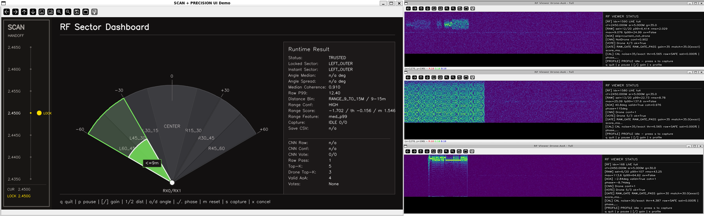
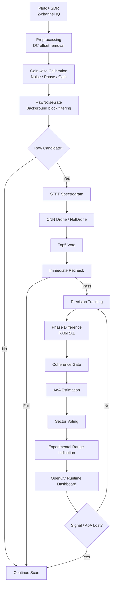
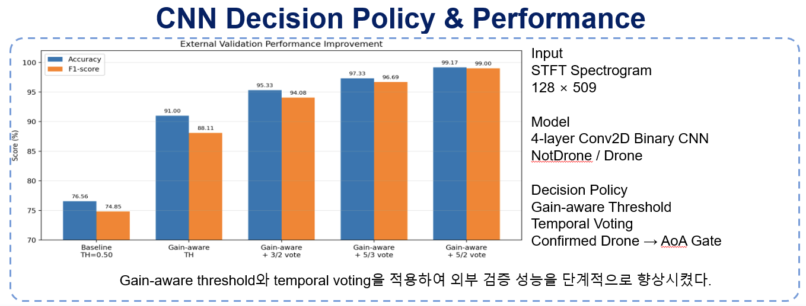
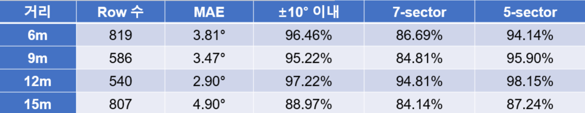

# SDR-based RF Drone Detection and AoA Tracking System

> Pluto+ SDR 기반 2.4GHz RF 신호를 이용해 드론 관련 RF activity를 탐지하고, 2채널 IQ 위상차를 기반으로 신호 도래 방향(AoA)을 추정하는 졸업작품 프로젝트입니다.

본 프로젝트는 고가의 통합 대드론 장비 전체를 구현한 것이 아니라, 그중 **RF 탐지 계층**에 해당하는 핵심 기능을 저비용 SDR 장비와 소프트웨어 신호처리 pipeline으로 구현한 prototype입니다.

단순히 CNN으로 Drone / NotDrone을 분류하는 프로젝트가 아니라, 다음 요소를 하나의 runtime pipeline으로 통합한 것이 핵심입니다.

```text
Pluto+ SDR IQ Acquisition
→ Gain-wise Calibration
→ RawNoiseGate
→ CNN-based Signal Verification
→ Same-frequency Recheck
→ Phase-difference-based AoA
→ Coherence Validation
→ Sector Stabilization
→ Experimental Range Indication
→ OpenCV Runtime Dashboard
```

---

## Demo



> OpenCV 기반 scan / precision dashboard를 통해 RF activity 탐지, AoA/Sector 추정, experimental range indication 상태를 실시간으로 확인합니다.

---

## 1. Project Overview

2.4GHz ISM band에는 드론 조종 신호뿐 아니라 Wi-Fi, Bluetooth 등 다양한 간섭 신호가 함께 존재합니다.

따라서 단순 RF energy detection만으로는 드론 관련 신호를 안정적으로 구분하기 어렵습니다.

이 프로젝트는 SDR로 수집한 IQ 신호를 기반으로 다음 문제를 해결하는 것을 목표로 했습니다.

```text
1. 2.4GHz RF activity 중 드론 관련 신호 후보를 찾는다.
2. CNN 기반 spectrogram 분류로 후보 신호를 검증한다.
3. 두 수신 채널의 위상차를 이용해 신호 도래 방향을 추정한다.
4. 실시간 dashboard를 통해 scan / precision 상태를 시각화한다.
5. 오탐과 불안정한 AoA를 줄이기 위해 gate, vote, coherence 정책을 결합한다.
```

---

## 2. What This System Provides

최종 prototype은 다음 정보를 실시간으로 제공하도록 구성되었습니다.

| Output | Description |
|---|---|
| RF activity detection | 2.4GHz 대역 후보 신호 탐지 |
| Candidate frequency | Scan mode에서 탐지된 후보 중심 주파수 |
| CNN drone probability | STFT spectrogram 기반 Drone probability |
| Top5 vote status | raw score 상위 block 기반 CNN vote |
| Recheck result | 동일 주파수 immediate recheck 결과 |
| AoA angle | RX0/RX1 위상차 기반 도래각 추정 |
| Locked sector | sector voting 기반 안정화 방향 |
| Coherence | AoA 신뢰도 검증 지표 |
| Raw strength profile | raw_p99, frame power 등 신호 세기 특징 |
| Experimental range class | sector별 coarse range indication |
| Runtime state | SCAN / TRACK_AOA / HOLD / AUTO-RETURN 상태 |

---

## 3. System Architecture




---

## 4. Key Features

| Layer | Implementation |
|---|---|
| RF Receiver | Pluto+ SDR, 2-channel IQ input |
| Preprocessing | DC offset removal, IQ block processing |
| Calibration | gain-wise noise / phase / gain calibration |
| Signal Gate | RawNoiseGate based on raw IQ energy |
| ML Verification | STFT spectrogram + binary CNN |
| False Positive Reduction | Top5 vote + same-frequency immediate recheck |
| AoA Estimation | RX0/RX1 phase difference + arcsin relation |
| Reliability Check | STFT coherence gate |
| Direction Stabilization | fixed-bin sector voting |
| Range Output | experimental sector-specific coarse range indication |
| UI | OpenCV scan / precision runtime dashboard |
| Runtime Control | signal/AoA lost auto-return |

---

## 5. Experimental Setup

| Item | Value |
|---|---|
| SDR | Pluto+ SDR |
| RF band | 2.4GHz ISM band |
| Main precision frequency | 2.450GHz |
| Scan range | 2.435GHz ~ 2.465GHz |
| Scan step | 5MHz |
| Sample rate | 5 MSPS |
| Block size | 16,384 samples |
| Block time | about 3.28 ms |
| Channels | RX0 / RX1, 2 channels |
| Antenna spacing | about 0.06 m |
| CNN input | STFT spectrogram, 128 × 509 |
| Runtime UI | OpenCV dashboard |

---

## 6. Runtime Flow

최종 runtime은 크게 두 단계로 동작합니다.

### 6.1 Scan Mode

```text
Frequency sweep
→ RawNoiseGate evaluation
→ Candidate frequency selection
→ CNN Top5 vote
→ Same-frequency immediate recheck
```

Scan mode에서는 raw energy만으로 precision mode에 진입하지 않습니다.

RawNoiseGate를 통과한 후보도 CNN Top5 vote와 immediate recheck를 통과해야 precision tracking 대상으로 인정됩니다.

### 6.2 Precision Mode

```text
Fixed target frequency tracking
→ RawNoiseGate pass block selection
→ CNN drone candidate filtering
→ AoA candidate generation
→ Coherence validation
→ Sector consensus
→ Experimental range indication
→ Signal/AoA lost auto-return
```

Precision mode에서는 AoA와 sector를 반복 계산하고, 신호 또는 AoA consensus가 사라지면 scan mode로 자동 복귀합니다.

---

## 7. Main Technical Ideas

### 7.1 RawNoiseGate

RawNoiseGate는 정규화된 spectrogram이 아니라 **DC 제거 후 raw IQ energy**를 기반으로 신호 존재 여부를 판단하는 1차 gate입니다.

역할은 다음과 같습니다.

```text
- background block이 CNN에 들어가는 것을 줄임
- scan mode에서 후보 주파수 생성
- candidate verify에서 Top5 block 선택 기준 제공
- AoA / range feature 계산 전 후보 block 제한
```

### 7.2 CNN Verification



CNN은 STFT spectrogram을 입력으로 받아 Drone / NotDrone을 판정합니다.

단일 block 결과만 사용하지 않고, raw score 상위 block을 대상으로 Top5 vote를 수행합니다.

```text
selected IQ block
→ DC offset removal
→ STFT spectrogram
→ CNN inference
→ Drone probability
→ Top5 vote / recheck
```

### 7.3 AoA Estimation

AoA는 RX0/RX1 두 채널의 phase difference를 이용해 계산합니다.

```text
phase difference
→ wavelength
→ antenna spacing
→ arcsin relation
→ AoA angle
```

실제 RF 환경에서는 멀티패스와 위상 흔들림이 존재하므로, coherence gate와 sector voting을 함께 사용했습니다.

### 7.4 Sector and Range Indication

단일 AoA angle은 순간적으로 흔들릴 수 있으므로, 최종 dashboard에서는 fixed-bin sector voting을 통해 방향을 안정화했습니다.

Range output은 정확한 거리 회귀 모델이 아니라, sector별 raw feature profile을 기반으로 한 **experimental coarse range indication**입니다.

---

## 8. Validation Summary



최종 단계에서 다음 항목을 검증했습니다.

```text
- trusted-only sector capture
- true_angle_deg / distance_m CSV labeling
- sector profile CSV replay
- WITHIN_9M / RANGE_9_TO_15M profile generation
- OpenCV scan rail UI
- precision sector/range dashboard
- scan → precision handoff
- signal/AoA lost auto-return
```

자세한 검증 내용은 다음 문서에 정리했습니다.

- [Final Validation Summary](docs/results/final_validation_summary.md)

---

## 9. How to Run

Runtime entry point는 다음과 같습니다.

```bash
PYTHONPATH=. python -m src.runtime.cli
```

주요 CLI mode는 다음과 같습니다.

| Key | Mode | Purpose |
|---|---|---|
| c | status | calibration / pipeline 상태 확인 |
| n | noise calibration | gain-wise noise profile 생성 |
| p | phase/gain calibration | RX0/RX1 phase/gain profile 생성 |
| s | clean scan | 후보 주파수 탐색 |
| sf | scan-fixed handoff | scan 후 precision tracking 진입 |
| f | fixed precision | fixed frequency AoA/Sector dashboard |
| v | UI demo | Pluto+ 없이 OpenCV UI demo |
| q | quit | 종료 |

자세한 실행 방법과 현장 운용 절차는 다음 문서에 정리했습니다.

- [Runtime Operation Manual](docs/operation/runtime_manual.md)

---

## 10. Repository Structure

```text
.
├── configs/                  # receiver / detect / ml / aoa / scan / ui 설정
├── src/
│   ├── receiver/             # Pluto+, raw file, simulation receiver
│   ├── preprocess/           # DC offset, framing, IQ normalization, phase/gain correction
│   ├── features/             # FFT, STFT spectrogram, window functions
│   ├── detect/               # energy detector
│   ├── aoa/                  # phase difference, angle estimator, coherence gate
│   ├── scan/                 # scan policy, scanner, precision analyzer
│   ├── runtime/              # CLI, runtime pipeline, raw noise gate
│   ├── ui/                   # dashboard, logging, plotting
│   └── viewer/               # OpenCV scan rail and sector dashboard
├── scripts/experimental/     # experiment capture, replay, dashboard prototypes
├── docs/
│   ├── technical/            # detailed system deep dive
│   ├── operation/            # runtime manual
│   ├── results/              # validation summary
│   ├── future_work/          # future expansion
│   └── interview/            # portfolio / interview story
├── assets/                   # README images and dashboard captures
└── README.md
```

---

## 11. Project Status

This project was completed as a graduation capstone prototype.

Implemented scope:

```text
- Pluto+ SDR based RF signal acquisition
- 2.4GHz RF activity scan
- gain-wise noise / phase / gain calibration
- RawNoiseGate based candidate filtering
- STFT spectrogram CNN verification
- Top5 vote and immediate recheck
- RX0/RX1 phase-difference AoA estimation
- coherence-based AoA validation
- sector-level direction stabilization
- experimental coarse range indication
- OpenCV runtime dashboard
- signal/AoA lost auto-return
```

---

## 12. Limitations

본 프로젝트는 prototype 수준의 RF 탐지 계층 구현이며, 다음 한계가 있습니다.

```text
1. Range class는 정확한 거리 추정이 아니라 experimental coarse range indication이다.
2. Gain, center frequency, 안테나 배치가 바뀌면 range profile 재검증이 필요하다.
3. 장시간 운용 시 SDR thermal drift와 false positive 가능성이 존재한다.
4. 다양한 드론 모델, 주파수, 거리, 각도 조건에 대한 추가 데이터가 필요하다.
5. Same-window 구조는 완전한 단일 while-loop state machine은 아니다.
```

---

## 13. Future Work

향후 확장 방향은 다음과 같습니다.

```text
- RF uplink / downlink dataset expansion
- gain and frequency specific range profile validation
- receiver watchdog for long-term stability
- complete single-loop runtime state machine
- embedded deployment optimization
- RF + non-RF sensor fusion
```

자세한 future work는 다음 문서에 정리했습니다.

- [RF-centered Hybrid Drone Detection](docs/future_work/hybrid_rf_sensor_fusion.md)

---

## 14. Portfolio / Interview Notes

이 프로젝트는 다음 경험으로 설명할 수 있습니다.

```text
- RF signal processing
- SDR-based sensing
- CNN-based signal classification
- AoA estimation using two-channel IQ phase difference
- real-time runtime system integration
- field validation and experimental debugging
```

면접/자소서용 정리는 다음 문서에 있습니다.

- [Project Story for Interview](docs/interview/project_story.md)

---

---

## 15. Detailed Documentation

| Document | Purpose |
|---|---|
| [Technical Deep Dive](docs/technical/final_system_deep_dive.md) | 기존 상세 README를 보존한 기술 설명 문서 |
| [Runtime Operation Manual](docs/operation/runtime_manual.md) | 실행 방법, CLI, calibration, 현장 운용법 |
| [Final Validation Summary](docs/results/final_validation_summary.md) | 최종 검증 결과 요약 |
| [RF-centered Hybrid Drone Detection](docs/future_work/hybrid_rf_sensor_fusion.md) | 향후 센서융합 확장 방향 |
| [Project Story for Interview](docs/interview/project_story.md) | 면접/자소서용 프로젝트 설명 |

---

## 16. Summary

본 프로젝트는 저비용 Pluto+ SDR을 이용해 2.4GHz RF activity를 탐지하고, CNN 기반 후보 검증과 2채널 위상차 기반 AoA 추정을 결합하여 방향 정보를 제공하는 RF sensing prototype입니다.

핵심 의의는 단순 모델 학습이 아니라, **RF 수신 → 신호처리 → CNN 검증 → AoA 추정 → sector/range 표시 → 실시간 dashboard**로 이어지는 전체 pipeline을 실제 실험 환경에서 구성하고 검증했다는 점입니다.
