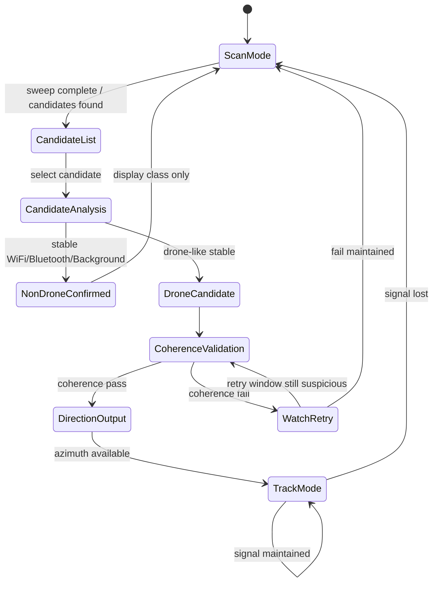
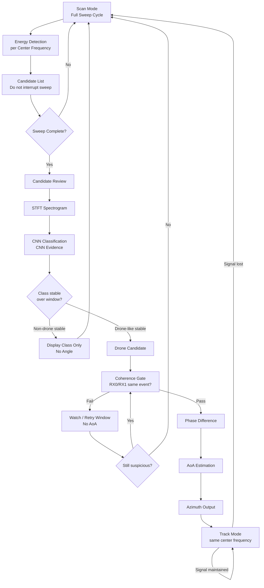
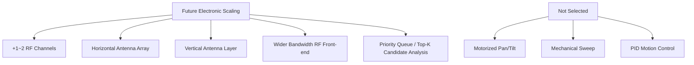

# RF Drone Detection Pipeline Block Diagram Plan

## 1. 문서 목적

이 문서는 `rf-drone-detection-capstone` 프로젝트의 RF 드론 탐지 파이프라인을 블럭다이어그램으로 설명하기 위한 설계 문서다.

목표는 단순히 `RF 수신 -> CNN -> 결과`를 보여주는 것이 아니라, 다음 설계 의도를 함께 설명하는 것이다.

- 제한된 예산과 연산 자원에서 의미 있는 RF 후보에만 계산을 집중한다.
- 하드 리얼타임 제어가 아니라 soft real-time RF 추적을 목표로 한다.
- CNN은 중요한 evidence지만, 단일 block 판정만으로 드론을 확정하지 않는다.
- AoA는 드론 판정을 위한 입력 evidence가 아니라, 드론으로 확정된 RF track에만 제공되는 방향 출력이다.
- 기계식 회전 구조가 아니라 electronic-first RF sensing 구조를 우선한다.

---

## 2. 시스템 설계 철학

### 2.1 Soft Real-time Tracking

이 시스템은 hard real-time 제어 시스템이 아니다. 즉시 요격, 물리적 제어, 모터 구동 명령을 deadline 안에 수행하는 시스템이 아니라, RF 이벤트를 관찰하고 드론 의심 신호를 soft real-time으로 추적하는 시스템이다.

따라서 단일 block 즉시 판정보다, 짧은 block window를 이용한 안정적 판정이 더 중요하다.

```text
1 block  ~= 3.3 ms
5 blocks ~= 16.5 ms
7 blocks ~= 23.1 ms
15 blocks ~= 49.5 ms
```

수십 ms 수준의 안정화 지연은 인간이 보는 드론 탐지/추적 상황에서는 충분히 허용 가능하다. 대신 순간적인 WiFi/Bluetooth burst나 CNN confidence 튐에 덜 민감한 구조를 얻을 수 있다.

### 2.2 Electronic-first RF Sensing

본 프로젝트는 모터 기반 pan/tilt, 기계식 sweep, PID motion control layer를 사용하지 않는다.

기계식 회전 구조를 섞으면 낮은 비용으로 더 넓은 azimuth/elevation 범위를 볼 수 있지만, 다음 부담이 생긴다.

- 모터, 기어, 엔코더 등 기계 구동부 추가
- PID tuning 및 motion control loop 설계
- 회전 속도와 위치 피드백 한계
- 기계적 지연, 진동, 내구성 문제
- RF 수집 파이프라인과 제어 파이프라인의 결합 증가

현재 프로젝트는 제한된 연산 자원에서 CNN 기반 RF 분류와 방향 추정 파이프라인에 집중하기 위해, motion control layer를 설계 범위에서 제외한다.

향후 확장도 motorized scan이 아니라 electronic scaling을 우선한다.

- RF 채널 추가
- 수평 안테나 배열 확장
- 수직축 안테나 추가
- 더 넓은 bandwidth RF front-end
- electronic wideband scan

### 2.3 Compute-aware Gated Pipeline

모든 RF block에 무거운 계산을 수행하지 않는다.

대신 다음 순서로 후보를 점점 좁힌다.

```text
Energy Gate
-> Candidate List
-> STFT / CNN
-> Class Stability Window
-> Drone Candidate
-> Coherence Gate
-> AoA / Azimuth
-> Track Mode
```

이 구조는 제한된 연산 능력을 가진 축소형 프로토타입에서 특히 중요하다.

---

## 3. 전체 상태 흐름

이 파이프라인은 단순 선형 구조가 아니라 state machine에 가깝다.

```text
Scan Mode
-> Candidate List
-> Candidate Analysis
-> Class Confirmation
-> Drone Candidate
-> Coherence Validation
-> Direction Output
-> Track Mode
-> Return to Scan
```



---

## 4. Scan Mode와 Candidate List

### 4.1 Sweep-complete Rule

Scan Mode에서는 sweep 도중 Energy Detection이 발생해도 즉시 sweep을 중단하지 않는다.

한 sweep cycle은 반드시 끝까지 완료한다. Energy Detection에 걸린 center frequency/block은 즉시 상세 분석으로 넘어가지 않고 candidate list에 등록한다. Sweep이 끝난 뒤 candidate list를 검토하고 상세 분석으로 넘어간다.

```text
Start Sweep
-> Center Frequency Step
-> Energy Detection
-> Candidate List Update
-> Next Frequency
-> Sweep Complete
-> Candidate Review
```

이 방식은 scan mode의 최소 동작 단위를 center frequency 한 지점이 아니라 sweep 1회로 유지한다. 따라서 특정 주파수의 순간 이벤트 때문에 전체 대역 scan coverage가 계속 끊기는 문제를 줄인다.

### 4.2 Candidate List Entry

후보군은 sweep 종료 후 상세 분석을 위해 다음 정보를 가질 수 있다.

| Field | 의미 |
|---|---|
| `center_frequency` | 후보가 발견된 중심 주파수 |
| `sweep_id` | 후보가 발견된 sweep 번호 |
| `active_block_count` | 해당 sweep에서 active로 잡힌 block 수 |
| `max_energy` | 최대 energy 값 |
| `average_energy` | 평균 energy 값 |
| `first_seen_time` | 처음 발견된 시각 |
| `last_seen_time` | 마지막으로 관찰된 시각 |
| `priority_score` | 후보 분석 우선순위 |

현재 축소형 프로토타입에서는 관측 대역폭과 후보 수가 제한적이므로, 한 sweep에서 검출된 후보군 전체를 STFT/CNN 분석하는 방식이 충분히 가능하다.

향후 대역폭이 넓어져 후보가 많아지면 candidate priority queue와 top-K analysis로 확장할 수 있다.

```text
Current prototype:
Analyze all candidates per sweep

Future wideband mode:
Analyze top-K candidates by priority
Carry over lower priority candidates to later sweeps
```

---

## 5. Candidate Analysis Pipeline

Candidate Analysis는 sweep 종료 후 선택된 후보에 대해 수행된다.

```text
Candidate List
-> STFT Spectrogram
-> CNN Classification
-> Class Confirmation Window
```

CNN은 STFT spectrogram을 입력으로 받아 class confidence를 출력한다. 이때 spectrogram 자체가 다음 정보를 포함한다.

- 신호 세기 분포
- 시간-주파수 패턴
- burst 길이
- burst 반복성
- WiFi / Bluetooth / Background와의 패턴 차이

따라서 `energy pattern score`, `spectrogram pattern score`, `signal duration / burst consistency`는 별도 독립 점수로 분리하지 않고 CNN evidence 내부의 하위 근거로 본다.

---

## 6. Drone Decision Logic

CNN drone-like confidence는 강한 근거지만, 단일 block 결과만으로 드론을 확정하지 않는다.

최근 block window에서 같은 판정이 유지되는지 확인한다. 이 방식은 순간적인 오탐을 줄이고, WiFi/Bluetooth burst에 덜 민감한 판정을 가능하게 한다.

초기 configurable parameter는 다음과 같이 둘 수 있다.

```yaml
energy_confirm_blocks: 3

non_drone_window: 5
non_drone_vote_required: 4

drone_candidate_window: 7
drone_candidate_vote_required: 5
```

출력 정책:

| CNN/window 결과 | 동작 |
|---|---|
| WiFi / Bluetooth / Background 안정 | class name만 표시 후 scan mode 복귀 |
| 판정 불안정 | watch 상태 또는 candidate 재검사 |
| Drone-like 안정 | coherence validation으로 이동 |

비드론 RF 신호에는 angle을 표시하지 않는다.

---

## 7. Coherence Gate와 AoA 출력 정책

### 7.1 Coherence Gate

안테나가 2개이므로, RX0와 RX1이 같은 RF 이벤트를 보고 있는지 확인해야 한다.

Coherence Gate는 두 채널이 같은 신호를 관측하는지 확인하는 2채널 일치성 검사다. 개념적으로는 RX0/RX1의 신호 표현이 같은 대상에 주목하고 있는지 확인하는 cross-channel attention gate처럼 볼 수 있다.

초기 configurable parameter:

```yaml
coherence_window: 5
coherence_vote_required: 4
```

Coherence threshold를 넘지 못하면 바로 scan mode로 복귀하지 않고 watch/retry window를 거친다. Retry window에서도 실패가 유지되면 scan mode로 복귀한다.

### 7.2 AoA 출력 정책

AoA는 드론 여부를 결정하기 위한 입력 evidence가 아니다.

AoA는 드론으로 확정된 RF track에 대해서만 제공되는 direction output stage다.

```text
Drone confirmed
-> Coherence Gate
-> Phase Difference
-> AoA Estimation
-> Azimuth Output
```

WiFi 또는 Bluetooth 같은 비드론 RF 이벤트에 대해 AoA를 계산하거나 표시하지 않는다. 비드론 RF 방향을 표시하면, 실제 드론이 존재하는 상황에서 시스템이 주변 WiFi/Bluetooth 방향을 드론 방향으로 오인하게 만드는 중대한 오탐이 발생할 수 있다.

따라서 방향 출력은 의도적으로 보수적으로 설계한다.

```text
Non-drone RF: class name only, no angle
Watch / unstable candidate: no angle
Drone confirmed + coherence pass: class name + azimuth angle
```

---

## 8. Soft Real-time Tracking

AoA가 계산되고 azimuth로 변환되면 track mode로 들어간다.

Track Mode에서는 같은 center frequency에서 계속 검사하며 신호 유지 여부를 확인한다. 신호가 유지되면 track을 유지하고, 신호가 말소되거나 score가 충분히 하락하면 scan mode로 복귀한다.

초기 configurable parameter:

```yaml
aoa_stability_window: 7
track_window: 15
lost_tolerance_blocks: 5
```

출력 상태는 다음과 같이 나눌 수 있다.

| 상태 | 방향 표시 | 의미 |
|---|---|---|
| `inactive` | 없음 | 의미 있는 RF 신호 없음 |
| `non_drone_rf` | 없음 | WiFi/Bluetooth/Background로 판단 |
| `watch` | 없음 | 일부 의심 근거는 있으나 확정 부족 |
| `drone_candidate` | 없음 | 드론 가능성은 높지만 방향 표시 조건 미충족 |
| `drone_confirmed_with_direction` | 있음 | 드론 판정 + coherence 통과 + AoA 가능 |
| `track` | 있음 | 같은 center frequency에서 추적 중 |
| `lost` | 없음 | 신호 말소, scan mode 복귀 |

---

## 9. Compute Saving / FLOPs 절감 구조

단계적 gate 구조는 FLOPs와 전체 계산량을 줄이기 위해 필요하다.

Naive 구조는 모든 block에 대해 다음 연산을 수행한다.

```text
Energy Detection + STFT + CNN + Coherence + AoA
```

하지만 gated 구조는 다음처럼 후보가 줄어든 뒤에만 무거운 연산을 수행한다.

```text
Energy 통과 block만 STFT/CNN
Drone candidate만 Coherence
Drone confirmed + Coherence pass만 AoA
```

전체 RF block 수를 `N`이라고 하고, 각 통과율과 비용을 다음처럼 둔다.

| Symbol | 의미 |
|---|---|
| `p_energy` | Energy Gate 통과율 |
| `p_drone` | STFT/CNN 이후 drone candidate 비율 |
| `p_coherence` | Coherence Gate 통과율 |
| `C_energy` | Energy Detection 비용 |
| `C_stft` | STFT 비용 |
| `C_cnn` | CNN 비용 |
| `C_coherence` | Coherence 비용 |
| `C_aoa` | AoA 비용 |

Naive 구조:

```text
C_naive =
N * (C_energy + C_stft + C_cnn + C_coherence + C_aoa)
```

Gated 구조:

```text
C_gated =
N * C_energy
+ N * p_energy * (C_stft + C_cnn)
+ N * p_energy * p_drone * C_coherence
+ N * p_energy * p_drone * p_coherence * C_aoa
```

예를 들어 전체 block 중 active가 20%, 그중 drone candidate가 5%, coherence pass가 80%라면:

```text
STFT/CNN 대상: 전체 block의 20%
Coherence 대상: 전체 block의 1%
AoA 대상: 전체 block의 0.8%
```

핵심 관계:

```text
N_confirmed << N_drone_candidate << N_active << N_total
```

이 구조는 제한된 연산 자원에서 가장 무거운 계산을 소수 후보에만 집중하게 한다.

---

## 10. Future Electronic Scaling

향후 확장은 mechanical scan이 아니라 electronic scaling을 우선한다.

| 확장 목표 | 선호 방식 |
|---|---|
| Azimuth 범위 확장 | 수평 안테나 채널 추가 |
| Elevation 판단 | 수직축 안테나 추가 |
| 광대역 감시 | wider RF bandwidth front-end |
| 빠른 scan | electronic frequency sweep |
| 더 많은 후보 처리 | candidate priority queue / top-K analysis |
| 방향 추정 안정화 | 다중 채널 phase/coherence 비교 |

Not selected:

- Motorized pan/tilt
- Mechanical sweep
- PID motion control

현재 축소형 구현은 제한된 채널 수로 구성되어 있지만, 추가 RF 채널을 1~2개 더 확보할 수 있다면 azimuth 확장과 elevation 판단을 기계식 회전 없이 전자식 구조 안에서 처리할 수 있다.

---

## 11. 최종 블럭다이어그램 초안

### 11.1 Main Pipeline



### 11.2 Future Scaling / Not Selected



---

## 12. 핵심 발표 문장

이 시스템은 하드 리얼타임 제어 시스템이 아니라, 제한된 연산 자원에서 의미 있는 RF 후보에만 계산을 집중하는 soft real-time RF 추적 파이프라인이다.

Scan Mode에서는 sweep 도중 energy가 검출되어도 즉시 중단하지 않고 candidate list에 등록한 뒤, sweep 종료 후 후보군을 상세 분석한다.

CNN은 spectrogram 기반의 강한 evidence지만 최종 판정기는 아니다. 단일 block 판정이 아니라 최근 block window에서 판정이 유지되는지를 확인한다.

AoA는 드론 여부를 결정하기 위한 evidence가 아니라, 드론으로 확정되고 coherence gate를 통과한 RF track에 대해서만 제공되는 방향 출력이다.

전자식 RF sensing 구조를 우선하여 모터, 기계식 sweep, PID motion control layer를 제거하고, 작은 크기와 빠른 scan 가능성을 확보한다.
