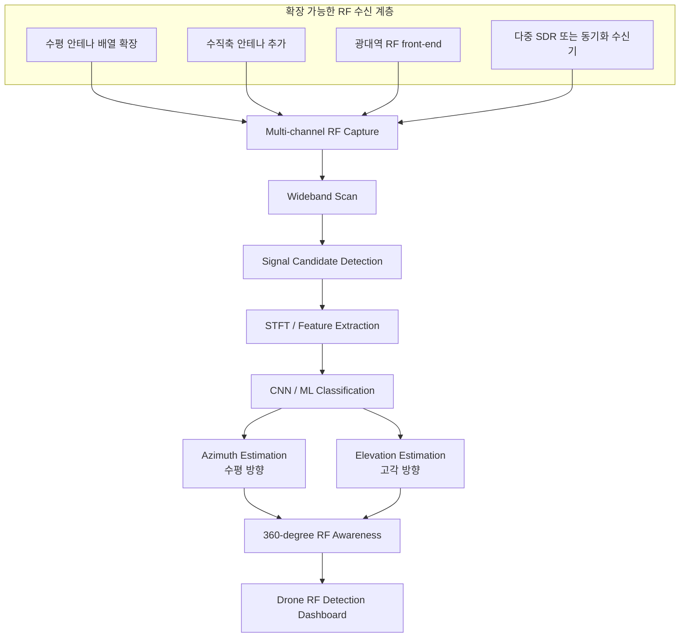

# RF Drone Detection Capstone 진행상황

## 1. 현재 한 줄 요약

이 프로젝트는 2.4GHz RF 신호를 Pluto+ SDR로 수집하고, STFT spectrogram 기반 CNN 분류 파이프라인을 구축하는 캡스톤 프로젝트입니다.

현재 구현은 예산과 장비 제약을 반영한 **축소형 RF 드론 탐지 프로토타입**입니다. 완성형 대드론 장비를 만드는 것이 아니라, 저비용 SDR과 Python 기반 신호처리 파이프라인으로 **RF 탐지 계층**을 검증하는 데 초점을 둡니다.

중요한 점은 현재 구조가 단순 실험 코드가 아니라, 예산이 확보되면 안테나 수, 관측 대역폭, 수신 채널, 분류 클래스, 방향 추정 범위를 확장할 수 있는 형태로 분리되어 있다는 것입니다.

---

## 2. 현재 브랜치 상태

| 항목 | 상태 |
|---|---|
| 작업 브랜치 | `experiment/stft-128-hop32` |
| 최신 원격 커밋 | `994886f Add project showcase page` |
| 기준 STFT 입력 | `128 x 509` |
| 주요 모델 | RF3 CNN baseline |
| 현재 분류 클래스 | Background / Bluetooth / WiFi |
| 소개 페이지 | `docs/showcase/index.html` 추가 완료 |
| 현재 성격 | 예산 제약 기반 축소형 RF 탐지 프로토타입 |

---

## 3. 왜 축소형 구현인가

RF 기반 드론 탐지는 수신 장비, 안테나 배열, 동기화된 다중 채널 수신기, 광대역 RF front-end, 실제 드론 RF 데이터 확보 여부에 따라 비용과 난이도가 크게 증가합니다.

현재 프로젝트는 제한된 예산 안에서 다음 질문에 먼저 답하는 방향으로 축소되었습니다.

```text
저비용 SDR과 소프트웨어 파이프라인만으로
2.4GHz RF 신호를 수집하고,
의미 있는 RF block을 선별하고,
spectrogram으로 변환하고,
CNN 분류 입력으로 연결할 수 있는가?
```

현재 구현은 이 질문에 대한 검증 단계입니다. 따라서 지금 시스템은 최종 대드론 시스템이라기보다, 확장 가능한 RF 탐지 시스템의 최소 동작 구조입니다.

---

## 4. 현재 구현 아키텍처


현재 파이프라인은 다음 순서로 동작합니다.

```text
RF IQ 수신
  ↓
전처리
  ↓
Energy Detection
  ↓
STFT Spectrogram 생성
  ↓
CNN 학습/추론 데이터 구성
  ↓
결과 저장 및 보고서화
```

현재는 RF3 baseline 기준으로 Background, Bluetooth, WiFi를 구분하는 모델을 먼저 구축했습니다. 실제 drone-like RF 데이터가 아직 확보되지 않았기 때문에, 현재 모델은 최종 드론 탐지 모델이 아니라 **비드론 RF 신호 분류 baseline**입니다.

---

## 5. 예산 확보 시 확장 가능한 아키텍처

현재 구현은 입력부와 후단 처리부가 분리되어 있습니다. 따라서 RF 수신부를 확장하면, Energy Detection, STFT, CNN 분류, 결과 저장 흐름은 재사용하거나 확장할 수 있습니다.



확장 방향은 다음과 같습니다.

| 구분 | 현재 구현 | 예산 확보 시 확장 |
|---|---|---|
| 안테나 구성 | 제한된 안테나/채널 기반 | 수평 다중 안테나 배열 |
| 탐지 방향 | 제한된 방향 범위 중심 | 360도 전방위 감지 |
| 고각 판단 | 현재 구현 범위 밖 | 수직축 안테나 추가로 elevation angle 추정 |
| 중심 주파수 | 2.45GHz 근처 | 2.4GHz ISM 대역 전체 및 추가 대역 확장 |
| 관측 대역폭 | 현재 안테나 기준 약 23MHz | 더 넓은 bandwidth RF front-end로 확장 |
| 수신 구조 | 단일 또는 제한된 수신 채널 | 다중 SDR / 동기화 수신기 |
| 분류 모델 | Background / Bluetooth / WiFi baseline | Drone-like / controller / telemetry 등 클래스 확장 |
| 시스템 목표 | RF 탐지 계층 검증 | 실시간 대드론 RF 감시 시스템 |

---

## 6. 확장 가능하지만 현재 미구현인 영역

다음 항목은 현재 구현 완료 기능이 아니라, 예산과 장비가 확보될 경우 확장 가능한 설계 방향입니다.

### 6.1 전방위 탐지

현재 제한된 안테나 구성에서는 특정 방향 범위 중심의 탐지가 현실적입니다. 하지만 수평 방향으로 안테나 배열을 늘리면, 제한된 전방 각도만 보는 구조에서 벗어나 360도 전방위 RF 감시 구조로 확장할 수 있습니다.

핵심 확장 요소:

- 수평 안테나 배열 추가
- 다중 채널 동기화
- 채널 간 위상차 기반 azimuth 추정
- 방향별 RF 신호 후보 분리

### 6.2 고각 판단

현재 구조는 주로 수평 방향의 RF 탐지 흐름에 초점이 있습니다. 드론은 지상 장비보다 높은 위치에서 신호를 발생시키므로, 실제 운용형 시스템에서는 고각 판단이 중요합니다.

수직축 안테나 또는 높이 차가 있는 안테나 배열을 추가하면 다음 방향으로 확장할 수 있습니다.

- elevation angle 추정
- 수평 방향 + 고각 방향 결합
- 드론 신호의 공간적 위치 후보 추정
- 지상 RF 신호와 공중 RF 신호의 구분 가능성 향상

### 6.3 광대역 감시

현재 안테나의 중심 주파수는 2.45GHz 근처이고, 관측 가능한 대역폭은 약 23MHz 수준입니다. 이 구조는 축소형 실험에는 적합하지만, 실제 환경에서는 더 넓은 대역을 감시해야 합니다.

예산이 확보되면 다음 방향으로 확장할 수 있습니다.

- 2.4GHz ISM band 전체 스캔
- 더 넓은 bandwidth를 지원하는 RF front-end 사용
- 후보 주파수 탐색 후 정밀 분석
- 드론 제어/영상/텔레메트리 대역으로 확장

### 6.4 실제 Drone-like 데이터 추가

현재 RF3 baseline은 Background, Bluetooth, WiFi 3분류 모델입니다. 실제 드론 RF 데이터가 확보되면 다음처럼 모델을 확장할 수 있습니다.

```text
Background
Bluetooth
WiFi
Drone-like
Controller-like
Telemetry-like
```

이 단계가 진행되어야 프로젝트가 비드론 RF 신호 분류 baseline에서 실제 드론 탐지 모델로 넘어갈 수 있습니다.

---

## 7. 완성된 것

### 문서

- README를 현재 RF 탐지 파이프라인 기준으로 정리
- RF3 CNN baseline 보고서 추가
- STFT `128 x 509` 기준 문서화
- SDR 수집/분석 명령 문서 추가
- 프로젝트 showcase 페이지 추가

### 데이터/모델

- Background / Bluetooth / WiFi 3분류 baseline 구성
- Balanced dataset 1,500개 기준 실험 완료
- 대표 모델 test accuracy 98.67% 기록
- 오분류 sample 분석 및 ambiguous 후보 관리 방식 정리

### 파이프라인

- IQ block 수신 구조 정리
- DC offset / gain / phase / normalization 전처리 흐름 정리
- Energy Detector 기반 active block 선별
- STFT spectrogram 생성
- CNN dataset capture 흐름 정리
- 향후 AoA branch 연결 구조 정리

---

## 8. 아직 진행 중인 것

| 영역 | 현재 상태 | 다음 액션 |
|---|---|---|
| Drone-like 데이터 | 실제 드론 RF 데이터 미확보 | 수집 계획/라벨링 기준 필요 |
| Runtime inference | 구조는 있음 | RF3 checkpoint 연결 검증 |
| AoA | 설계 branch 있음 | RX0/RX1 2채널 실측 검증 필요 |
| 설정 파일 | 일부 로컬 변경 있음 | 커밋 여부 판단 필요 |
| 분류 실행 helper | `scripts/run_classify_once.py` 미커밋 | 테스트 후 커밋 여부 결정 |
| 확장 아키텍처 | 문서화 단계 | 발표용 이미지/다이어그램으로 정리 가능 |

---

## 9. 최근 작업 흐름

```text
main
  ↓
RF3 CNN baseline 문서/코드 추가
  ↓
STFT 입력 기준 128 x 509로 정렬
  ↓
Runtime CNN capture 구조 정리
  ↓
프로젝트 showcase 페이지 추가
  ↓
축소형 구현과 확장 가능 아키텍처 문서화
```

---

## 10. 현재 남은 로컬 변경

현재 WSL 작업 트리에는 다음 변경이 남아 있습니다.

```text
M configs/ml.yaml
M configs/receiver.yaml
M docs/planning/COMMANDS.md
M docs/planning/STATUS.md
M docs/planning/commands.md
M docs/planning/mustdothing.md
M scripts/check_cnn_capture_sample.py
?? scripts/run_classify_once.py
?? docs/planning/PROJECT_PROGRESS.md
```

`docs/showcase`는 이미 커밋되어 원격 브랜치에 올라간 상태입니다. 위 변경들은 별도 작업물로 보고, 필요한 경우 다음 커밋으로 묶는 것이 좋습니다.

---

## 11. 다음 추천 작업

### 1순위: 단일 파일 분류 실행 흐름 확인

`scripts/run_classify_once.py`가 실제로 어떤 입력을 받아 어떤 결과를 내는지 확인하고, RF3 checkpoint 기반 단일 파일 분류 흐름을 안정화합니다.

### 2순위: 설정 파일 변경 의도 정리

`configs/ml.yaml`, `configs/receiver.yaml`이 실험 기준 변경인지 임시 변경인지 확인합니다. 커밋할 설정과 로컬 실험용 설정을 분리하는 것이 좋습니다.

### 3순위: Drone-like 데이터 수집 계획 작성

실제 드론 RF 데이터가 없으면 현재 모델은 비드론 RF baseline에 머무릅니다. 따라서 라벨링 기준, 수집 환경, 거리, 주파수, 장비 조건을 정리한 수집 계획이 필요합니다.

### 4순위: 확장 아키텍처 발표 자료화

현재 문서의 확장 가능성 내용을 발표용 이미지로 바꾸면 좋습니다.

필수로 보여줄 이미지:

- 현재 축소형 아키텍처
- 예산 확보 시 확장형 아키텍처
- 수평 안테나 배열 확장으로 360도 탐지
- 수직축 안테나 추가로 고각 판단
- 2.45GHz 중심 제한 대역에서 광대역 감시로 확장

---

## 12. 발표/보고서용 핵심 문장

현재 구현은 예산 제약을 반영한 축소형 RF 탐지 프로토타입입니다.

하지만 시스템을 RF 수신부, 전처리, Energy Detection, STFT feature extraction, CNN classification, 방향 추정 branch로 분리했기 때문에, 예산이 확보되면 안테나 배열과 수신 대역폭을 확장하여 전방위 탐지, 고각 판단, 광대역 RF 감시 구조로 확장할 수 있습니다.

즉, 이 프로젝트의 핵심 성과는 완성형 대드론 장비 자체가 아니라, 저비용 장비로 RF 탐지 계층의 최소 동작 구조를 구현하고, 이후 확장 가능한 신호처리 파이프라인을 설계했다는 점입니다.

python3 -m http.server 8015
http://127.0.0.1:8015/docs/planning/PROJECT_PROGRESS.html