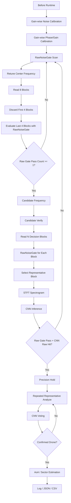

# SDR 기반 비인가 드론 RF 신호 탐지 및 AoA 추정 모듈

Pluto+ SDR 기반 2.4GHz RF 신호를 이용해 Wi-Fi / Bluetooth / Background와 구분되는 **드론 관련 RF activity**를 탐지하고, 2채널 IQ 데이터의 위상차를 이용해 도래각(AoA, Angle of Arrival)을 추정하는 캡스톤 프로젝트입니다.

본 프로젝트는 고가의 통합 대드론 장비 전체를 구현하는 것이 아니라, 그중 **RF 탐지 계층**에 해당하는 핵심 기능을 저비용 SDR 장비와 소프트웨어 신호처리 파이프라인으로 구현하는 것을 목표로 합니다.

현재 주 실행 흐름은 **CLI 기반 scan/runtime pipeline**입니다. Live viewer는 RF 패턴 확인, gain profile 저장, CNN/AoA 디버깅을 위한 보조 실험 도구로 사용합니다.

```text
사전 준비
Gain-wise Noise Calibration
→ Gain-wise Phase/Gain Calibration
→ 필요 시 Drone / NotDrone CNN dataset 보강

본 실행
CLI RawNoiseGate Scan
→ Candidate Frequency
→ Representative Block Candidate Verify
→ CNN Raw Hit / Temporal Voting
→ Precision Hold
→ Coherence Check
→ AoA / Sector Estimation
→ Result Logging
```

---

## 1. 프로젝트 목표

2.4GHz 대역 RF 신호를 수신하여 드론 운용과 관련된 RF activity를 탐지하고, 수신 신호의 방향 정보를 함께 제공하는 RF 기반 탐지 프로토타입을 구현합니다.

주요 목표는 다음과 같습니다.

- Pluto+ SDR을 이용한 2.4GHz RF 신호 수신
- RX0/RX1 2채널 IQ 데이터 처리
- Gain-wise noise calibration 기반 raw noise gate 구축
- RawNoiseGate 기반 scan 후보 주파수 탐색
- 후보 주파수에서 representative block 기반 CNN 정밀 판정
- CNN temporal voting 및 precision hold 구조 구현
- Coherence 기반 AoA 신뢰도 검증
- RX0/RX1 위상차 기반 AoA 추정
- Gain-wise phase/gain calibration profile 기반 RX1 보상
- OpenCV live viewer를 통한 RF pattern / CNN / AoA 디버깅
- 향후 Raspberry Pi 등 엣지 장치 배포 가능성 검토

---

## 2. 하드웨어 구성

| 부품 | 역할 |
|---|---|
| Pluto+ SDR | 2채널 IQ 수신 |
| 2.4GHz 안테나 ×2 | RX0/RX1 위상차 기반 AoA 추정 |
| 신호발생기 | AoA phase/gain calibration 및 각도 검증 |
| 노트북 | 신호처리, CNN 추론, CLI runtime / viewer 실행 |
| 드론 / 조종기 | 실측 RF 데이터 수집 대상 |
| Python 실행 환경 | 전체 pipeline 실행 및 결과 저장 |

---

## 3. 현재 기본 처리 단위

| 항목 | 값 |
|---|---:|
| Sample rate | 5 MSPS |
| 기본 center frequency | 2.45 GHz 실험 중심 |
| Block size | 16,384 samples |
| Block time | 약 3.28 ms |
| Channel count | 2 channels |
| SDR input | Pluto+ SDR |
| Calibration gain sweep | 20 / 25 / 30 / 35 / 40 dB |

---

## 4. Runtime Pipeline 개요

현재 pipeline은 다음 네 단계로 구성됩니다.

```text
1. Before Runtime
   gain-wise noise calibration
   gain-wise phase/gain calibration

2. Scan Mode
   RawNoiseGate 기반 후보 주파수 탐색

3. Candidate Verify / Precision Mode
   후보 주파수에서 representative block 기반 CNN 판정

4. Precision Hold / AoA Mode
   CNN raw hit 또는 voting 기반 hold 진입
   confirmed 상태에서 AoA / sector 추정
```



---

## 5. Calibration

### 5.1 Gain-wise Noise Calibration

Noise calibration은 gain별 noise profile을 생성하여 JSON으로 저장하고, runtime에서 현재 gain에 맞는 profile을 조회하는 방식으로 수행합니다.

```text
gain 20 / 25 / 30 / 35 / 40에서 noise block 수집
→ DC offset 제거
→ EnergyDetector 기준 frame energy 계산
→ gain별 noise_floor / threshold 계산
→ noise_by_gain_latest.json 저장
```

기본 저장 경로:

```text
outputs/calibration/noise_by_gain_latest.json
```

Runtime에서는 JSON의 `noise_floor`와 `configs/detect.yaml`의 `threshold_multiplier`를 사용합니다.

```text
runtime_threshold = noise_floor * threshold_multiplier
```

주의: JSON의 `profile["threshold"]`를 그대로 사용하지 않고, YAML multiplier를 곱해 runtime threshold를 다시 계산합니다.

---

### 5.2 Gain-wise Phase/Gain Calibration

RX0/RX1은 같은 정면 0도 신호를 받아도 SDR 내부 경로, 케이블 길이, 안테나 배치 차이 때문에 상대 gain과 phase offset이 달라질 수 있습니다.

따라서 각 gain에서 직접 phase/gain calibration을 수행하여 gain별 calibration profile을 JSON으로 저장합니다.

```text
gain 20 / 25 / 30 / 35 / 40에서 calibration block 수집
→ DC offset 제거
→ RX0/RX1 gain mismatch 추정
→ RX1 gain correction 계산
→ RX1-RX0 phase offset 추정
→ coherence-like 품질 지표 계산
→ phase_gain_by_gain_latest.json 저장
```

기본 저장 경로:

```text
outputs/calibration/phase_gain_by_gain_latest.json
```

Runtime에서는 현재 gain에 맞는 보정값을 조회하여 RX1에 적용합니다.

```python
rx1_gain_corrected = rx1 * gain_correction
rx1_compensated = rx1_gain_corrected * np.exp(-1j * phase_offset_rad)
```

---

## 6. RawNoiseGate

RawNoiseGate는 정규화된 spectrogram이 아니라 **DC 제거 후 raw IQ energy**를 기반으로 신호 존재 여부를 판단합니다.

역할:

```text
1. Scan 단계에서 후보 주파수 탐색
2. CNN 입력 전 background block 차단
3. Candidate verify에서 representative block 선택 기준 제공
```

핵심 설정:

```yaml
raw_noise_gate:
  enabled: true
  noise_profile_path: outputs/calibration/noise_by_gain_latest.json
  detector_method: time_power
  frame_size: 1024
  hop_size: 512
  allow_nearest_gain: true
  use_profile_threshold: false
  threshold_source: noise_floor_times_yaml_multiplier
  threshold_multiplier: 5.0
  min_detection_ratio: 0.05
  block_cnn_on_fail: true
  reset_cnn_history_on_fail: true
  block_aoa_on_fail: true
  pass_label: RAW_GATE_PASS
  fail_label: GATE_LOW_BACKGROUND
```

---

## 7. Scan Mode

Scan mode는 2.4GHz 대역을 sweep하면서 RF 신호가 있는 후보 주파수를 찾는 단계입니다. 이 단계에서는 CNN이나 AoA를 수행하지 않습니다.

현재 scan 후보 생성은 RawNoiseGate 기반입니다.

```text
각 center frequency로 retune
→ 8 block read
→ 앞 4 block discard
→ 뒤 4 block RawNoiseGate 평가
→ usable 4 block 중 1개 이상 통과 시 candidate 저장
```

설정:

```yaml
scan_candidate:
  enabled: true
  blocks_per_freq: 8
  discard_blocks_after_tune: 4
  min_raw_gate_pass_count: 1
  max_candidates: 5
```

로그 해석:

```text
[RAW_GATE_TRIGGER] 2.460 GHz | score=1240.85 | pass_count=2/4
```

의미:

```text
2.460 GHz에서 usable 4 block 중 2 block이 raw energy gate를 통과했다.
CNN 통과 횟수가 아니라 RawNoiseGate 통과 횟수이다.
```

---

## 8. Candidate Verify / Precision Mode

Candidate verify는 scan에서 올라온 후보 주파수에 대해 CNN을 이용해 드론 관련 RF activity인지 확인하는 단계입니다.

현재 구조는 live OpenCV viewer에서 검증된 representative block 방식을 사용합니다.

```text
후보 주파수 진입
→ N개 decision block read
→ 각 block RawNoiseGate 평가
→ raw gate pass block 중 score_max가 가장 큰 block 선택
→ selected block 하나만 STFT/CNN 수행
→ CNN voting 1회 업데이트
```

설정:

```yaml
candidate_verify:
  enabled: true
  representative_selection: true
  blocks_per_decision: 20
  select_policy: raw_gate_pass_score_max
  block_cnn_on_raw_gate_fail: true
  reset_temporal_on_raw_gate_fail: false
```

대표 block 선택 정책:

```text
raw_gate_pass_score_max:
1. raw gate 통과 block이 있으면 그중 score_max 최대 block 선택
2. 통과 block이 없으면 전체 중 score_max 최대 block 선택
3. selected block이 raw gate fail이면 CNN/AoA는 block
```

---

## 9. Precision Hold 진입 정책

Representative 방식에서는 `analyze()` 1회가 CNN vote 1개만 만든다. 따라서 entry screening 단계에서 `confirmed=True`를 요구하면 hold에 거의 진입하지 못한다.

기존 문제:

```text
cnn=Drone prob=1.0 thr=0.35 votes=1/5 confirmed=False accepted=False
```

현재는 다음 조건으로 hold 진입을 허용합니다.

```text
raw_gate_passed == True
and drone_probability >= entry_probability_threshold
```

설정:

```yaml
precision_hold:
  entry_screening:
    enabled: true
    precision_blocks: 5
    require_confirmed: false
    allow_candidate: false
    accept_raw_drone_hit: true
    entry_probability_threshold: 0.35
    require_raw_gate_passed: true
    reject_not_drone: true
```

현재 `entry_probability_threshold: 0.35`는 개발 단계용 값입니다. 2.460 / 2.465 GHz 드론 positive 데이터를 보강한 뒤 0.65~0.80으로 상향할 수 있습니다.

---

## 10. Precision Hold / AoA Mode

Precision hold는 후보 주파수에서 일정 시간 머물며 반복적으로 representative analyze를 수행하는 단계입니다.

```text
HOLD_BLOCK 0
→ representative block 선택
→ CNN vote 업데이트

HOLD_BLOCK 1
→ representative block 선택
→ CNN vote 업데이트

HOLD_BLOCK 2
→ representative block 선택
→ CNN vote 업데이트
→ 3/5 confirmed 가능
→ AoA 계산 가능
```

AoA는 confirmed 상태일 때만 계산합니다.

```text
confirmed_status == True
→ coherence check
→ phase difference estimation
→ angle calculation
→ smoothing / sector quantization
```

---

## 11. Live RF Viewer

Live viewer는 CLI runtime의 대체 프로그램이 아니라, RF 패턴 확인 및 CNN/AoA 디버깅을 위한 보조 도구입니다.

현재 `live_rf_viewer_drone_aoa.py`도 representative block 방식을 사용합니다.

설정:

```yaml
live_rf_viewer:
  blocks_per_update: 20
  select_policy: raw_gate_pass_score_max
  cli_log_every_n: 1
  disable_cli_log: false
```

실험 결과 `blocks_per_update: 20`에서 CNN Drone 판정이 끊기지 않고 안정적으로 유지되었다.

실행:

```bash
PYTHONPATH=. python scripts/live_rf_viewer_drone_aoa.py --mode full
```

---

## 12. 실행 방법

### 12.1 Runtime CLI 실행

```bash
PYTHONPATH=. python -m src.runtime.cli
```

메뉴에서:

```text
s
```

흐름:

```text
status 확인
→ scan/runtime pipeline start
→ RawNoiseGate scan
→ candidate verify
→ precision hold
→ AoA/logging
```

### 12.2 Live RF Viewer 실행

```bash
PYTHONPATH=. python scripts/live_rf_viewer_drone_aoa.py --mode full
```

YAML 기본값을 사용하므로 중심 주파수, sample rate, block size, rx index 등을 CLI에 매번 넣지 않는다. CLI 인자는 임시 실험 override 용도로만 사용한다.

---

## 13. 현재 한계와 다음 작업

### 13.1 CNN 학습 데이터 한계

실제 viewer 확인 결과, 드론 신호는 2.450 GHz뿐 아니라 2.460 GHz, 2.465 GHz에서도 관측되었다. 그러나 해당 대역의 드론 spectrogram이 학습 데이터에 충분히 들어가지 않아 CNN confidence가 낮게 나오는 문제가 있다.

따라서 다음 positive 데이터를 추가해야 한다.

```text
Drone ON:
- 2.450 GHz
- 2.455 GHz
- 2.460 GHz
- 2.465 GHz
- 가능하면 2.440 / 2.445 GHz 일부
```

negative 데이터도 같은 주파수에서 수집해야 한다.

```text
Drone OFF:
- Background
- Wi-Fi
- Bluetooth
- 기타 2.4GHz 간섭
```

### 13.2 Threshold 안정화

현재 개발값:

```text
entry_probability_threshold: 0.35
```

데이터 보강 후 목표:

```text
0.65 ~ 0.80 범위에서 재튜닝
```

### 13.3 Representative selector 공통화

현재는 안정화 우선으로 viewer와 precision analyzer 내부에 유사 로직을 각각 두었다. 안정화 후 다음 모듈로 분리한다.

```text
src/runtime/representative_block_selector.py
```

공통화 대상:

```text
- scripts/live_rf_viewer_drone_aoa.py
- src/scan/precision_analyzer.py
- 향후 dataset capture / CLI pipeline
```

---

## 14. 주요 출력 파일

| 파일 | 목적 |
|---|---|
| `outputs/calibration/noise_by_gain_latest.json` | gain-wise noise profile |
| `outputs/calibration/phase_gain_by_gain_latest.json` | gain-wise phase/gain profile |
| `outputs/runs/latest/scan_events.json` | 최신 scan event 결과 |
| `outputs/runs/latest/scan_events_cycle_*.json` | scan cycle별 event log |
| `outputs/runs/latest/scan_precision/` | candidate verify artifacts |

---

## 15. 결론

현재 pipeline은 다음 구조까지 구현되었다.

```text
Gain-wise calibration
→ RawNoiseGate scan candidate
→ Representative block candidate verify
→ CNN raw hit entry screening
→ Precision hold voting
→ AoA / sector estimation
```

오늘 개선으로 기존의 핵심 병목이 해결되었다.

```text
Before:
scan trigger는 되지만 CNN confirmed가 만들어지지 않아 hold 진입 실패

After:
raw gate pass + CNN raw hit 조건으로 hold 진입 성공
```

다음 핵심 과제는 2.460 / 2.465 GHz 등 실제 드론 신호가 관측되는 인접 대역을 CNN 학습 데이터에 포함하여 모델 일반화 성능을 높이는 것이다.
