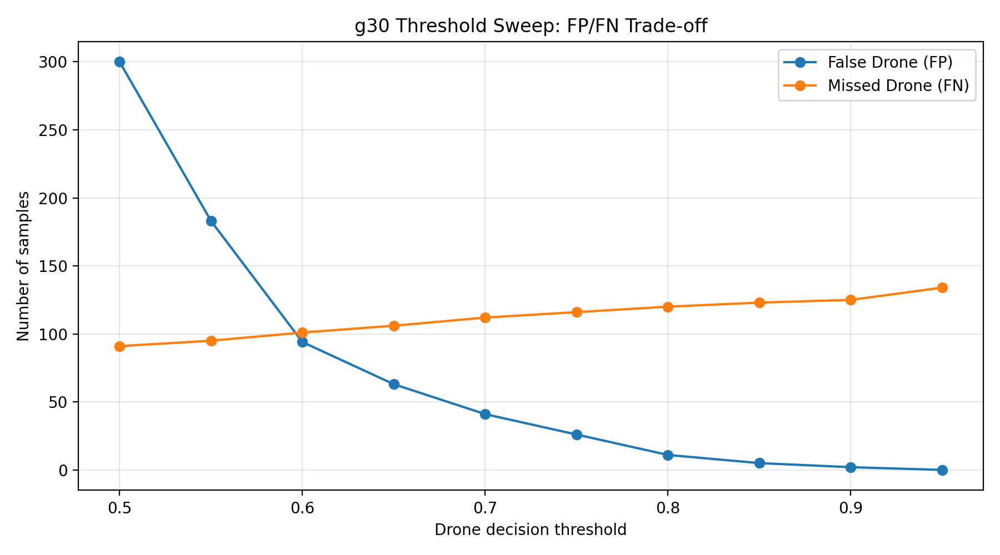
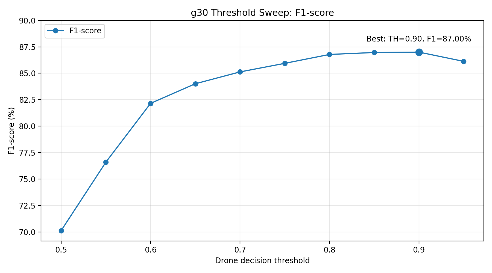
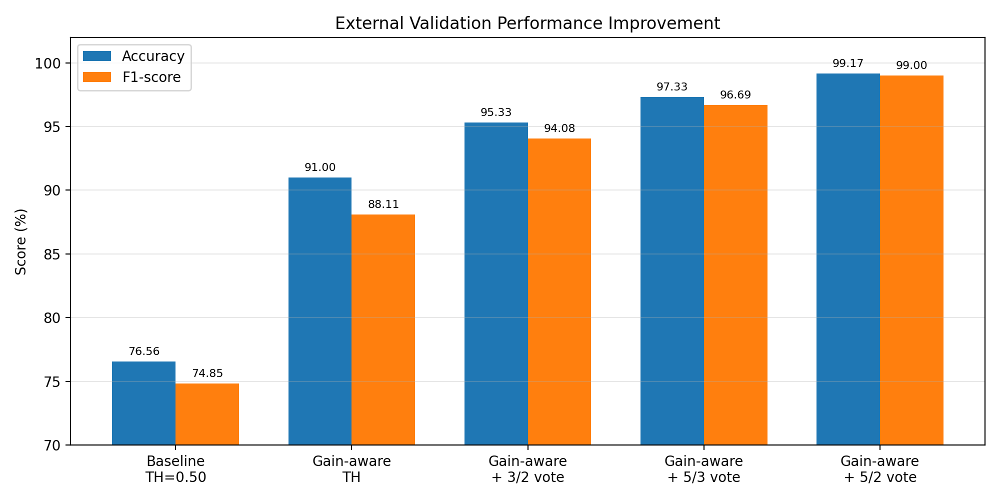
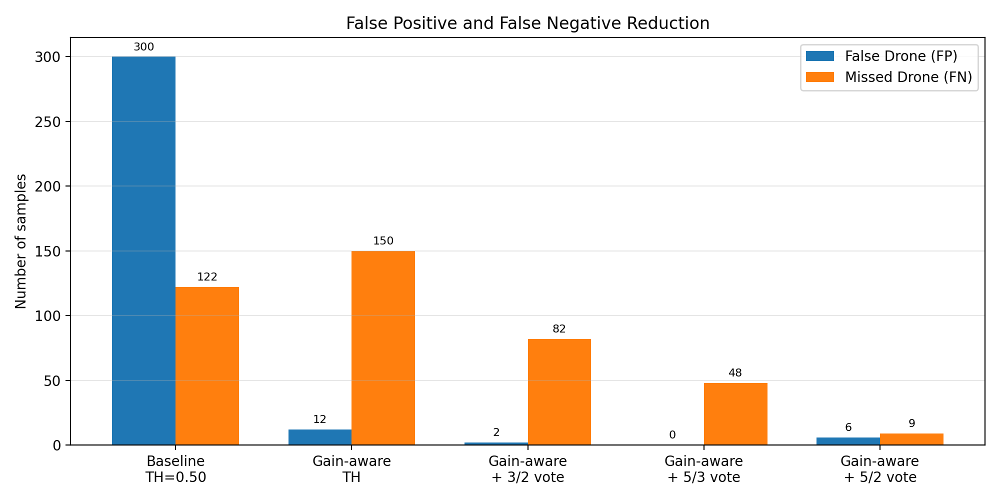

# 2026-05-31 RF Binary CNN 외부 검증 및 Gain-aware Temporal Voting 안정화 실험 보고서

## 1. 실험 목적

본 실험의 목적은 20260530 수집 데이터를 기반으로 학습한 RF binary CNN 모델이 학습에 사용되지 않은 별도 날짜의 RF 데이터에서도 일반화되는지 확인하는 것이다.

기존 내부 테스트에서는 높은 정확도가 확인되었으나, 실제 RF 드론 탐지 시스템은 학습 데이터와 다른 날짜, 다른 수신 gain, 다른 RF 배경 환경에서도 안정적으로 동작해야 한다. 따라서 본 실험에서는 20260528에 수집한 외부 데이터를 이용하여 모델의 일반화 성능을 평가하고, 성능 저하가 발생할 경우 그 원인을 분석하였다.

또한 수신 gain 조건에 따라 CNN confidence threshold를 다르게 적용하는 gain-aware threshold 방식과, 최근 block 판정 결과를 이용하는 temporal voting 방식을 적용하여 외부 환경에서의 탐지 안정성을 개선하고자 하였다.

---

## 2. 실험 데이터 구성

### 2.1 학습 데이터

학습에는 20260530에 수집한 RF binary dataset을 사용하였다.

* Dataset: `data/processed/rf4_binary_20260530_no_controller`
* Manifest: `data/processed/rf4_binary_20260530_no_controller/binary_manifest.csv`
* Class:

  * `Drone`
  * `NonDrone`

학습 데이터는 Drone과 NonDrone을 구분하는 이진 분류 구조로 구성되었다.

### 2.2 외부 검증 데이터

외부 검증에는 학습에 사용하지 않은 20260528 수집 데이터를 사용하였다.

* Dataset: `outputs/datasets/rf_binary_v1_att10_20260528`
* Manifest: `data/processed/external_binary_20260528_manifest.csv`

외부 검증 데이터 구성은 다음과 같다.

| Class    | Samples |
| -------- | ------: |
| Drone    |     750 |
| NonDrone |    1050 |
| Total    |    1800 |

해당 데이터는 학습 manifest에 포함되지 않은 별도 날짜 데이터이므로, 날짜 분리 외부 검증 데이터로 볼 수 있다.

---

## 3. 내부 테스트 결과

20260530 데이터 기반 내부 test 결과는 다음과 같다.

| Metric            |  Result |
| ----------------- | ------: |
| Test Accuracy     |  97.28% |
| Drone Accuracy    |  96.12% |
| NonDrone Accuracy |  98.35% |
| False Drone Rate  |   1.65% |
| Missed Drone Rate |   3.88% |
| F1-score          | 약 97.1% |

혼동행렬은 다음과 같다.

|               | Pred NonDrone | Pred Drone |
| ------------- | ------------: | ---------: |
| True NonDrone |           416 |          7 |
| True Drone    |            15 |        372 |

내부 테스트에서는 모델이 Drone과 NonDrone을 안정적으로 구분하는 것으로 확인되었다. 그러나 내부 테스트는 같은 날짜와 유사한 수집 조건에서 분리된 데이터이므로, 실제 일반화 성능을 판단하기 위해 별도 날짜의 외부 검증이 필요하다.

---

## 4. 기본 Threshold 기반 외부 검증 결과

먼저 모든 샘플에 동일한 Drone decision threshold 0.50을 적용하여 20260528 외부 데이터에 대한 성능을 평가하였다.

| Metric                  |   Result |
| ----------------------- | -------: |
| Accuracy                |   76.56% |
| Drone Accuracy / Recall |   83.73% |
| NonDrone Accuracy       |   71.43% |
| False Drone Rate        |   28.57% |
| Missed Drone Rate       |   16.27% |
| Precision               | 약 67.67% |
| F1-score                | 약 74.85% |

혼동행렬은 다음과 같다.

|               | Pred NonDrone | Pred Drone |
| ------------- | ------------: | ---------: |
| True NonDrone |           750 |        300 |
| True Drone    |           122 |        628 |

내부 테스트 정확도는 97.28%였으나, 외부 검증 정확도는 76.56%로 감소하였다. 특히 NonDrone을 Drone으로 잘못 판단한 False Drone이 300개 발생하였다. 따라서 외부 검증 성능 저하의 주요 원인은 미탐보다는 오탐 증가로 판단된다.

---

## 5. 수신 Gain 조건별 성능 저하 원인 분석

외부 검증 데이터의 성능 저하 원인을 분석하기 위해 수신 gain 조건을 기준으로 g25와 g30 데이터를 분리하여 평가하였다.

| Gain | Accuracy | False Drone Rate | Missed Drone Rate |  TN |  FP | FN |  TP |
| ---- | -------: | ---------------: | ----------------: | --: | --: | -: | --: |
| g25  |   92.25% |            0.00% |            15.50% | 200 |   0 | 31 | 169 |
| g30  |   72.07% |           35.29% |            16.55% | 550 | 300 | 91 | 459 |

분석 결과, g25 조건에서는 False Drone이 발생하지 않았다. 반면 g30 조건에서는 False Drone이 300개 발생하였고, False Drone Rate가 35.29%까지 증가하였다.

이를 통해 외부 검증 성능 저하의 주원인은 낮은 gain에서 드론을 탐지하지 못하는 문제가 아니라, 높은 gain 조건에서 NonDrone 신호가 Drone-like 패턴으로 오인되는 문제임을 확인하였다.

즉, g30 조건에서는 Background, WiFi, Bluetooth 등의 NonDrone 신호가 강하게 수신되면서 CNN이 이를 Drone으로 오탐하는 경향이 나타났다.

---

## 6. g30 Threshold Sweep 분석

g30 조건에서 threshold 변화에 따른 FP/FN trade-off를 분석하였다.



Figure 1은 g30 조건에서 Drone decision threshold를 증가시킬 때 False Drone과 Missed Drone이 어떻게 변하는지 보여준다. Threshold를 0.50에서 0.80 이상으로 높이면 False Drone은 급격히 감소한다. 반면 Missed Drone은 점진적으로 증가한다.

대표 결과는 다음과 같다.

| Threshold |  FP |  FN | F1-score |
| --------: | --: | --: | -------: |
|      0.50 | 300 |  91 |   70.13% |
|      0.60 |  94 | 101 |   82.16% |
|      0.70 |  41 | 112 |   85.13% |
|      0.80 |  11 | 120 |   86.78% |
|      0.85 |   5 | 123 |   86.97% |
|      0.90 |   2 | 125 |   87.00% |
|      0.95 |   0 | 134 |   86.13% |



Figure 2는 threshold 변화에 따른 g30 F1-score를 나타낸다. F1-score는 threshold 0.80~0.90 구간에서 높은 값을 유지하였다. F1-score만 기준으로 보면 0.90이 가장 높았지만, 실시간 탐지에서는 드론 미탐과 반응성을 함께 고려해야 하므로 g30 threshold 0.80도 유효한 후보로 판단하였다.


---

## 7. Gain-aware Threshold 적용

기본 방식에서는 모든 gain 조건에 동일하게 threshold 0.50을 적용하였다. 그러나 g25와 g30에서 confidence 분포와 오탐 특성이 다르게 나타났기 때문에, gain 조건에 따라 threshold를 다르게 적용하는 gain-aware threshold 방식을 도입하였다.

본 실험에서 사용한 실시간 탐지형 threshold 조합은 다음과 같다.

| Gain    | Threshold |
| ------- | --------: |
| g25     |      0.35 |
| g30     |      0.80 |
| default |      0.50 |

Gain-aware threshold 적용 결과는 다음과 같다.

| Metric            | Baseline TH=0.50 | Gain-aware TH |
| ----------------- | ---------------: | ------------: |
| Accuracy          |           76.56% |        91.00% |
| Precision         |         약 67.67% |        98.04% |
| Recall            |           83.73% |        80.00% |
| F1-score          |         약 74.85% |        88.11% |
| False Drone Rate  |           28.57% |         1.14% |
| Missed Drone Rate |           16.27% |        20.00% |
| FP                |              300 |            12 |
| FN                |              122 |           150 |

Gain-aware threshold를 적용한 결과, 외부 검증 정확도는 76.56%에서 91.00%로 향상되었다. 특히 False Drone은 300개에서 12개로 크게 감소하였다.

다만 threshold를 높인 영향으로 Missed Drone은 122개에서 150개로 증가하였다. 따라서 gain-aware threshold는 오탐 억제에는 매우 효과적이지만, 일부 드론 미탐을 증가시키는 trade-off가 존재한다.

---

## 8. Temporal Voting 기반 안정화

실시간 RF 탐지에서는 단일 block 판정만으로 최종 판단을 내릴 경우 순간적인 오탐 또는 미탐이 발생할 수 있다. 이를 보완하기 위해 최근 N개 block의 판정 결과를 이용하는 temporal voting을 적용하였다.

본 실험에서는 gain-aware threshold를 적용한 block별 raw decision에 대해 다음 voting 방식을 비교하였다.

* 최근 3 block 중 2개 이상 Drone
* 최근 5 block 중 3개 이상 Drone
* 최근 5 block 중 2개 이상 Drone

### 8.1 3 block 중 2개 이상 Drone 판정

| Metric            |              Result |
| ----------------- | ------------------: |
| Accuracy          |              95.33% |
| Precision         |              99.70% |
| Recall            |              89.07% |
| F1-score          |              94.08% |
| False Drone Rate  |               0.19% |
| Missed Drone Rate |              10.93% |
| TN / FP / FN / TP | 1048 / 2 / 82 / 668 |

### 8.2 5 block 중 3개 이상 Drone 판정

| Metric            |              Result |
| ----------------- | ------------------: |
| Accuracy          |              97.33% |
| Precision         |             100.00% |
| Recall            |              93.60% |
| F1-score          |              96.69% |
| False Drone Rate  |               0.00% |
| Missed Drone Rate |               6.40% |
| TN / FP / FN / TP | 1050 / 0 / 48 / 702 |

### 8.3 5 block 중 2개 이상 Drone 판정

| Metric            |             Result |
| ----------------- | -----------------: |
| Accuracy          |             99.17% |
| Precision         |             99.20% |
| Recall            |             98.80% |
| F1-score          |             99.00% |
| False Drone Rate  |              0.57% |
| Missed Drone Rate |              1.20% |
| TN / FP / FN / TP | 1044 / 6 / 9 / 741 |

5 block 중 2개 이상 Drone으로 판단하는 방식에서 가장 높은 성능을 얻었다. 이 방식은 False Drone을 6개로 낮게 유지하면서도 Missed Drone을 9개까지 줄였다.

---

## 9. 최종 성능 비교



Figure 3은 기본 threshold, gain-aware threshold, temporal voting 적용에 따른 Accuracy와 F1-score 변화를 보여준다. 기본 threshold 0.50만 사용했을 때 Accuracy는 76.56%, F1-score는 약 74.85%였으나, gain-aware threshold와 temporal voting을 적용하면서 성능이 단계적으로 향상되었다.

최종적으로 gain-aware threshold와 5-block temporal voting을 함께 적용한 방식에서는 Accuracy 99.17%, F1-score 99.00%를 달성하였다.



Figure 4는 False Drone과 Missed Drone의 변화를 보여준다. 기본 threshold에서는 False Drone이 300개 발생했으나, gain-aware threshold 적용 후 12개로 감소하였다. 이후 5 block 중 2개 이상 Drone으로 판단하는 temporal voting을 적용한 결과, False Drone은 6개, Missed Drone은 9개 수준으로 감소하였다.

전체 성능 비교표는 다음과 같다.

| Method                  | Accuracy | Precision | Recall | F1-score |  FP |  FN |
| ----------------------- | -------: | --------: | -----: | -------: | --: | --: |
| Baseline TH=0.50        |   76.56% |  약 67.67% | 83.73% | 약 74.85% | 300 | 122 |
| Gain-aware TH           |   91.00% |    98.04% | 80.00% |   88.11% |  12 | 150 |
| Gain-aware + 3/2 voting |   95.33% |    99.70% | 89.07% |   94.08% |   2 |  82 |
| Gain-aware + 5/3 voting |   97.33% |   100.00% | 93.60% |   96.69% |   0 |  48 |
| Gain-aware + 5/2 voting |   99.17% |    99.20% | 98.80% |   99.00% |   6 |   9 |

이 결과를 통해 gain-aware threshold는 g30 조건에서 발생한 대량의 오탐을 억제하는 데 효과적이며, temporal voting은 단일 block 판정에서 발생하는 순간적인 미탐과 오탐을 안정화하는 데 효과적임을 확인하였다.

---

## 10. 실시간 시스템 적용 방향

본 실험 결과를 바탕으로 향후 live CNN spectrogram viewer에는 decision mode를 추가할 예정이다.

예상 decision mode는 다음과 같다.

| Mode       | Description                                  |
| ---------- | -------------------------------------------- |
| raw        | CNN confidence 기반 단일 block 판정                |
| gain-aware | 수신 gain에 따라 threshold를 다르게 적용                |
| temporal   | 최근 block 판정 결과 기반 voting 적용                  |
| hybrid     | gain-aware threshold와 temporal voting을 함께 적용 |

최종 실시간 판단 로직은 다음과 같이 구성할 수 있다.

1. SDR로부터 RF block 수신
2. STFT spectrogram 생성
3. CNN으로 Drone probability 계산
4. 현재 수신 gain에 따라 threshold 선택

   * g25: 0.35
   * g30: 0.80
   * default: 0.50
5. block 단위 raw decision 생성
6. 최근 5개 block decision 저장
7. 2개 이상 Drone이면 Drone-like Candidate
8. 3개 이상 Drone이면 Confirmed Drone

실시간 viewer에는 다음 정보가 표시되도록 구성할 수 있다.

* CNN Drone probability
* 적용 threshold
* raw decision
* 최근 5 block decision history
* Candidate / Confirmed Drone 상태
* 현재 gain 및 center frequency

---

## 11. 실험 재현 명령어

### 11.1 RF binary CNN 학습

```bash
PYTHONPATH=. python scripts/ml/train_rf_binary_cnn.py \
  --manifest data/processed/rf4_binary_20260530_no_controller/binary_manifest.csv \
  --out-dir outputs/ml/rf4_binary_20260530_no_controller_lr1e3_v2 \
  --epochs 30 \
  --batch-size 32 \
  --lr 0.001 \
  --weight-decay 0.0001 \
  --device auto
```

### 11.2 외부 검증 manifest 생성

```bash
PYTHONPATH=. python scripts/ml/build_external_binary_manifest_20260528.py
```

### 11.3 외부 검증 실행

```bash
PYTHONPATH=. python scripts/ml/eval_external_rf_binary_cnn.py \
  --model outputs/ml/rf4_binary_20260530_no_controller_lr1e3_v2/best_model.pt \
  --manifest data/processed/external_binary_20260528_manifest.csv \
  --device auto
```

### 11.4 조건별 slice manifest 생성

```bash
PYTHONPATH=. python scripts/ml/build_external_binary_slices_20260528.py
```

### 11.5 g30 threshold sweep

```bash
PYTHONPATH=. python scripts/ml/eval_rf_binary_threshold_sweep.py \
  --model outputs/ml/rf4_binary_20260530_no_controller_lr1e3_v2/best_model.pt \
  --manifest data/processed/external_slices_20260528/gain_g30.csv \
  --device auto \
  --out-csv outputs/ml/external_eval_20260528_slices/gain_g30_threshold_sweep.csv
```

### 11.6 gain-aware threshold 평가

```bash
PYTHONPATH=. python scripts/ml/eval_rf_binary_gain_aware_threshold.py \
  --model outputs/ml/rf4_binary_20260530_no_controller_lr1e3_v2/best_model.pt \
  --manifest data/processed/external_binary_20260528_manifest.csv \
  --device auto \
  --th-g25 0.35 \
  --th-g30 0.80
```

### 11.7 temporal voting 평가

```bash
PYTHONPATH=. python scripts/ml/eval_rf_binary_temporal_vote.py \
  --model outputs/ml/rf4_binary_20260530_no_controller_lr1e3_v2/best_model.pt \
  --manifest data/processed/external_binary_20260528_manifest.csv \
  --device auto \
  --th-g25 0.35 \
  --th-g30 0.80 \
  --window 5 \
  --vote-k 2
```

### 11.8 결과 그래프 생성

```bash
PYTHONPATH=. python scripts/ml/plot_external_validation_results.py
```

---

## 12. 한계 및 향후 계획

본 실험에는 다음과 같은 한계가 있다.

첫째, temporal voting 평가는 저장된 외부 검증 데이터의 파일명 순서를 수집 순서로 간주하여 수행한 근사 평가이다. 따라서 실제 실시간 SDR 입력 환경에서는 live viewer에 동일한 sliding window voting 로직을 적용한 뒤 추가 검증이 필요하다.

둘째, 외부 검증 데이터는 20260528 데이터 하나를 기준으로 구성되었다. 모델의 일반화 성능을 더 강하게 입증하기 위해서는 새로운 날짜, 새로운 장소, 다른 거리 조건에서 추가 데이터를 수집하여 검증할 필요가 있다.

셋째, g30 조건에서 NonDrone 오탐이 크게 발생하는 문제가 확인되었다. Gain-aware threshold와 temporal voting으로 이를 크게 완화할 수 있었지만, 근본적인 모델 일반화를 위해서는 g30 조건의 Background, WiFi, Bluetooth 데이터를 추가하여 fine-tuning하는 방법도 고려할 수 있다.

향후 계획은 다음과 같다.

1. `live_cnn_spectrogram_viewer.py`에 decision mode 추가
2. raw / gain-aware / temporal / hybrid 모드 선택 기능 구현
3. 실시간 viewer에서 Candidate / Confirmed Drone 상태 표시
4. 실제 SDR live block 입력 기준 temporal voting 검증
5. 새로운 날짜 및 장소에서 추가 외부 검증 수행
6. 거리 변화 및 안테나 방향 변화에 따른 성능 분석
7. 필요 시 g30 NonDrone 데이터 추가 학습 또는 fine-tuning 수행

---

## 13. 결론

본 실험에서는 20260530 데이터로 학습한 RF binary CNN 모델을 학습에 사용하지 않은 20260528 외부 데이터에 적용하여 일반화 성능을 검증하였다.

기본 threshold 0.50을 사용한 경우 외부 검증 정확도는 76.56%로 감소하였고, 특히 g30 조건에서 NonDrone 신호를 Drone으로 오탐하는 문제가 크게 나타났다. 조건별 분석 결과, g25 조건에서는 False Drone이 발생하지 않았으나 g30 조건에서는 False Drone이 300개 발생하였다. 따라서 외부 성능 저하의 주요 원인은 높은 gain 조건에서 NonDrone 신호가 Drone-like 패턴으로 오인되는 현상으로 판단된다.

이를 개선하기 위해 gain-aware threshold를 적용한 결과, 외부 검증 정확도는 91.00%로 향상되었고 False Drone은 300개에서 12개로 감소하였다. 이후 temporal voting을 적용한 결과, 5 block 중 2개 이상 Drone으로 판단하는 방식에서 Accuracy 99.17%, Precision 99.20%, Recall 98.80%, F1-score 99.00%를 달성하였다.

따라서 본 실험을 통해 RF 드론 탐지 시스템에서 수신 gain 조건을 고려한 threshold 조정과 temporal voting 기반 안정화가 외부 환경에서의 탐지 성능을 크게 향상시킬 수 있음을 확인하였다.
