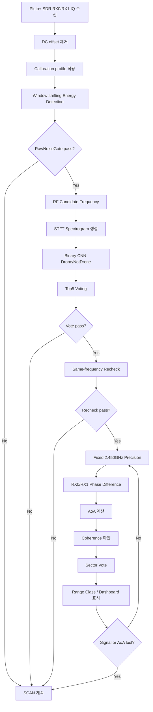

# SDR 기반 비인가 드론 RF 신호 탐지 및 AoA / Sector / Range 추정 시스템

Pluto+ SDR 기반 2.4GHz RF 신호를 이용해 주변 RF activity 중 드론 관련 신호를 탐지하고, 2채널 IQ 데이터의 위상차를 이용해 도래각(AoA, Angle of Arrival), 방향 sector, 그리고 실험적 coarse range class를 함께 제공하는 캡스톤 프로젝트입니다.

본 프로젝트는 고가의 통합 대드론 장비 전체를 구현하는 것이 아니라, 그중 **RF 탐지 계층**에 해당하는 핵심 기능을 저비용 SDR 장비와 소프트웨어 신호처리 파이프라인으로 구현하는 것을 목표로 합니다.

```text
Gain-wise Calibration
→ RawNoiseGate 기반 Clean Scan
→ Candidate Frequency Selection
→ CNN Top5 Vote Verify
→ Same-frequency Immediate Recheck
→ Fixed 2.450GHz Precision Tracking
→ Coherence 기반 AoA 신뢰도 검증
→ Fixed-bin Sector Estimation
→ Sector-specific Coarse Range Indication
→ Signal/AoA Lost Auto-return
→ OpenCV Same-window Runtime Dashboard
```

---

## 1. 프로젝트 개요

본 시스템은 2.4GHz 대역에서 수신되는 RF 신호를 분석하여 드론 조종기 또는 드론 관련 RF activity로 의심되는 신호를 탐지하고, 해당 신호의 방향 정보를 제공하는 RF 기반 탐지 프로토타입입니다.

핵심 목적은 다음과 같습니다.

- Pluto+ SDR을 이용한 2.4GHz RF 신호 수신
- RX0/RX1 2채널 IQ 데이터 기반 위상차 분석
- Gain-wise noise calibration 기반 RawNoiseGate 구축
- Scan mode에서 후보 주파수 탐색
- 후보 주파수에 대한 CNN Top5 vote 검증
- 동일 후보 주파수 immediate recheck를 통한 오탐 억제
- Fixed 2.450GHz precision mode에서 AoA / Sector / Range 추정
- Coherence 기반 AoA 신뢰도 검증
- Fixed-bin sector 기반 방향 안정화
- Sector별 raw feature 기반 coarse range class 표시
- Precision 단계에서 signal/AoA lost 시 scan 자동 복귀
- OpenCV 기반 same-window runtime UI 구현

본 프로젝트는 단순히 “드론 여부”만 출력하는 것이 아니라, 다음 정보를 함께 제공합니다.

```text
- 탐지 여부
- 후보 주파수
- CNN Drone probability
- Top5 CNN vote 상태
- Recheck 결과
- AoA angle
- Locked sector
- Coherence
- Raw P99 / signal strength profile
- Experimental range class
- SCAN / TRACK_AOA / HOLD runtime state
```

---

## 2. 시스템 구성

### 2.1 하드웨어 구성

| 부품 | 역할 |
|---|---|
| Pluto+ SDR | 2채널 IQ 수신 |
| 2.4GHz 안테나 ×2 | RX0/RX1 위상차 기반 AoA 추정 |
| 신호발생기 | Phase/gain calibration 및 각도 검증 |
| 드론 / 조종기 | 실측 RF 데이터 수집 대상 |
| 노트북 | 신호처리, CNN 추론, OpenCV dashboard 실행 |
| 냉각 장치 | 장시간 구동 시 SDR 열 안정성 확보 |
| Python 실행 환경 | 전체 pipeline 구동 및 결과 저장 |

### 2.2 기본 실험 조건

| 항목 | 값 |
|---|---:|
| RF 대역 | 2.4GHz ISM band |
| 기본 precision 중심 주파수 | 2.450GHz |
| Scan 주파수 범위 | 2.435GHz ~ 2.465GHz |
| Scan step | 5MHz |
| Sample rate | 5 MSPS |
| Block size | 16,384 samples |
| Block time | 약 3.28 ms |
| Channel count | 2 channels |
| SDR input | Pluto+ SDR |
| Energy frame size | 1,024 samples |
| Energy hop size | 512 samples |
| STFT input shape | 128 × 509 |
| CNN output | NotDrone / Drone |
| Calibration gain sweep | 20 / 25 / 30 / 35 / 40 dB |
| Viewer update 기본값 | 20 blocks/update |
| Sector voting top-K | 5 blocks |

---

## 3. 전체 Software Runtime Pipeline



최종 runtime은 크게 네 단계로 구성됩니다.

```text
1. Before Runtime
   - Gain-wise noise calibration
   - Gain-wise phase/gain calibration
   - CNN model / YAML config 확인
   - SDR 냉각 및 수신 상태 안정화

2. Clean Scan Mode
   - 설정 주파수 sweep
   - 각 center frequency에서 RawNoiseGate 평가
   - raw gate trigger 후보 수집
   - candidate_top_k 후보 주파수 선정

3. CNN Verify / Recheck
   - 후보 주파수별 decision block 수집
   - raw score 기준 CNN Top5 선정
   - Drone probability threshold 기반 Top5 vote 수행
   - 같은 주파수에서 즉시 recheck 수행
   - first vote와 recheck가 모두 통과해야 handoff 후보로 인정

4. Fixed 2.450GHz Precision Mode
   - scan 후보가 통과하면 fixed 2.450GHz precision dashboard 진입
   - CNN TopK / AoA / sector / range 추정
   - AoA/coherence lost가 연속 누적되면 scan으로 자동 복귀
```

---

## 4. 데이터 Shape 흐름

| 단계 | Shape | 의미 |
|---|---:|---|
| SDR 수신 | `(2, 16384)` | RX0/RX1 2채널 IQ block |
| CNN 채널 선택 | `(16384,)` | RX0 또는 RX1 단일 채널 |
| Energy frame 분할 | `31 frames` | frame size 1024, hop 512 기준 |
| STFT 변환 | `(128, 509)` | frequency bin × time frame |
| CNN 입력 | `(B, 1, 128, 509)` | batch 포함 spectrogram |
| CNN feature 요약 | `(B, 128)` | AdaptiveAvgPool 이후 대표 feature |
| CNN 출력 logits | `(B, 2)` | NotDrone / Drone score |
| Softmax 출력 | `(B, 2)` | NotDrone / Drone probability |
| AoA 입력 | `(2, 16384)` | RX0/RX1 phase difference 계산 |
| Dashboard 출력 | scalar + label | angle, coherence, sector, range class |

> 현재 runtime CNN은 Drone / NotDrone 2-class binary 모델을 사용합니다. 4-class 구조는 발표 및 최종 설명에서 제외합니다.

---

## 5. 핵심 신호처리 공식

이 섹션은 발표 및 보고서에서 “시스템이 어떤 원리로 동작하는지”를 설명하기 위한 최소 공식입니다.

### 5.1 IQ 신호 표현

```text
x[n] = I[n] + jQ[n]
```

- `I[n]`: In-phase 성분
- `Q[n]`: Quadrature 성분
- `x[n]`: 복소 IQ 신호

IQ 신호는 크기뿐 아니라 위상 정보를 포함하므로 CNN 분류와 AoA 방향 추정 모두에 사용할 수 있습니다.

### 5.2 DC Offset 제거

```text
x_dc_removed[n] = x[n] - mean(x[n])
```

수신 하드웨어로 인해 생기는 고정 DC 성분을 제거하여 energy, FFT, phase 계산의 왜곡을 줄입니다.

### 5.3 Window Shifting

```text
x_m[n] = x[n + mH] w[n]
```

- `m`: frame index
- `H`: hop size
- `w[n]`: window function
- `x_m[n]`: m번째 windowed frame

RF 신호는 block 전체에 균일하게 존재하지 않고 burst 형태로 나타날 수 있으므로 window를 이동시키며 frame 단위로 분석합니다.

### 5.4 Frame Energy

```text
E_m = (1/N) Σ |x_m[n]|²
```

각 frame의 평균 전력을 계산하여 해당 구간에 RF 신호가 있는지 판단합니다.

### 5.5 RawNoiseGate Threshold

```text
T_g = NoiseFloor_g × Multiplier_g
```

- `T_g`: gain `g`에서 runtime threshold
- `NoiseFloor_g`: gain `g`에서 noise calibration으로 얻은 noise floor
- `Multiplier_g`: YAML에서 관리하는 threshold multiplier

### 5.6 STFT와 Spectrogram

```text
X(m,k) = Σ x[n + mH] w[n] e^(-j2πkn/N)
S(m,k) = |X(m,k)|²
```

STFT는 window를 이동시키며 각 frame에 FFT를 적용하고, 결과를 시간축 방향으로 쌓아 CNN 입력용 spectrogram을 만듭니다.

### 5.7 CNN Softmax

```text
z = [z_NotDrone, z_Drone]
P(class_i) = exp(z_i) / Σ exp(z_j)
```

CNN은 NotDrone과 Drone에 대한 score를 출력하고, softmax를 통해 확률로 변환합니다.

### 5.8 Cross-correlation 기반 Phase Difference

```text
R_xy = mean(conj(x[n]) · y[n])
Δφ = angle(R_xy)
```

- `x[n]`: RX0 IQ 신호
- `y[n]`: RX1 IQ 신호
- `conj(x[n])`: RX0의 켤레복소수
- `Δφ`: RX0/RX1 사이 phase difference

본 시스템은 일반적인 시간지연 탐색용 `np.correlate()`가 아니라, 복소 IQ의 평균 cross product를 이용해 평균 위상차를 구합니다.

### 5.9 AoA 계산

```text
Δφ = 2πd sin(θ) / λ
θ = sin⁻¹(Δφλ / 2πd)
```

- `d`: 안테나 간격
- `λ`: RF 신호 파장
- `θ`: 신호 도래각, AoA

### 5.10 파장 계산

```text
λ = c / f_c
```

2.45GHz 기준:

```text
λ ≈ 3×10⁸ / 2.45×10⁹ ≈ 0.122 m
```

### 5.11 Coherence

```text
Coherence ≈ |P_xy(f)|² / (P_xx(f) P_yy(f))
```

Coherence는 두 채널의 주파수 성분이 얼마나 안정적인 위상 관계를 갖는지 보는 AoA 신뢰도 지표입니다.

---

## 6. SCAN 모드 정책

SCAN 모드는 드론을 최종 판정하는 단계가 아니라, **정밀검사할 RF 후보 주파수를 빠르게 찾는 단계**입니다.

SCAN 단계에서는 모든 주파수에 대해 STFT, CNN, AoA를 수행하지 않습니다. 먼저 raw IQ energy 기반으로 후보 주파수만 고릅니다.

### 6.1 Frequency Sweep

```text
2.435 GHz → 2.440 GHz → 2.445 GHz → 2.450 GHz → 2.455 GHz → 2.460 GHz → 2.465 GHz
```

설정된 시작 주파수부터 종료 주파수까지 일정 step으로 center frequency를 바꿔가며 sweep합니다.

### 6.2 Retune 후 Discard

주파수를 바꾼 직후에는 SDR 수신 상태가 안정되지 않을 수 있습니다.

```text
주파수 변경
→ 일부 block discard
→ 안정화된 usable block만 분석
```

현재 정책 예시:

```text
blocks_per_freq = 8
discard_blocks_after_tune = 4
usable blocks = 4
```

### 6.3 RawNoiseGate Candidate 선정

각 scan frequency에서 usable block을 수집하고, 각 block에 RawNoiseGate를 적용합니다.

```text
각 주파수에서 usable block 수집
→ RawNoiseGate 적용
→ pass block 개수 확인
→ 기준 이상이면 candidate frequency로 저장
```

현재 정책 예시:

```text
min_raw_gate_pass_count = 1
max_candidates = 5
```

### 6.4 Candidate Verify

SCAN에서 후보가 잡혔다고 바로 precision mode로 가지 않습니다.

```text
candidate frequency
→ decision block 수집
→ raw gate pass block 확인
→ score 높은 대표 block 또는 Top5 block 선택
→ CNN 검증
```

현재 정책 예시:

```text
blocks_per_decision = 10
select_policy = raw_gate_pass_score_max
```

### 6.5 CNN Top5 Voting / Recheck

```text
candidate frequency
→ raw score Top5 block 선택
→ CNN Drone probability 계산
→ Drone probability ≥ 0.90인 block 개수 확인
→ 5개 중 3개 이상이면 1차 통과
→ 같은 주파수에서 recheck
→ recheck도 통과하면 fixed precision 진입
```

현재 정책 예시:

```text
cnn_top_m = 5
cnn_vote_required = 3
cnn_conf_min = 0.90
```

### 6.6 CLI 모드 차이

| CLI | 이름 | 역할 |
|---|---|---|
| `s` | clean scan observe | scan과 CNN Top5 vote 확인, precision 진입 안 함 |
| `sf` | scan fixed handoff | scan과 CNN 검증 통과 시 fixed precision 진입 |
| `f` | fixed precision | scan 없이 2.450GHz 고정 precision 실행 |

---

## 7. Window Shifting Energy Detection과 RawNoiseGate

RF 신호는 block 전체에 균일하게 존재하지 않을 수 있습니다. 특히 드론 조종 신호나 간섭 신호는 짧은 burst 형태로 나타날 수 있습니다.

```text
1 block = 16,384 IQ samples

[ window 1 ]
      [ window 2 ]
            [ window 3 ]
                  [ window 4 ]
                        ...
```

처리 흐름:

```text
IQ block 수신
→ DC offset 제거
→ window 단위 frame 분할
→ 각 frame energy 계산
→ noise threshold와 비교
→ threshold 이상이면 RF candidate
```

RawNoiseGate의 역할은 드론 판별이 아니라, CNN을 돌릴 가치가 있는 RF 후보 block을 빠르게 고르는 것입니다.

| 이유 | 설명 |
|---|---|
| 연산량 감소 | 모든 block에 CNN을 돌리지 않아도 됨 |
| 오탐 감소 | 배경 noise block을 CNN에 넣지 않음 |
| burst 탐지 | 짧게 나타나는 RF 신호를 frame 단위로 포착 |
| 실시간성 확보 | 빠른 1차 필터 역할 |

---

## 8. STFT Spectrogram과 CNN Drone/NotDrone 분류기

CNN은 raw IQ sample을 직접 입력받지 않습니다. 먼저 IQ 신호를 STFT로 변환해 시간-주파수 이미지인 spectrogram을 만듭니다.

```text
IQ signal
→ window 단위로 분할
→ 각 window마다 FFT
→ 시간축 방향으로 쌓음
→ spectrogram 생성
→ 0~1 정규화
→ CNN 입력
```

현재 CNN은 **Drone / NotDrone binary classifier**입니다.

```text
입력: STFT Spectrogram
입력 shape: (B, 1, 128, 509)
출력 shape: (B, 2)
Class 0: NotDrone
Class 1: Drone
```

### 8.1 CNN Layer별 기능

| Layer | 역할 | 설명 |
|---|---|---|
| Conv2D | 지역 패턴 추출 | spectrogram에서 시간-주파수 패턴을 찾음 |
| BatchNorm | 분포 안정화 | feature scale을 안정화 |
| ReLU | 비선형성 추가 | 의미 있는 양의 특징을 통과 |
| MaxPool | 크기 축소 | 강한 특징은 남기고 연산량 감소 |
| AdaptiveAvgPool | 전체 요약 | feature map을 대표값으로 압축 |
| Flatten | 벡터화 | classifier 입력 형태로 변환 |
| Dropout | 과적합 방지 | 특정 패턴 암기 방지 |
| Linear | 최종 분류 | NotDrone / Drone 점수 출력 |
| Softmax | 확률 변환 | 두 class의 확률 계산 |

### 8.2 CNN 판단 방식

```text
STFT spectrogram 입력
→ CNN forward
→ NotDrone score, Drone score 출력
→ Softmax로 확률 변환
→ Drone probability 계산
→ threshold 이상이면 Drone candidate
→ 여러 block voting 조건을 만족하면 confirmed Drone
```

---

## 9. 2채널 안테나, Cross-correlation, AoA, Coherence

### 9.1 2채널 안테나와 위상차

두 안테나 RX0, RX1은 같은 RF 신호를 서로 다른 위치에서 수신합니다. 신호가 어느 방향에서 들어오는지에 따라 두 안테나에 도달하는 경로 길이가 달라지고, 이 경로 차이는 위상 차이로 나타납니다.

```text
정면 입사: RX0와 RX1의 위상차가 작음
측면 입사: RX0와 RX1의 위상차가 커짐
```

### 9.2 Cross-correlation

Cross-correlation은 RX0와 RX1 신호가 얼마나 유사한지, 그리고 두 신호 사이에 어떤 위상 차이가 있는지를 계산하는 방법입니다.

```text
RX0 = x[n]
RX1 = y[n]
R_xy = mean(conj(x[n]) · y[n])
Δφ = angle(R_xy)
```

### 9.3 AoA 계산

```text
RX0/RX1 phase difference 계산
→ 안테나 간격 d와 파장 λ 적용
→ angle θ 계산
→ sector로 변환
```

실제 환경에서는 반사파와 multipath 때문에 위상차가 항상 직접파만 반영하지는 않습니다. 따라서 coherence와 sector vote로 안정성을 보완합니다.

### 9.4 Coherence

Coherence는 두 안테나 신호의 위상 관계가 얼마나 안정적인지 확인하는 지표입니다.

| 구분 | Correlation | Coherence |
|---|---|---|
| 보는 것 | 두 신호의 유사도 | 위상 관계의 안정성 |
| 목적 | 같은 신호를 보는지 확인 | AoA 신뢰도 판단 |
| 낮아지는 경우 | 서로 다른 신호, 약한 신호, 잡음 | multipath, 반사파, 간섭, 위상 불안정 |
| 발표 표현 | “두 신호가 닮았는가” | “각도 계산을 믿어도 되는가” |

---

## 10. Sector Vote와 Range Class

### 10.1 Sector Vote

AoA angle 하나만 바로 사용하면 순간적으로 각도가 튈 수 있습니다. 따라서 여러 block의 angle을 sector로 묶어 voting합니다.

```text
instant angle
→ sector bin 변환
→ 최근 top-K block의 sector vote
→ 가장 많이 나온 sector를 locked sector로 표시
```

7-sector 구조:

| Sector | Angle range | 대표 label |
|---|---:|---:|
| LEFT_60_45 | -60° ~ -45° | -52.5° |
| LEFT_45_30 | -45° ~ -30° | -37.5° |
| LEFT_30_15 | -30° ~ -15° | -22.5° |
| CENTER | -15° ~ +15° | 0° |
| RIGHT_15_30 | +15° ~ +30° | +22.5° |
| RIGHT_30_45 | +30° ~ +45° | +37.5° |
| RIGHT_45_60 | +45° ~ +60° | +52.5° |

### 10.2 Coarse Range Class

Range class는 정확한 거리 회귀값이 아니라, sector별 raw feature 조합을 기반으로 한 **실험적 coarse range indication**입니다.

| Range Class | 의미 | Dashboard 표시 |
|---|---|---|
| WITHIN_9M | 약 9m 이내 | 해당 sector 안쪽 cell 점등 |
| RANGE_9_TO_15M | 약 9m 초과 ~ 15m 이내 | 해당 sector 바깥쪽 cell 점등 |
| SECTOR_ONLY | sector는 신뢰되지만 거리 구간은 불안정 | sector 전체 점등 |

발표/보고서 표현:

```text
정확한 거리 추정기 X
sector-specific coarse range indicator O
```

---

## 11. Calibration

### 11.1 Gain-wise Noise Calibration

Noise calibration은 gain별 background noise profile을 생성하여 runtime에서 신호 검출 기준으로 사용합니다.

```text
gain 20 / 25 / 30 / 35 / 40에서 noise block 수집
→ DC offset 제거
→ EnergyDetector 기준 frame energy 계산
→ gain별 noise_floor / threshold 계산
→ noise_by_gain_latest.json 저장
```

저장 경로:

```text
outputs/calibration/noise_by_gain_latest.json
```

### 11.2 Gain-wise Phase/Gain Calibration

AoA는 RX0/RX1 위상차를 이용하므로, 두 채널 간 고정 위상 오차와 gain mismatch를 보정해야 합니다.

```text
gain 20 / 25 / 30 / 35 / 40에서 calibration block 수집
→ DC offset 제거
→ RX0/RX1 gain mismatch 추정
→ RX1 gain correction 계산
→ RX1-RX0 phase offset 추정
→ coherence-like 품질 지표 계산
→ phase_gain_by_gain_latest.json 저장
```

저장 경로:

```text
outputs/calibration/phase_gain_by_gain_latest.json
```

Runtime에서는 현재 gain에 맞는 phase/gain profile을 조회하여 RX1에 보정합니다.

```python
rx1_gain_corrected = rx1 * gain_correction
rx1_compensated = rx1_gain_corrected * np.exp(-1j * phase_offset_rad)
```

---

## 12. OpenCV Same-window Runtime UI

최종 시연용 UI는 scan과 precision을 별도 창으로 분리하지 않고 같은 OpenCV window name을 사용합니다.

```text
RF Drone Detection Runtime
```

### 12.1 SCAN 상태

```text
- mode: SCAN
- current frequency: sweep 중인 center frequency
- raw gate status: triggered / pass count / score
- candidate list: raw score 기준 후보 주파수
- CNN verify: Top5 Drone vote
- recheck: same-frequency immediate recheck
```

### 12.2 TRACK_AOA / PRECISION 상태

```text
- fixed cf: 2.450GHz
- raw_pass: raw gate pass block 수
- topk: top-K 후보 block 수
- drone: CNN drone 후보 block 수
- instant sector: 현재 update의 sector 판단
- locked sector: 안정화된 sector
- angle median: AoA median
- coherence: AoA 신뢰도
- p99: raw signal strength profile
- range class: experimental coarse range indicator
```

### 12.3 Auto-return 상태

```text
TRACK_AOA
→ hold_no_valid_aoa
→ hold_no_consensus
→ AoA/coherence lost 누적
→ AUTO-RETURN
→ SCAN
```

---

## 13. CLI 실행 구조

최종 실행은 `src.runtime.cli`를 중심으로 수행합니다.

```bash
PYTHONPATH=. python -m src.runtime.cli
```

| 키 | 기능 | 설명 |
|---|---|---|
| `c` | Status | noise / phase calibration profile 존재 여부와 gain별 상태 확인 |
| `n` | Noise calibration | gain별 background noise profile 생성 |
| `p` | Phase/gain calibration | gain별 RX0/RX1 phase offset 및 gain correction 생성 |
| `s` | Clean scan | RawNoiseGate + CNN verify로 후보 탐색만 수행, precision 진입 없음 |
| `sf` | Scan-fixed handoff | scan 후보 검증 후 fixed 2.450GHz precision 진입, lost 시 scan 복귀 |
| `f` | Fixed precision | scan 없이 fixed 2.450GHz AoA/Sector dashboard 직접 실행 |
| `v` | UI demo | Pluto+ 없이 SCAN rail / PRECISION dashboard 화면만 확인 |
| `t` | Terminal loop | 기존 terminal 로그 기반 scan/runtime pipeline 실행 |
| `d` | Dataset capture | CNN 학습용 spectrogram / raw IQ 데이터 수집 |
| `r` | RF4 inference | 특정 주파수에서 RF4 binary CNN 단일 테스트 |
| `q` | Quit | CLI 종료 |

권장 시연 순서:

```text
1. Pluto+ 냉각 상태 확인
2. c : Calibration / pipeline 상태 확인
3. n : 장소, gain, 감쇠기, 냉각 조건이 바뀌었으면 noise calibration
4. p : 안테나, 케이블, RX 포트, gain 조건이 바뀌었으면 phase/gain calibration
5. s : 드론 OFF 상태에서 clean scan observe로 false confirm 여부 확인
6. sf : 최종 시연용 scan-fixed handoff 모드 실행
7. 신호 ON : candidate 검출 → CNN Top5 vote → recheck → fixed precision 진입
8. 신호 OFF : AUTO-RETURN scan 복귀 확인
```

---

## 14. 주요 파일 구조

| 파일 | 역할 |
|---|---|
| `src/runtime/cli.py` | 최종 CLI entrypoint |
| `src/runtime/scan_activity_cnn_runtime.py` | clean scan / sf scan-fixed handoff runtime |
| `src/runtime/fixed2450_precision_runtime.py` | fixed 2.450GHz precision wrapper |
| `scripts/experimental/live_aoa_sector_dashboard.py` | fixed precision AoA/Sector/Range dashboard |
| `src/runtime/raw_noise_gate.py` | RawNoiseGate runtime 평가 |
| `src/scan/scan_policy.py` | scan frequency list 생성 |
| `src/scan/precision_analyzer.py` | candidate 주파수 CNN verify 분석 |
| `src/viewer/opencv_renderer.py` | OpenCV scan renderer 및 창 위치/크기 제어 |
| `src/viewer/sector_range_estimator.py` | sector별 range class 계산 |
| `configs/detect.yaml` | RawNoiseGate / candidate verify 설정 |
| `configs/ml.yaml` | CNN model / threshold / temporal voting 설정 |
| `configs/aoa.yaml` | AoA geometry / coherence / smoothing 설정 |
| `configs/aoa_sector.yaml` | sector bin / sector voting 설정 |
| `configs/ui.yaml` | OpenCV viewer / dashboard 설정 |

---

## 15. 주요 출력 파일

| 파일 또는 폴더 | 목적 |
|---|---|
| `outputs/calibration/noise_by_gain_latest.json` | gain-wise noise profile |
| `outputs/calibration/phase_gain_by_gain_latest.json` | gain-wise phase/gain profile |
| `outputs/runs/latest/scan_events.json` | 최신 scan event 결과 |
| `outputs/runs/latest/scan_events_cycle_*.json` | scan cycle별 event log |
| `outputs/runs/latest/scan_precision/` | candidate verify artifact |
| `outputs/aoa_sector_profiles/*.csv` | sector / distance profile capture 결과 |
| `outputs/sector_range_profiles/*.json` | sector별 coarse range profile |
| `outputs/runs/latest/opencv_scan_precision/` | OpenCV runtime precision artifact |

---

## 16. 현재 검증 결과 요약

### 16.1 2026-06-06 Sector capture 검증

```text
1. trusted-only capture 기능이 정상 동작하였다.
2. true_angle_deg 라벨이 CSV에 저장되었다.
3. sector name을 범위 기반으로 바꾸어 결과 해석이 명확해졌다.
4. 오른쪽 방향에서는 CENTER → RIGHT_15_30 → RIGHT_30_45 → RIGHT_45_60로 자연스럽게 이동하였다.
5. 왼쪽 큰 각도에서는 LEFT_60_45 / LEFT_45_30 sector가 안정적으로 나타났다.
6. median_coherence는 대부분 0.997~1.000 수준으로 높게 유지되었다.
```

### 16.2 2026-06-07 Range dashboard / CSV replay 검증

```text
1. sector profile CSV 기반으로 WITHIN_9M / RANGE_9_TO_15M profile JSON을 생성하였다.
2. SectorRangeEstimator를 통해 sector별 feature 조합 기반 range class를 계산하였다.
3. 거리 구분이 불안정한 경우 SECTOR_ONLY로 처리하여 방향 정보는 유지하도록 하였다.
4. fan_v2 dashboard에서 sector grid와 range cell을 같은 polygon 좌표계로 그려 칸에 맞는 점등을 구현하였다.
5. CSV replay dashboard를 통해 저장된 distance_m / true_angle_deg 원본 라벨과 추정 결과를 동시에 확인할 수 있게 하였다.
```

### 16.3 2026-06-08 SCAN + PRECISION UI 검증

```text
1. CLI에서 v 입력 시 Pluto+ 없는 UI demo 실행 확인
2. SCAN rail 주파수 목록 자동 표시 확인
3. SCAN 상태에서 marker 이동 확인
4. PRECISION 상태에서 marker lock 확인
5. SCAN rail 초록색 활성화 / 회색 비활성화 전환 확인
6. 기존 precision 부채꼴 dashboard 유지 확인
7. OpenCV 창에서 q 또는 ESC 입력 시 CLI 복귀 확인
8. CLI에서 s 입력 시 실제 runtime 진입 구조 연결
```

### 16.4 2026-06-11 Scan-fixed 안정화 / Same-window 검증

```text
1. sf 모드에서 scan → fixed 2.450GHz precision handoff 흐름을 확인하였다.
2. precision 단계에서 signal/AoA lost가 누적되면 AUTO-RETURN으로 scan 복귀하는 구조를 확인하였다.
3. scan과 precision의 OpenCV window name을 RF Drone Detection Runtime으로 통일하였다.
4. sf handoff 시 scan renderer를 닫지 않도록 처리하였다.
5. auto-return 시 fixed precision renderer를 닫지 않도록 guard를 추가하였다.
6. scan 창의 위치와 크기를 조정하여 화면 구석 또는 하단에서 잘리는 문제를 완화하였다.
7. SDR 냉각은 false positive 감소에 효과가 있으나, 장시간 구동 시에는 오탐이 다시 증가할 수 있음을 확인하였다.
8. 장시간 운용 안정성 확보를 위해 향후 receiver watchdog과 handoff 조건 강화가 필요하다.
```

---

## 17. 현재 한계

### 17.1 CNN 데이터 일반화 한계

드론 신호는 2.450GHz뿐 아니라 2.460GHz, 2.465GHz에서도 관측될 수 있습니다. 따라서 다양한 center frequency, gain, 거리, 방향 조건에서 드론 spectrogram을 추가 수집하여 CNN 일반화 성능을 보강해야 합니다.

### 17.2 Threshold 안정화 필요

현재 기본 scan verify 정책은 다음과 같습니다.

```text
cnn_conf_min = 0.90
cnn_vote_required = 3
cnn_top_m = 5
recheck = enabled
```

향후 발표용 안정성을 더 높이고 싶다면 다음 조건을 검토할 수 있습니다.

```text
first vote >= 4/5
recheck vote >= 4/5
scan_cf == 2.450GHz 또는 허용 tolerance 이내
```

### 17.3 Range class는 experimental 기능

현재 range class는 정확한 거리 추정기가 아닙니다. gain 35, 2.45GHz 조건에서 수집한 sector profile CSV를 기반으로 한 실험적 coarse range indicator입니다.

### 17.4 장시간 운용 안정성 한계

SDR 냉각은 false positive 감소에 도움이 되지만, 장시간 구동 시에는 내부 상태 누적, thermal drift, spur, RF front-end 상태 변화 등으로 인해 오탐이 다시 증가할 수 있습니다.

보완 방향:

```text
- SDR 직접 냉각 유지
- 시연 전 calibration 재확인
- 일정 시간마다 receiver reset 또는 reconnect
- warm-up block discard
- sf handoff 조건 보수화
```

### 17.5 Same-window는 완전한 단일 상태머신은 아님

현재 same-window 개선은 scan runtime과 fixed precision runtime이 같은 OpenCV window name을 사용하고, handoff 및 auto-return 상황에서 window close를 skip하는 방식입니다. 향후에는 scan runtime 내부에 precision branch를 포함하여 다음 구조로 발전시킬 수 있습니다.

```text
SCAN → TRACK_AOA → SIGNAL_HOLD / AOA_HOLD → SCAN
```

---

## 18. 프로젝트 의의

본 프로젝트는 단순한 CNN 분류기 또는 단순 RF energy detector가 아니라, 다음 요소를 하나의 runtime pipeline으로 통합했다는 점에서 의의가 있습니다.

```text
1. SDR 기반 RF 수신
2. Gain-wise noise calibration
3. RawNoiseGate 기반 scan candidate 탐색
4. CNN Top5 vote 기반 후보 검증
5. Same-frequency immediate recheck 기반 오탐 억제
6. Fixed 2.450GHz precision AoA 추적
7. RX0/RX1 위상차 기반 AoA 추정
8. Coherence 기반 신뢰도 검증
9. Fixed-bin sector consensus
10. Sector-specific coarse range indication
11. Signal/AoA lost auto-return
12. OpenCV same-window runtime dashboard
```

특히 최종 OpenCV UI는 시스템이 단순히 한 주파수만 분석하는 것이 아니라, 먼저 주파수 sweep을 통해 후보를 찾고, 후보가 통과하면 fixed 2.450GHz precision 단계에서 AoA/Sector/Range를 추적한다는 점을 직관적으로 보여줍니다.

---

## 19. Future Work

### 19.1 CNN 데이터 보강

```text
1. 2.450GHz 드론 데이터 추가
2. 2.460GHz 드론 데이터 추가
3. 2.465GHz 드론 데이터 추가
4. gain 30 / 35 / 40 조건별 데이터 수집
5. background / Wi-Fi / Bluetooth negative 데이터 보강
6. 장시간 구동 후 SDR 열화 상태 negative 데이터 보강
```

### 19.2 Sector / Range 일반화 검증

```text
1. Leave-one-file-out 검증
2. Leave-one-angle-out 검증
3. 새로운 실험일 CSV replay
4. gain별 profile 분리
5. center frequency별 profile 분리
```

### 19.3 Receiver Watchdog

장시간 구동 시 SDR 상태가 누적적으로 흔들릴 수 있으므로, 다음 watchdog 구조를 검토합니다.

```text
scan runtime 일정 시간 초과
→ receiver close
→ 2~5초 대기
→ receiver reopen
→ retune
→ warm-up block discard
→ scan 재개
```

### 19.4 완전한 단일 상태머신 구조

```text
mode = SCAN
while running:
    if mode == SCAN:
        sweep + raw gate + CNN Top5 verify + recheck
        if confirmed:
            retune fixed 2.450GHz
            mode = TRACK_AOA
    elif mode == TRACK_AOA:
        fixed 2.450GHz precision step
        if signal/AoA lost:
            mode = SCAN
```

### 19.5 임베디드 배포를 위한 CNN 입력 해상도 최적화

현재 CNN 입력은 STFT spectrogram 기준 `128 × 509` 크기를 사용합니다.

```text
128 × 509 = 65,152 pixels
64 × 509 = 32,576 pixels
```

입력 해상도를 줄이면 convolution 연산량이 감소할 수 있으나, 분류 성능이 유지되는지 반드시 재학습과 검증을 통해 확인해야 합니다.

---

## 20. 결론

현재 시스템은 다음 구조까지 구현되었습니다.

```text
Gain-wise calibration
→ RawNoiseGate clean scan candidate
→ Candidate Top-K selection
→ CNN Top5 vote verify
→ Same-frequency immediate recheck
→ Fixed 2.450GHz precision tracking
→ Coherence-based AoA validation
→ Fixed-bin sector estimation
→ Sector-specific coarse range indication
→ Signal/AoA lost auto-return
→ Same-window OpenCV runtime dashboard
```

프로젝트는 단순 RF 탐지 단계를 넘어, 드론 관련 RF activity에 대해 **탐지 여부, 후보 주파수, CNN confidence, AoA angle, locked sector, coherence, raw strength profile, experimental range class, runtime state**를 함께 제공하는 RF 탐지/AoA 검증 시스템으로 발전했습니다.

다만 range class는 아직 일반화 검증 전 단계이므로, 현재는 gain 35 / 2.45GHz 조건에서의 experimental coarse range indicator로 제한하여 사용합니다. 또한 장시간 구동 시 Pluto+ SDR의 온도 및 내부 상태 변화로 인해 false positive가 증가할 수 있으므로, 최종 시연에서는 SDR 냉각, calibration 확인, auto-return 유지가 필수적입니다.
