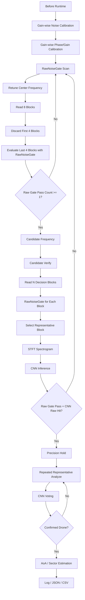

# SDR 기반 비인가 드론 RF 신호 탐지 및 AoA / Sector 추정 모듈

Pluto+ SDR 기반 2.4GHz RF 신호를 이용해 Wi-Fi / Bluetooth / Background와 구분되는 **드론 관련 RF activity**를 탐지하고, 2채널 IQ 데이터의 위상차를 이용해 도래각(AoA, Angle of Arrival) 및 방향 sector를 추정하는 캡스톤 프로젝트입니다.

본 프로젝트는 고가의 통합 대드론 장비 전체를 구현하는 것이 아니라, 그중 **RF 탐지 계층**에 해당하는 핵심 기능을 저비용 SDR 장비와 소프트웨어 신호처리 파이프라인으로 구현하는 것을 목표로 합니다.

현재 주 실행 흐름은 **CLI 기반 scan/runtime pipeline**입니다. Live viewer와 sector/capture viewer는 RF 패턴 확인, gain profile 저장, CNN/AoA 디버깅, sector profile 수집을 위한 보조 실험 도구로 사용합니다.

```text
사전 준비
Gain-wise Noise Calibration
→ Gain-wise Phase/Gain Calibration
→ 필요 시 Drone / NotDrone CNN dataset 보강

본 실행
CLI RawNoiseGate Scan
→ Candidate Frequency
→ Representative Block Candidate Verify
→ CNN Raw Hit / Temporal Voting
→ Precision Hold
→ Coherence Check
→ AoA / Sector Estimation
→ Result Logging

보조 실험
OpenCV Live Viewer
→ Fixed-Bin Sector Viewer
→ Trusted-only Capture Viewer
→ Sector/Distance Profile CSV
```

---

## 1. 프로젝트 목표

2.4GHz 대역 RF 신호를 수신하여 드론 운용과 관련된 RF activity를 탐지하고, 수신 신호의 방향 정보를 함께 제공하는 RF 기반 탐지 프로토타입을 구현합니다.

주요 목표는 다음과 같습니다.

- Pluto+ SDR을 이용한 2.4GHz RF 신호 수신
- RX0/RX1 2채널 IQ 데이터 처리
- Gain-wise noise calibration 기반 raw noise gate 구축
- RawNoiseGate 기반 scan 후보 주파수 탐색
- 후보 주파수에서 representative block 기반 CNN 정밀 판정
- CNN temporal voting 및 precision hold 구조 구현
- Coherence 기반 AoA 신뢰도 검증
- RX0/RX1 위상차 기반 AoA 추정
- Gain-wise phase/gain calibration profile 기반 RX1 보상
- Fixed-bin sector consensus 기반 방향 안정화
- Trusted-only sector profile 자동 수집
- OpenCV viewer를 통한 RF pattern / CNN / AoA / Sector 디버깅
- 향후 Raspberry Pi 등 엣지 장치 배포 가능성 검토

---

## 2. 하드웨어 구성

| 부품 | 역할 |
|---|---|
| Pluto+ SDR | 2채널 IQ 수신 |
| 2.4GHz 안테나 ×2 | RX0/RX1 위상차 기반 AoA 추정 |
| 신호발생기 | AoA phase/gain calibration 및 각도 검증 |
| 노트북 | 신호처리, CNN 추론, CLI runtime / viewer 실행 |
| 드론 / 조종기 | 실측 RF 데이터 수집 대상 |
| Python 실행 환경 | 전체 pipeline 실행 및 결과 저장 |

---

## 3. 현재 기본 처리 단위

| 항목 | 값 |
|---|---:|
| Sample rate | 5 MSPS |
| 기본 center frequency | 2.45 GHz 실험 중심 |
| Block size | 16,384 samples |
| Block time | 약 3.28 ms |
| Channel count | 2 channels |
| SDR input | Pluto+ SDR |
| Calibration gain sweep | 20 / 25 / 30 / 35 / 40 dB |
| Viewer update 기본값 | 20 blocks/update |
| Sector top-K 기본값 | 5 blocks |

---

## 4. Runtime Pipeline 개요

현재 pipeline은 다음 네 단계로 구성됩니다.

```text
1. Before Runtime
   gain-wise noise calibration
   gain-wise phase/gain calibration

2. Scan Mode
   RawNoiseGate 기반 후보 주파수 탐색

3. Candidate Verify / Precision Mode
   후보 주파수에서 representative block 기반 CNN 판정

4. Precision Hold / AoA Mode
   CNN raw hit 또는 voting 기반 hold 진입
   confirmed 상태에서 AoA / sector 추정
```



---

## 5. Calibration

### 5.1 Gain-wise Noise Calibration

Noise calibration은 gain별 noise profile을 생성하여 JSON으로 저장하고, runtime에서 현재 gain에 맞는 profile을 조회하는 방식으로 수행합니다.

```text
gain 20 / 25 / 30 / 35 / 40에서 noise block 수집
→ DC offset 제거
→ EnergyDetector 기준 frame energy 계산
→ gain별 noise_floor / threshold 계산
→ noise_by_gain_latest.json 저장
```

기본 저장 경로:

```text
outputs/calibration/noise_by_gain_latest.json
```

Runtime에서는 JSON의 `noise_floor`와 `configs/detect.yaml`의 `threshold_multiplier`를 사용합니다.

```text
runtime_threshold = noise_floor * threshold_multiplier
```

### 5.2 Gain-wise Phase/Gain Calibration

RX0/RX1은 같은 정면 0도 신호를 받아도 SDR 내부 경로, 케이블 길이, 안테나 배치 차이 때문에 상대 gain과 phase offset이 달라질 수 있습니다.

따라서 각 gain에서 직접 phase/gain calibration을 수행하여 gain별 calibration profile을 JSON으로 저장합니다.

```text
gain 20 / 25 / 30 / 35 / 40에서 calibration block 수집
→ DC offset 제거
→ RX0/RX1 gain mismatch 추정
→ RX1 gain correction 계산
→ RX1-RX0 phase offset 추정
→ coherence-like 품질 지표 계산
→ phase_gain_by_gain_latest.json 저장
```

기본 저장 경로:

```text
outputs/calibration/phase_gain_by_gain_latest.json
```

Runtime에서는 현재 gain에 맞는 보정값을 조회하여 RX1에 적용합니다.

```python
rx1_gain_corrected = rx1 * gain_correction
rx1_compensated = rx1_gain_corrected * np.exp(-1j * phase_offset_rad)
```

---

## 6. RawNoiseGate

RawNoiseGate는 정규화된 spectrogram이 아니라 **DC 제거 후 raw IQ energy**를 기반으로 신호 존재 여부를 판단합니다.

역할:

```text
1. Scan 단계에서 후보 주파수 탐색
2. CNN 입력 전 background block 차단
3. Candidate verify에서 representative block 선택 기준 제공
4. Sector viewer에서 top-K 후보 선택 기준 제공
```

핵심 설정:

```yaml
raw_noise_gate:
  enabled: true
  noise_profile_path: outputs/calibration/noise_by_gain_latest.json
  detector_method: time_power
  frame_size: 1024
  hop_size: 512
  allow_nearest_gain: true
  use_profile_threshold: false
  threshold_source: noise_floor_times_yaml_multiplier
  threshold_multiplier: 5.0
  min_detection_ratio: 0.05
  block_cnn_on_fail: true
  reset_cnn_history_on_fail: true
  block_aoa_on_fail: true
```

---

## 7. Scan Mode

Scan mode는 2.4GHz 대역을 sweep하면서 RF 신호가 있는 후보 주파수를 찾는 단계입니다. 이 단계에서는 CNN이나 AoA를 수행하지 않습니다.

현재 scan 후보 생성은 RawNoiseGate 기반입니다.

```text
각 center frequency로 retune
→ 8 block read
→ 앞 4 block discard
→ 뒤 4 block RawNoiseGate 평가
→ usable 4 block 중 1개 이상 통과 시 candidate 저장
```

설정:

```yaml
scan_candidate:
  enabled: true
  blocks_per_freq: 8
  discard_blocks_after_tune: 4
  min_raw_gate_pass_count: 1
  max_candidates: 5
```

---

## 8. Candidate Verify / Precision Mode

Candidate verify는 scan에서 올라온 후보 주파수에 대해 CNN을 이용해 드론 관련 RF activity인지 확인하는 단계입니다.

현재 구조는 live OpenCV viewer에서 검증된 representative block 방식을 사용합니다.

```text
후보 주파수 진입
→ N개 decision block read
→ 각 block RawNoiseGate 평가
→ raw gate pass block 중 score_max가 가장 큰 block 선택
→ selected block 하나만 STFT/CNN 수행
→ CNN voting 1회 업데이트
```

설정:

```yaml
candidate_verify:
  enabled: true
  representative_selection: true
  blocks_per_decision: 20
  select_policy: raw_gate_pass_score_max
  block_cnn_on_raw_gate_fail: true
  reset_temporal_on_raw_gate_fail: false
```

---

## 9. Precision Hold 진입 정책

Representative 방식에서는 `analyze()` 1회가 CNN vote 1개만 만든다. 따라서 entry screening 단계에서 `confirmed=True`를 요구하면 hold에 거의 진입하지 못한다.

현재는 다음 조건으로 hold 진입을 허용합니다.

```text
raw_gate_passed == True
and drone_probability >= entry_probability_threshold
```

설정:

```yaml
precision_hold:
  entry_screening:
    enabled: true
    precision_blocks: 5
    require_confirmed: false
    allow_candidate: false
    accept_raw_drone_hit: true
    entry_probability_threshold: 0.35
    require_raw_gate_passed: true
    reject_not_drone: true
```

현재 `entry_probability_threshold: 0.35`는 개발 단계용 값입니다. 2.460 / 2.465 GHz 드론 positive 데이터를 보강한 뒤 0.65~0.80으로 상향할 수 있습니다.

---

## 10. AoA / Sector Estimation

AoA는 RX0/RX1 위상차 기반으로 계산합니다. 단일 angle만 바로 믿지 않고, 실험 viewer에서는 여러 후보 block의 AoA를 sector vote로 묶어 안정화합니다.

```text
20 blocks/update
→ raw gate pass block 중 top-K 선택
→ top-K CNN raw 판정
→ Drone 후보 block만 AoA 후보로 사용
→ valid AoA 후보 sector vote
→ trusted consensus 발생 시 locked sector 갱신
```

현재 fixed-bin 7-sector 구조는 다음과 같습니다.

| Sector | Range | 대표 label |
|---|---:|---:|
| LEFT_60_45 | -60° ~ -45° | -52.5° |
| LEFT_45_30 | -45° ~ -30° | -37.5° |
| LEFT_30_15 | -30° ~ -15° | -22.5° |
| CENTER | -15° ~ +15° | 0° |
| RIGHT_15_30 | +15° ~ +30° | +22.5° |
| RIGHT_30_45 | +30° ~ +45° | +37.5° |
| RIGHT_45_60 | +45° ~ +60° | +52.5° |

---

## 11. Viewer 종류

### 11.1 기존 Live RF Viewer

기존 live viewer는 RF pattern / CNN / AoA 디버깅용입니다.

```bash
PYTHONPATH=. python scripts/live_rf_viewer_drone_aoa.py --mode full
```

### 11.2 Sector Experiment Viewer

Fixed-bin sector stabilizer 검증용 viewer입니다.

```bash
PYTHONPATH=. python scripts/experimental/live_aoa_sector_experiment.py --gain 35
```

### 11.3 Sector Capture Viewer

거리별·각도별 profile 수집을 위한 viewer입니다.

```bash
PYTHONPATH=. python scripts/experimental/live_aoa_sector_experiment_capture.py   --gain 35   --distance-m 6   --true-angle-deg 0   --capture-trusted-n 30   --memo "sector_profile_g35"
```

키 조작:

| 키 | 기능 |
|---|---|
| `1` / `2` | distance_m 감소 / 증가 |
| `0` | distance_m 리셋 |
| `a` / `d` | true_angle_deg 감소 / 증가 |
| `c` | true_angle_deg 리셋 |
| `s` | trusted row 자동 수집 시작 |
| `x` | capture 취소 |
| `,` / `.` | phase offset live delta -1° / +1° |
| `m` | phase offset live delta 리셋 |

---

## 12. 실행 방법

### 12.1 Runtime CLI 실행

```bash
PYTHONPATH=. python -m src.runtime.cli
```

메뉴에서:

```text
s
```

흐름:

```text
status 확인
→ scan/runtime pipeline start
→ RawNoiseGate scan
→ candidate verify
→ precision hold
→ AoA/logging
```

### 12.2 Sector profile 수집

```bash
PYTHONPATH=. python scripts/experimental/live_aoa_sector_experiment_capture.py   --gain 35   --distance-m 3   --true-angle-deg 0   --capture-trusted-n 30   --memo "CENTER_3m_g35"
```

저장 경로:

```text
outputs/aoa_sector_profiles/
```

최근 저장 파일 확인:

```bash
ls -lt outputs/aoa_sector_profiles | head
```

---

## 13. 현재 실험 결과 요약

2026-06-06 sector capture 실험에서 다음을 확인했습니다.

```text
1. trusted-only capture 기능이 정상 동작하였다.
2. true_angle_deg 5도 단위 라벨이 CSV에 저장되었다.
3. sector name을 범위 기반으로 바꾸어 결과 해석이 명확해졌다.
4. 오른쪽 방향에서는 실제 각도 증가에 따라 CENTER → RIGHT_15_30 → RIGHT_30_45 → RIGHT_45_60로 자연스럽게 이동하였다.
5. 왼쪽 큰 각도에서는 LEFT_60_45 / LEFT_45_30 sector가 안정적으로 나타났다.
6. median_coherence는 대부분 0.997~1.000 수준으로 높게 유지되었다.
```

주의 사항:

```text
- true_angle_deg는 사람이 직접 입력하는 정답 라벨이므로 capture 전에 화면의 [LABEL] angle 값을 반드시 확인해야 한다.
- 15도, 30도, 45도는 sector 경계에 해당하므로 검증 각도로는 애매할 수 있다.
- 추천 대표 각도는 -55, -40, -25, 0, +25, +40, +55이다.
- 거리 profile은 모든 5도 각도를 반복하지 말고 -25, 0, +25 중심으로 우선 수집한다.
```

---

## 14. 주요 출력 파일

| 파일 | 목적 |
|---|---|
| `outputs/calibration/noise_by_gain_latest.json` | gain-wise noise profile |
| `outputs/calibration/phase_gain_by_gain_latest.json` | gain-wise phase/gain profile |
| `outputs/runs/latest/scan_events.json` | 최신 scan event 결과 |
| `outputs/runs/latest/scan_events_cycle_*.json` | scan cycle별 event log |
| `outputs/runs/latest/scan_precision/` | candidate verify artifacts |
| `outputs/aoa_sector_profiles/*.csv` | sector/distance profile capture result |

---

## 15. 현재 한계와 다음 작업

### 15.1 CNN 학습 데이터 한계

실제 viewer 확인 결과, 드론 신호는 2.450 GHz뿐 아니라 2.460 GHz, 2.465 GHz에서도 관측되었다. 해당 대역의 드론 spectrogram을 학습 데이터에 계속 보강해야 한다.

### 15.2 Threshold 안정화

현재 개발값:

```text
entry_probability_threshold: 0.35
```

데이터 보강 후 목표:

```text
0.65 ~ 0.80 범위에서 재튜닝
```

### 15.3 Representative selector 공통화

현재는 안정화 우선으로 viewer와 precision analyzer 내부에 유사 로직을 각각 두었다. 안정화 후 다음 모듈로 분리한다.

```text
src/runtime/representative_block_selector.py
```

### 15.4 Sector별 거리 profile 구축

다음 우선순위:

```text
1. -25, 0, +25도에서 3m, 6m, 9m, 12m, 15m profile 수집
2. sector별 median_raw_p99 table 생성
3. near / mid / far 수준의 rough range estimation 구현
```

---

## 16. 결론

현재 pipeline은 다음 구조까지 구현되었다.

```text
Gain-wise calibration
→ RawNoiseGate scan candidate
→ Representative block candidate verify
→ CNN raw hit entry screening
→ Precision hold voting
→ AoA / fixed-bin sector estimation
→ Trusted-only sector profile capture
```

프로젝트는 단순히 RF 신호를 탐지하는 단계를 넘어, 드론 RF activity에 대해 **탐지 여부, 후보 주파수, 방향 sector, angle median, coherence, raw strength profile**을 함께 제공하는 실험용 RF 탐지/AoA 검증 시스템으로 발전하였다.
