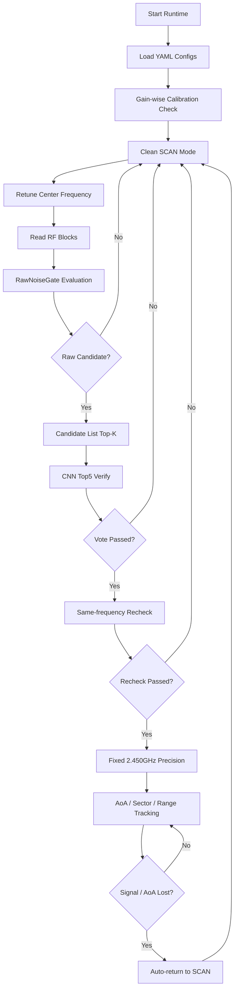

# SDR 기반 비인가 드론 RF 신호 탐지 및 AoA / Sector / Range 추정 시스템

Pluto+ SDR 기반 2.4GHz RF 신호를 이용해 주변 RF activity 중 드론 관련 신호를 탐지하고, 2채널 IQ 데이터의 위상차를 이용해 도래각(AoA, Angle of Arrival), 방향 sector, 그리고 실험적 coarse range class를 함께 제공하는 캡스톤 프로젝트입니다.

본 프로젝트는 고가의 통합 대드론 장비 전체를 구현하는 것이 아니라, 그중 **RF 탐지 계층**에 해당하는 핵심 기능을 저비용 SDR 장비와 소프트웨어 신호처리 파이프라인으로 구현하는 것을 목표로 합니다.

최종 시스템은 다음 흐름을 갖습니다.

```text
Gain-wise Calibration
→ RawNoiseGate 기반 Clean Scan
→ Candidate Frequency Selection
→ CNN Top5 Vote Verify
→ Same-frequency Immediate Recheck
→ Fixed 2.450GHz Precision Tracking
→ Coherence 기반 AoA 신뢰도 검증
→ Fixed-bin Sector Estimation
→ Sector-specific Coarse Range Indication
→ Signal/AoA Lost Auto-return
→ OpenCV Same-window Runtime Dashboard
```

---

## 1. 프로젝트 개요

본 시스템은 2.4GHz 대역에서 수신되는 RF 신호를 분석하여 드론 조종기 또는 드론 관련 RF activity로 의심되는 신호를 탐지하고, 해당 신호의 방향 정보를 제공하는 RF 기반 탐지 프로토타입입니다.

핵심 목적은 다음과 같습니다.

- Pluto+ SDR을 이용한 2.4GHz RF 신호 수신
- RX0/RX1 2채널 IQ 데이터 기반 위상차 분석
- Gain-wise noise calibration 기반 RawNoiseGate 구축
- Scan mode에서 후보 주파수 탐색
- 후보 주파수에 대한 CNN Top5 vote 검증
- 동일 후보 주파수 immediate recheck를 통한 오탐 억제
- Fixed 2.450GHz precision mode에서 AoA / Sector / Range 추정
- Coherence 기반 AoA 신뢰도 검증
- Fixed-bin sector 기반 방향 안정화
- Sector별 raw feature 기반 coarse range class 표시
- Precision 단계에서 signal/AoA lost 시 scan 자동 복귀
- OpenCV 기반 same-window runtime UI 구현
- 향후 Raspberry Pi 등 엣지 장치 배포 가능성 검토

본 프로젝트는 단순히 “드론 여부”만 출력하는 것이 아니라, 다음 정보를 함께 제공합니다.

```text
- 탐지 여부
- 후보 주파수
- CNN Drone probability
- Top5 CNN vote 상태
- Recheck 결과
- AoA angle
- Locked sector
- Coherence
- Raw P99 / signal strength profile
- Experimental range class
- SCAN / TRACK_AOA / HOLD runtime state
```

---

## 2. 시스템 구성

### 2.1 하드웨어 구성

| 부품 | 역할 |
|---|---|
| Pluto+ SDR | 2채널 IQ 수신 |
| 2.4GHz 안테나 ×2 | RX0/RX1 위상차 기반 AoA 추정 |
| 신호발생기 | Phase/gain calibration 및 각도 검증 |
| 드론 / 조종기 | 실측 RF 데이터 수집 대상 |
| 노트북 | 신호처리, CNN 추론, OpenCV dashboard 실행 |
| 냉각 장치 | 장시간 구동 시 SDR 열 안정성 확보 |
| Python 실행 환경 | 전체 pipeline 구동 및 결과 저장 |

### 2.2 기본 실험 조건

| 항목 | 값 |
|---|---:|
| RF 대역 | 2.4GHz ISM band |
| 기본 precision 중심 주파수 | 2.450GHz |
| Scan 주파수 범위 | 2.435GHz ~ 2.465GHz |
| Scan step | 5MHz |
| Sample rate | 5 MSPS |
| Block size | 16,384 samples |
| Block time | 약 3.28 ms |
| Channel count | 2 channels |
| SDR input | Pluto+ SDR |
| Calibration gain sweep | 20 / 25 / 30 / 35 / 40 dB |
| Viewer update 기본값 | 20 blocks/update |
| Sector voting top-K | 5 blocks |

---

## 3. 최종 Runtime 구조

최종 runtime은 크게 네 단계로 구성됩니다.

```text
1. Before Runtime
   - Gain-wise noise calibration
   - Gain-wise phase/gain calibration
   - CNN model / YAML config 확인
   - SDR 냉각 및 수신 상태 안정화

2. Clean Scan Mode
   - configs/scan.yaml 기반 주파수 sweep
   - 각 center frequency에서 RawNoiseGate 평가
   - raw gate trigger 후보 수집
   - candidate_top_k 후보 주파수 선정

3. CNN Verify / Recheck
   - 후보 주파수별 verify_blocks 수집
   - raw score 기준 상위 CNN Top5 선정
   - Drone probability threshold 기반 Top5 vote 수행
   - 같은 주파수에서 즉시 recheck 수행
   - first vote와 recheck가 모두 통과해야 handoff 후보로 인정

4. Fixed 2.450GHz Precision Mode
   - scan 후보가 통과하면 fixed 2.450GHz precision dashboard 진입
   - CNN TopK / AoA / sector / range 추정
   - AoA/coherence lost가 연속 누적되면 scan으로 자동 복귀
```

### 3.1 전체 흐름



---

## 4. CLI 실행 구조

최종 실행은 `src.runtime.cli`를 중심으로 수행합니다.

```bash
PYTHONPATH=. python -m src.runtime.cli
```

CLI 메뉴 및 운용 모드는 다음과 같습니다.

```text
[c] status        : calibration / pipeline 현재 상태창
[n] noise         : gain-wise noise calibration
[p] phase         : gain-wise phase/gain calibration
[s] scan          : clean scan observe only
[sf] scan-fixed   : clean scan → fixed 2.450GHz precision handoff
[f] fixed         : fixed 2.450GHz precision dashboard 직접 실행
[v] view/demo     : Pluto 없이 OpenCV UI demo 구동
[t] terminal-loop : 기존 terminal scan/runtime pipeline 구동
[d] dataset       : CNN dataset capture
[r] rf4           : RF4 single block inference
[q] quit/shutdown : receiver close 후 종료
```

### 4.1 주요 명령 설명

| 키 | 기능 | 설명 |
|---|---|---|
| `c` | Status | noise / phase calibration profile 존재 여부와 gain별 상태 확인 |
| `n` | Noise calibration | gain별 background noise profile 생성 |
| `p` | Phase/gain calibration | gain별 RX0/RX1 phase offset 및 gain correction 생성 |
| `s` | Clean scan | RawNoiseGate + CNN verify로 후보 탐색만 수행, precision 진입 없음 |
| `sf` | Scan-fixed handoff | scan 후보 검증 후 fixed 2.450GHz precision 진입, lost 시 scan 복귀 |
| `f` | Fixed precision | scan 없이 fixed 2.450GHz AoA/Sector dashboard 직접 실행 |
| `v` | UI demo | Pluto+ 없이 SCAN rail / PRECISION dashboard 화면만 확인 |
| `t` | Terminal loop | 기존 terminal 로그 기반 scan/runtime pipeline 실행 |
| `d` | Dataset capture | CNN 학습용 spectrogram / raw IQ 데이터 수집 |
| `r` | RF4 inference | 특정 주파수에서 RF4 binary CNN 단일 테스트 |
| `q` | Quit | CLI 종료 |

### 4.2 권장 실행 순서

현장 실험 또는 최종 시연 전에는 다음 순서로 진행합니다.

```text
1. Pluto+ 냉각 상태 확인
   장시간 구동 시 SDR 열화로 false positive가 증가할 수 있으므로 팬 또는 직접 냉각 권장

2. c
   Calibration / pipeline 상태 확인

3. n
   장소, gain, 감쇠기, 냉각 조건이 바뀌었으면 noise calibration 수행

4. p
   안테나, 케이블, RX 포트, gain 조건이 바뀌었으면 phase/gain calibration 수행

5. s
   드론 OFF 상태에서 clean scan observe로 false confirm 여부 확인

6. sf
   최종 시연용 scan-fixed handoff 모드 실행

7. f
   필요 시 fixed 2.450GHz AoA/Sector dashboard 단독 확인
```

---

## 5. OpenCV Same-window Runtime UI

최종 시연용 UI는 scan과 precision을 별도 창으로 분리하지 않고, 같은 OpenCV window name을 사용하여 하나의 runtime 화면처럼 보이도록 구성합니다.

공통 창 이름은 다음과 같습니다.

```text
RF Drone Detection Runtime
```

### 5.1 SCAN 상태

SCAN mode에서는 현재 sweep 중인 주파수와 후보 검증 상태를 표시합니다.

```text
SCAN Mode
- mode             : SCAN
- current frequency: sweep 중인 center frequency
- raw gate status  : triggered / pass count / score
- candidate list   : raw score 기준 후보 주파수
- CNN verify       : Top5 Drone vote
- recheck          : same-frequency immediate recheck
```

### 5.2 TRACK_AOA / PRECISION 상태

후보 주파수가 CNN verify와 recheck를 통과하면 fixed 2.450GHz precision dashboard로 전환됩니다.

```text
TRACK_AOA / PRECISION Mode
- fixed cf         : 2.450GHz
- raw_pass         : raw gate pass block 수
- topk             : top-K 후보 block 수
- drone            : CNN drone 후보 block 수
- instant sector   : 현재 update의 sector 판단
- locked sector    : 안정화된 sector
- angle median     : AoA median
- coherence        : AoA 신뢰도
- p99              : raw signal strength profile
- range class      : experimental coarse range indicator
```

### 5.3 Auto-return 상태

precision 단계에서 신호 또는 AoA consensus가 사라지면 hold 상태가 누적됩니다. AoA/coherence lost가 설정 횟수 이상 누적되면 scan 모드로 복귀합니다.

```text
TRACK_AOA
→ hold_no_valid_aoa
→ hold_no_consensus
→ AoA/coherence lost 누적
→ AUTO-RETURN
→ SCAN
```

### 5.4 Same-window 개선 내용

현재 구조는 내부적으로 scan runtime과 fixed precision runtime이 완전히 하나의 while-loop로 통합된 것은 아닙니다. 그러나 다음 처리로 사용자가 보기에는 같은 창에서 scan과 precision이 이어지는 것처럼 보이도록 개선하였습니다.

```text
src/runtime/scan_activity_cnn_runtime.py
- scan renderer window_name을 RF Drone Detection Runtime으로 통일
- sf handoff 시 scan renderer.close()를 호출하지 않도록 조건부 처리
- fixed precision 진입 시 RF_SF_KEEP_WINDOW 환경변수 전달

scripts/experimental/live_aoa_sector_dashboard.py
- fixed precision renderer window_name을 RF Drone Detection Runtime으로 통일
- auto-return 시 renderer.close()를 skip하도록 guard 추가
- SystemExit(20) 기반 auto-return 상황을 감지하여 창 유지

src/viewer/opencv_renderer.py
- scan OpenCV 창 위치 및 크기 조정
- 화면 구석 또는 하단에 창이 열려 일부 내용이 잘리는 문제 완화
```

향후에는 scan runtime 내부에 precision branch를 직접 포함하여 다음과 같은 완전 단일 상태머신 구조로 발전시킬 수 있습니다.

```text
SCAN → TRACK_AOA → SIGNAL_HOLD / AOA_HOLD → SCAN
```

---

## 6. Calibration

### 6.1 Gain-wise Noise Calibration

Noise calibration은 gain별 background noise profile을 생성하여 runtime에서 신호 검출 기준으로 사용합니다.

```text
gain 20 / 25 / 30 / 35 / 40에서 noise block 수집
→ DC offset 제거
→ EnergyDetector 기준 frame energy 계산
→ gain별 noise_floor / threshold 계산
→ noise_by_gain_latest.json 저장
```

저장 경로:

```text
outputs/calibration/noise_by_gain_latest.json
```

Runtime threshold는 다음 방식으로 계산합니다.

```text
runtime_threshold = noise_floor * threshold_multiplier
```

Noise calibration은 다음 목적을 가집니다.

```text
1. scan mode에서 후보 주파수 탐색 기준 제공
2. background block이 CNN에 들어가는 것을 방지
3. gain별 raw signal strength 기준 통일
4. saturation / raw safety 상태 확인
```

### 6.2 Gain-wise Phase/Gain Calibration

AoA는 RX0/RX1 위상차를 이용하므로, 두 채널 간 고정 위상 오차와 gain mismatch를 보정해야 합니다.

```text
gain 20 / 25 / 30 / 35 / 40에서 calibration block 수집
→ DC offset 제거
→ RX0/RX1 gain mismatch 추정
→ RX1 gain correction 계산
→ RX1-RX0 phase offset 추정
→ coherence-like 품질 지표 계산
→ phase_gain_by_gain_latest.json 저장
```

저장 경로:

```text
outputs/calibration/phase_gain_by_gain_latest.json
```

Runtime에서는 현재 gain에 맞는 phase/gain profile을 조회하여 RX1에 보정합니다.

```python
rx1_gain_corrected = rx1 * gain_correction
rx1_compensated = rx1_gain_corrected * np.exp(-1j * phase_offset_rad)
```

### 6.3 냉각 및 감쇠기 조건

장시간 구동 시 Pluto+ SDR의 온도 상승 또는 RF front-end 상태 변화로 false positive가 증가할 수 있습니다. 실험 중 직접 냉각을 적용하면 오탐 빈도가 줄어드는 경향을 확인하였으나, 냉각만으로 장시간 안정성을 완전히 보장하지는 못했습니다.

따라서 다음 조건이 바뀌면 calibration을 다시 수행하는 것이 좋습니다.

```text
- 실험 장소
- SDR 냉각 조건
- 감쇠기 삽입 여부
- 안테나 위치
- 케이블 / 포트 변경
- gain 변경
```

---

## 7. RawNoiseGate

RawNoiseGate는 정규화된 spectrogram이 아니라 **DC 제거 후 raw IQ energy**를 기반으로 신호 존재 여부를 판단하는 1차 gate입니다.

역할은 다음과 같습니다.

```text
1. Scan 단계에서 후보 주파수 탐색
2. CNN 입력 전 background block 차단
3. Candidate verify에서 Top5 block 선택 기준 제공
4. Sector viewer에서 top-K 후보 block 선택 기준 제공
5. Raw P99 / frame power 등 range feature 계산의 기반 제공
```

핵심 설정 예시는 다음과 같습니다.

```yaml
raw_noise_gate:
  enabled: true
  noise_profile_path: outputs/calibration/noise_by_gain_latest.json
  detector_method: time_power
  frame_size: 1024
  hop_size: 512
  allow_nearest_gain: true
  threshold_source: noise_floor_times_yaml_multiplier
  threshold_multiplier: 5.0
  min_detection_ratio: 0.05
  block_cnn_on_fail: true
  block_aoa_on_fail: true
```

RawNoiseGate는 “RF energy가 존재하는가”를 판단하는 단계이며, 드론 여부를 단독으로 결정하지 않습니다. 드론 여부는 CNN verify 및 recheck를 통해 판단합니다.

---

## 8. Clean Scan Mode

Clean scan mode는 2.4GHz 대역을 sweep하면서 RF activity 후보를 찾는 단계입니다.

현재 scan frequency list는 다음과 같습니다.

```text
2.435 GHz
2.440 GHz
2.445 GHz
2.450 GHz
2.455 GHz
2.460 GHz
2.465 GHz
```

현재 scan 후보 생성 방식은 다음과 같습니다.

```text
각 center frequency로 retune
→ RF block read
→ RawNoiseGate 평가
→ usable block 중 1개 이상 통과 시 raw candidate로 저장
→ raw score 기준 candidate_top_k 선정
```

Clean scan mode의 핵심은 raw gate만으로 precision에 진입하지 않는다는 점입니다. Raw candidate는 반드시 CNN Top5 verify와 same-frequency recheck를 통과해야 handoff 후보가 됩니다.

---

## 9. CNN Top5 Verify / Immediate Recheck

Candidate verify는 scan mode에서 올라온 후보 주파수에 대해 CNN을 이용해 드론 관련 RF activity인지 정밀 확인하는 단계입니다.

현재 구조는 다음과 같습니다.

```text
후보 주파수 진입
→ verify_blocks 수집
→ 각 block RawNoiseGate score 계산
→ raw score 기준 상위 CNN Top5 선정
→ CNN Drone probability 계산
→ prob >= cnn_conf_min인 Drone block을 vote로 계산
→ votes >= cnn_vote_required이면 1차 통과
→ 같은 주파수에서 verify_blocks를 다시 수집하여 즉시 recheck
→ recheck도 통과해야 최종 handoff 후보 인정
```

현재 기본 정책은 다음과 같습니다.

```text
cnn_top_m        : 5
cnn_vote_required: 3
cnn_conf_min     : 0.90
```

즉, Top5 중 Drone probability가 0.90 이상인 block이 3개 이상이면 1차 통과이며, 같은 조건을 recheck에서도 다시 만족해야 합니다.

이 구조를 사용하는 이유는 다음과 같습니다.

```text
1. RawNoiseGate만으로는 Wi-Fi, Bluetooth, spur, thermal artifact를 구분할 수 없음
2. CNN 단일 block 결과는 순간 오탐에 취약함
3. Top5 vote는 burst성 드론 신호를 더 안정적으로 반영함
4. Same-frequency recheck는 일시적 false positive를 줄임
5. 장시간 구동 시 SDR 상태 변화로 인한 false handoff를 일부 억제함
```

---

## 10. CNN Inference / Temporal Voting

CNN branch는 STFT spectrogram을 입력으로 받아 Drone / NotDrone을 판정합니다.

기본 흐름은 다음과 같습니다.

```text
selected IQ block
→ DC offset removal
→ STFT spectrogram
→ 128 × 509 input
→ binary CNN inference
→ Drone probability
→ Top5 vote 또는 temporal history update
```

단일 block CNN 결과만으로 Drone 확정을 내리지 않고, scan 단계에서는 Top5 vote + recheck를 사용하고, precision 단계에서는 TopK 후보 및 sector consensus와 함께 판단합니다.

이 방식은 순간적인 오탐이나 약한 background block에 의한 흔들림을 줄이기 위한 것입니다.

---

## 11. Fixed 2.450GHz Precision / Auto-return

`sf` 모드에서 scan 후보가 최종 통과하면, 시스템은 후보 주파수 자체를 계속 추적하는 대신 fixed 2.450GHz precision dashboard로 진입합니다. 이는 현재 실험에서 드론 조종기 신호의 중심 운용 주파수를 2.450GHz로 두고 AoA / Sector / Range를 안정적으로 검증하기 위한 정책입니다.

Precision 단계에서는 다음 정보를 반복적으로 계산합니다.

```text
20 blocks/update
→ RawNoiseGate pass count
→ TopK block 선택
→ CNN drone block count
→ AoA candidate 생성
→ Sector consensus 판단
→ locked sector 갱신
→ range class 계산
```

precision 단계에서 신호 또는 AoA consensus가 사라지면 다음 상태가 나타납니다.

```text
hold_no_valid_aoa
hold_no_consensus
```

이 상태가 연속적으로 누적되면 `[AUTO-RETURN]`을 발생시키고 scan으로 복귀합니다.

기본 복귀 정책은 다음과 같습니다.

```text
RF_SF_LOST_LIMIT      : 5
RF_SF_WARMUP_UPDATES  : 5
RF_SF_MIN_DRONE       : 2
RF_SF_MIN_COH         : 0.85
```

즉, precision 진입 직후 warmup 구간을 제외하고, AoA/coherence 상태가 안정적으로 유지되지 않으면 lost count가 누적됩니다. lost count가 5회에 도달하면 scan으로 복귀합니다.

---

## 12. AoA / Sector Estimation

AoA는 RX0/RX1 위상차를 이용해 계산합니다.

기본 식은 다음 개념을 따릅니다.

```text
phase difference
→ wavelength
→ antenna spacing
→ arcsin relation
→ AoA angle
```

단일 angle은 멀티패스나 순간 위상 흔들림에 민감하므로, 실험 viewer에서는 top-K 후보 block의 AoA를 sector vote로 묶어 안정화합니다.

```text
20 blocks/update
→ raw gate pass block 중 top-K 선택
→ top-K CNN raw 판정
→ Drone 후보 block만 AoA 후보로 사용
→ valid AoA 후보 sector vote
→ trusted consensus 발생 시 locked sector 갱신
```

### 12.1 Fixed-bin 7-sector

현재 내부 sector 구조는 다음과 같습니다.

| Sector | Angle range | 대표 label |
|---|---:|---:|
| LEFT_60_45 | -60° ~ -45° | -52.5° |
| LEFT_45_30 | -45° ~ -30° | -37.5° |
| LEFT_30_15 | -30° ~ -15° | -22.5° |
| CENTER | -15° ~ +15° | 0° |
| RIGHT_15_30 | +15° ~ +30° | +22.5° |
| RIGHT_30_45 | +30° ~ +45° | +37.5° |
| RIGHT_45_60 | +45° ~ +60° | +52.5° |

### 12.2 Dashboard 5-sector 표시

Dashboard의 거리 구간 표시는 7-sector를 5-sector로 단순화하여 표시합니다.

| 5-sector | 대응 7-sector | Range |
|---|---|---:|
| LEFT_OUTER | LEFT_60_45 + LEFT_45_30 | -60° ~ -30° |
| LEFT_INNER | LEFT_30_15 | -30° ~ -15° |
| CENTER | CENTER | -15° ~ +15° |
| RIGHT_INNER | RIGHT_15_30 | +15° ~ +30° |
| RIGHT_OUTER | RIGHT_30_45 + RIGHT_45_60 | +30° ~ +60° |

---

## 13. Coarse Range Class

본 프로젝트의 range 출력은 정확한 거리값 회귀가 아니라, sector별 raw feature 조합을 기반으로 한 **실험적 coarse range indication**입니다.

현재 range class는 다음과 같습니다.

| Range Class | 의미 | Dashboard 표시 |
|---|---|---|
| WITHIN_9M | 약 9m 이내 | 해당 sector 안쪽 cell 점등 |
| RANGE_9_TO_15M | 약 9m 초과 ~ 15m 이내 | 해당 sector 바깥쪽 cell 점등 |
| SECTOR_ONLY | sector는 신뢰되지만 거리 구간은 불안정 | sector 전체 점등 |

현재 range profile은 gain 35, center frequency 2.45GHz 조건의 sector profile CSV를 기반으로 생성한 experimental profile입니다. 따라서 다른 gain, 다른 center frequency, 다른 안테나 배치에서는 별도 profile 생성과 재검증이 필요합니다.

현재 생성된 profile의 sector별 feature는 다음과 같습니다.

| 5-sector | Feature | Reliability | 비고 |
|---|---|---|---|
| LEFT_OUTER | median_raw_p99 | HIGH | 단일 p99 기반 |
| LEFT_INNER | frame_power_p99 + ratio_framepower_to_rms2 | HIGH | power + ratio |
| CENTER | frame_power_p99 | MID | 단일 fp99 기반 |
| RIGHT_INNER | median_raw_p99 + ratio_p99_to_mean | HIGH | p99 + ratio |
| RIGHT_OUTER | raw_abs_mean + raw_abs_p99 + ratio_framepower_to_rms2 | HIGH | 3-feature 조합 |

---

## 14. 주요 실행 방법

### 14.1 Runtime CLI 실행

```bash
PYTHONPATH=. python -m src.runtime.cli
```

### 14.2 Clean scan observe only

CLI에서 다음 키를 입력합니다.

```text
s
```

동작 흐름:

```text
configs/scan.yaml 로드
→ scan frequency list 생성
→ RawNoiseGate candidate 탐색
→ CNN Top5 verify
→ recheck 확인
→ precision 진입 없이 scan 반복
```

### 14.3 Scan-fixed handoff mode

CLI에서 다음 키를 입력합니다.

```text
sf
```

동작 흐름:

```text
scan frequency sweep
→ candidate_top_k 선정
→ CNN Top5 vote
→ same-frequency recheck
→ fixed 2.450GHz precision dashboard 진입
→ AoA / Sector / Range 표시
→ signal/AoA lost 시 scan 복귀
```

### 14.4 Fixed 2.450GHz precision only

CLI에서 다음 키를 입력합니다.

```text
f
```

`f` 모드는 scan 없이 fixed 2.450GHz precision dashboard를 직접 실행합니다. AoA / Sector / Range 검증을 단독으로 수행할 때 사용합니다.

### 14.5 Pluto+ 없는 UI demo

```text
v
```

`v` 모드는 실제 SDR, CNN, AoA 계산 없이 UI 동작만 확인하는 모드입니다.

### 14.6 기존 terminal scan loop

```text
t
```

OpenCV 없이 기존 terminal 로그 기반으로 scan/runtime pipeline을 확인하는 디버깅 모드입니다.

### 14.7 Sector profile 수집

```bash
PYTHONPATH=. python scripts/experimental/live_aoa_sector_experiment_capture.py   --gain 35   --distance-m 6   --true-angle-deg 0   --capture-trusted-n 30   --memo "sector_profile_g35"
```

### 14.8 Sector range profile 생성

```bash
PYTHONPATH=. python scripts/experimental/build_sector_range_profile.py
```

출력 예시:

```text
outputs/sector_range_profiles/gain35_cf2450000000_nearfar_profile.json
```

### 14.9 CSV replay dashboard

```bash
PYTHONPATH=. python scripts/experimental/replay_sector_profile_dashboard.py   --fps 2   --only-trusted
```

---

## 15. 주요 파일 구조

### 15.1 Runtime

| 파일 | 역할 |
|---|---|
| `src/runtime/cli.py` | 최종 CLI entrypoint |
| `src/runtime/scan_activity_cnn_runtime.py` | clean scan / sf scan-fixed handoff runtime |
| `src/runtime/fixed2450_precision_runtime.py` | fixed 2.450GHz precision wrapper |
| `scripts/experimental/live_aoa_sector_dashboard.py` | fixed precision AoA/Sector/Range dashboard |
| `src/runtime/raw_noise_gate.py` | RawNoiseGate runtime 평가 |
| `src/scan/scan_policy.py` | scan frequency list 생성 |
| `src/scan/precision_analyzer.py` | candidate 주파수 CNN verify 분석 |
| `src/runtime/opencv_scan_precision_runtime.py` | legacy OpenCV scan-precision runtime |

### 15.2 Viewer / Dashboard

| 파일 | 역할 |
|---|---|
| `src/viewer/opencv_renderer.py` | OpenCV scan renderer 및 창 위치/크기 제어 |
| `src/viewer/scan_rail.py` | OpenCV 왼쪽 SCAN rail 렌더링 |
| `scripts/experimental/test_scan_precision_rail_demo.py` | Pluto+ 없는 UI demo |
| `scripts/experimental/live_aoa_sector_dashboard.py` | 부채꼴 sector/range dashboard |
| `src/viewer/sector_range_estimator.py` | sector별 range class 계산 |

### 15.3 Calibration / Config

| 파일 | 역할 |
|---|---|
| `configs/receiver.yaml` | SDR / receiver 설정 |
| `configs/scan.yaml` | scan range / precision hold 설정 |
| `configs/detect.yaml` | RawNoiseGate / candidate verify 설정 |
| `configs/ml.yaml` | CNN model / threshold / temporal voting 설정 |
| `configs/aoa.yaml` | AoA geometry / coherence / smoothing 설정 |
| `configs/aoa_sector.yaml` | sector bin / sector voting 설정 |
| `configs/ui.yaml` | OpenCV viewer / dashboard 설정 |

---

## 16. 주요 출력 파일

| 파일 또는 폴더 | 목적 |
|---|---|
| `outputs/calibration/noise_by_gain_latest.json` | gain-wise noise profile |
| `outputs/calibration/phase_gain_by_gain_latest.json` | gain-wise phase/gain profile |
| `outputs/runs/latest/scan_events.json` | 최신 scan event 결과 |
| `outputs/runs/latest/scan_events_cycle_*.json` | scan cycle별 event log |
| `outputs/runs/latest/scan_precision/` | candidate verify artifact |
| `outputs/aoa_sector_profiles/*.csv` | sector / distance profile capture 결과 |
| `outputs/sector_range_profiles/*.json` | sector별 coarse range profile |
| `outputs/runs/latest/opencv_scan_precision/` | OpenCV runtime precision artifact |

---

## 17. 현재 검증 결과

### 17.1 2026-06-06 Sector capture 검증

```text
1. trusted-only capture 기능이 정상 동작하였다.
2. true_angle_deg 라벨이 CSV에 저장되었다.
3. sector name을 범위 기반으로 바꾸어 결과 해석이 명확해졌다.
4. 오른쪽 방향에서는 CENTER → RIGHT_15_30 → RIGHT_30_45 → RIGHT_45_60로 자연스럽게 이동하였다.
5. 왼쪽 큰 각도에서는 LEFT_60_45 / LEFT_45_30 sector가 안정적으로 나타났다.
6. median_coherence는 대부분 0.997~1.000 수준으로 높게 유지되었다.
```

### 17.2 2026-06-07 Range dashboard / CSV replay 검증

```text
1. sector profile CSV 기반으로 WITHIN_9M / RANGE_9_TO_15M profile JSON을 생성하였다.
2. SectorRangeEstimator를 통해 sector별 feature 조합 기반 range class를 계산하였다.
3. 거리 구분이 불안정한 경우 SECTOR_ONLY로 처리하여 방향 정보는 유지하도록 하였다.
4. fan_v2 dashboard에서 sector grid와 range cell을 같은 polygon 좌표계로 그려 칸에 맞는 점등을 구현하였다.
5. CSV replay dashboard를 통해 저장된 distance_m / true_angle_deg 원본 라벨과 추정 결과를 동시에 확인할 수 있게 하였다.
```

### 17.3 2026-06-08 SCAN + PRECISION UI 검증

```text
1. CLI에서 v 입력 시 Pluto+ 없는 UI demo 실행 확인
2. SCAN rail 주파수 목록 자동 표시 확인
3. SCAN 상태에서 marker 이동 확인
4. PRECISION 상태에서 marker lock 확인
5. SCAN rail 초록색 활성화 / 회색 비활성화 전환 확인
6. 기존 precision 부채꼴 dashboard 유지 확인
7. OpenCV 창에서 q 또는 ESC 입력 시 CLI 복귀 확인
8. CLI에서 s 입력 시 실제 runtime 진입 구조 연결
```

### 17.4 2026-06-11 Scan-fixed 안정화 / Same-window 검증

```text
1. sf 모드에서 scan → fixed 2.450GHz precision handoff 흐름을 확인하였다.
2. precision 단계에서 signal/AoA lost가 누적되면 AUTO-RETURN으로 scan 복귀하는 구조를 확인하였다.
3. scan과 precision의 OpenCV window name을 RF Drone Detection Runtime으로 통일하였다.
4. sf handoff 시 scan renderer를 닫지 않도록 처리하였다.
5. auto-return 시 fixed precision renderer를 닫지 않도록 guard를 추가하였다.
6. scan 창의 위치와 크기를 조정하여 화면 구석 또는 하단에서 잘리는 문제를 완화하였다.
7. SDR 냉각은 false positive 감소에 효과가 있으나, 장시간 구동 시에는 오탐이 다시 증가할 수 있음을 확인하였다.
8. 장시간 운용 안정성 확보를 위해 향후 receiver watchdog과 handoff 조건 강화가 필요하다.
```

---

## 18. 현재 한계

### 18.1 CNN 데이터 일반화 한계

드론 신호는 2.450GHz뿐 아니라 2.460GHz, 2.465GHz에서도 관측될 수 있습니다. 따라서 다양한 center frequency, gain, 거리, 방향 조건에서 드론 spectrogram을 추가 수집하여 CNN 일반화 성능을 보강해야 합니다.

### 18.2 Threshold 안정화 필요

현재 일부 threshold는 개발 및 실험 편의를 위해 민감하게 설정되어 있습니다. 특히 `sf` handoff 조건은 false positive 억제와 실제 신호 검출률 사이의 균형을 맞춰야 합니다.

현재 기본 scan verify 정책은 다음과 같습니다.

```text
cnn_conf_min      : 0.90
cnn_vote_required : 3
cnn_top_m         : 5
recheck           : enabled
```

향후 발표용 안정성을 더 높이고 싶다면 다음 조건을 검토할 수 있습니다.

```text
first vote  >= 4/5
recheck vote >= 4/5
scan_cf      == 2.450GHz 또는 허용 tolerance 이내
```

### 18.3 Range class는 experimental 기능

현재 range class는 정확한 거리 추정기가 아닙니다. gain 35, 2.45GHz 조건에서 수집한 sector profile CSV를 기반으로 한 실험적 coarse range indicator입니다.

따라서 보고서와 발표에서는 다음 표현을 사용합니다.

```text
정확한 거리 추정기
X

sector-specific coarse range indicator
O
```

### 18.4 장시간 운용 안정성 한계

SDR 냉각은 false positive 감소에 도움이 되지만, 장시간 구동 시에는 내부 상태 누적, thermal drift, spur, RF front-end 상태 변화 등으로 인해 오탐이 다시 증가할 수 있습니다.

따라서 장시간 운용에서는 다음 보완이 필요합니다.

```text
- SDR 직접 냉각 유지
- 시연 전 calibration 재확인
- 일정 시간마다 receiver reset 또는 reconnect
- warm-up block discard
- sf handoff 조건 보수화
```

### 18.5 Same-window는 완전한 단일 상태머신은 아님

현재 same-window 개선은 scan runtime과 fixed precision runtime이 같은 OpenCV window name을 사용하고, handoff 및 auto-return 상황에서 window close를 skip하는 방식입니다.

따라서 내부 구조는 아직 완전한 단일 while-loop 상태머신은 아닙니다. 향후에는 scan runtime 내부에 precision branch를 포함하여 다음 구조로 발전시킬 수 있습니다.

```text
SCAN → TRACK_AOA → SIGNAL_HOLD / AOA_HOLD → SCAN
```

---

## 19. 다음 작업

### 19.1 실제 Pluto+ 기반 `sf` runtime 최종 검증

```text
1. Pluto+ 냉각
2. c로 calibration 상태 확인
3. 필요 시 n, p 수행
4. s로 clean scan observe 확인
5. sf로 scan-fixed handoff 실행
6. fixed 2.450GHz precision 진입 확인
7. 조종기 OFF 시 AUTO-RETURN scan 복귀 확인
8. q / ESC로 CLI 복귀 확인
```

### 19.2 CNN 데이터 보강

```text
1. 2.450GHz 드론 데이터 추가
2. 2.460GHz 드론 데이터 추가
3. 2.465GHz 드론 데이터 추가
4. gain 30 / 35 / 40 조건별 데이터 수집
5. background / Wi-Fi / Bluetooth negative 데이터 보강
6. 장시간 구동 후 SDR 열화 상태 negative 데이터 보강
```

### 19.3 Sector / Range 일반화 검증

```text
1. Leave-one-file-out 검증
2. Leave-one-angle-out 검증
3. 새로운 실험일 CSV replay
4. gain별 profile 분리
5. center frequency별 profile 분리
```

### 19.4 Receiver watchdog 추가

장시간 구동 시 SDR 상태가 누적적으로 흔들릴 수 있으므로, 다음 watchdog 구조를 검토한다.

```text
scan runtime 일정 시간 초과
→ receiver close
→ 2~5초 대기
→ receiver reopen
→ retune
→ warm-up block discard
→ scan 재개
```

이 구조는 냉각만으로 해결되지 않는 장시간 오탐 문제를 완화하기 위한 목적이다.

### 19.5 완전한 단일 상태머신 구조 검토

현재 `sf`는 same-window 방식으로 사용자가 보기에는 하나의 창처럼 동작하지만, 내부적으로는 scan runtime과 fixed precision runtime이 분리되어 있다.

향후에는 다음 구조로 정리할 수 있다.

```text
mode = SCAN
while running:
    if mode == SCAN:
        sweep + raw gate + CNN Top5 verify + recheck
        if confirmed:
            retune fixed 2.450GHz
            mode = TRACK_AOA

    elif mode == TRACK_AOA:
        fixed 2.450GHz precision step
        if signal/AoA lost:
            mode = SCAN
```

### 19.6 임베디드 배포를 위한 CNN 입력 해상도 최적화 방향

현재 CNN 입력은 STFT spectrogram 기준 `128 × 509` 크기를 사용한다. 모델 자체의 파라미터 수는 비교적 작지만, 입력 spectrogram의 해상도가 크기 때문에 convolution 연산량이 증가한다. 따라서 임베디드 배포 단계에서는 모델 구조 변경보다 먼저 입력 해상도 축소를 검토하는 것이 효과적이다.

현재 입력 크기는 다음과 같다.

```text
128 × 509 = 65,152 pixels
```

주파수 bin 수를 128개에서 64개로 줄이면 입력 크기는 다음과 같이 감소한다.

```text
64 × 509 = 32,576 pixels
```

즉, CNN 입력 면적이 약 50% 감소한다. Conv 연산량은 입력 feature map 크기에 크게 비례하므로, frequency bin을 64개로 줄이면 CNN 연산량도 상당히 줄어들 것으로 예상된다.

다만 이 경우 주파수 해상도는 낮아진다.

```text
현재 128-bin 기준:
5 MHz / 128 ≈ 39.1 kHz/bin

64-bin 기준:
5 MHz / 64 ≈ 78.1 kHz/bin
```

따라서 64-bin 입력은 연산량 측면에서는 유리하지만, Drone / NotDrone 분류 성능이 유지되는지 반드시 재학습과 검증을 통해 확인해야 한다.

초기 실험에서는 STFT 자체를 바로 변경하기보다, 기존 128-bin spectrogram을 64-bin으로 축소하여 학습 데이터를 새로 구성하는 방식이 안전하다. 이 방식은 기존 데이터셋을 재활용할 수 있고, 64-bin 입력이 분류 성능을 유지할 수 있는지 빠르게 검증할 수 있다.

성능이 유지된다면 최종 배포용 입력은 다음 후보를 검토한다.

```text
1차 후보: 64 × 509
2차 후보: 64 × 256
최종 배포 후보: 64 × 256 + ONNX/TensorRT FP16
```

---

## 20. 프로젝트 의의

본 프로젝트는 단순한 CNN 분류기 또는 단순 RF energy detector가 아니라, 다음 요소를 하나의 runtime pipeline으로 통합했다는 점에서 의의가 있습니다.

```text
1. SDR 기반 RF 수신
2. Gain-wise noise calibration
3. RawNoiseGate 기반 scan candidate 탐색
4. CNN Top5 vote 기반 후보 검증
5. Same-frequency immediate recheck 기반 오탐 억제
6. Fixed 2.450GHz precision AoA 추적
7. RX0/RX1 위상차 기반 AoA 추정
8. Coherence 기반 신뢰도 검증
9. Fixed-bin sector consensus
10. Sector-specific coarse range indication
11. Signal/AoA lost auto-return
12. OpenCV same-window runtime dashboard
```

특히 최종 OpenCV UI는 시스템이 단순히 한 주파수만 분석하는 것이 아니라, 먼저 주파수 sweep을 통해 후보를 찾고, 후보가 통과하면 fixed 2.450GHz precision 단계에서 AoA/Sector/Range를 추적한다는 점을 직관적으로 보여줍니다.

---

## 21. Future Work: RF 중심 하이브리드 드론 탐지 시스템 확장

본 프로젝트는 2.4GHz 대역의 컨트롤러 업링크 RF 신호를 이용하여 드론 의심 신호를 탐지하고, CNN 기반 판정과 AoA 기반 방향 추정을 통해 조종자 방향 정보를 도출하는 데 집중하였다.

그러나 실제 운용 환경에서는 드론의 운용 방식에 따라 RF 신호 특성이 달라질 수 있으며, 일부 자율형 무인기는 통신 신호가 약하거나 거의 존재하지 않을 수 있다. 따라서 향후 연구에서는 RF 탐지 범위를 다운링크 신호까지 확장하는 동시에, RF 단독 탐지의 한계를 보완하기 위한 비RF 센서융합 구조로 발전시킬 필요가 있다.

---

### 21.1 RF가 시스템의 중심축인 이유

RF 신호 기반 탐지는 단순히 드론의 물리적 존재를 감지하는 것이 아니라, 조종기와 드론 사이의 통신 행위 자체를 직접 검출한다는 점에서 음향·카메라·레이더 등 비RF 센서와 본질적으로 다르다.

특히 본 시스템에서 사용하는 AoA 기반 방향 추정은 드론 의심 신호의 도래 방향을 분석하여 조종자 방향 정보를 도출할 수 있다는 점에서 중요한 차별성을 가진다. 비RF 센서는 드론의 존재 여부를 감지하는 데 유리하지만, 본 시스템이 목표로 하는 조종자 방향 추정에는 직접적으로 활용되기 어렵다.

따라서 향후 확장 구조에서도 RF는 시스템의 중심축으로 유지되어야 하며, 비RF 센서는 RF로 탐지되지 않는 영역을 보완하는 역할로 설계하는 것이 적절하다.

---

### 21.2 다운링크 신호 탐지 확장

현재 시스템은 주로 컨트롤러에서 드론으로 송신되는 업링크 신호를 중심으로 학습하였다. 향후에는 드론에서 송신되는 영상 전송 신호, 상태 정보, 비행 데이터, 텔레메트리성 신호 등 다운링크 신호를 학습 데이터에 포함하여 RF 기반 탐지 범위를 확장할 수 있다.

업링크 신호는 조종기 송신 신호이므로 조종자 방향 추정에 유리하고, 다운링크 신호는 드론 자체에서 송신되는 신호이므로 드론 방향 추정에 활용될 수 있다.

---

### 21.3 RF와 비RF 센서의 병렬 1차 탐지 구조

RF 업링크와 다운링크를 먼저 탐지한 뒤 비RF 센서를 마지막 단계에서만 사용하는 구조는 무선침묵형 자율무인기를 초기에 놓칠 가능성이 있다. 이러한 문제를 보완하기 위해 향후 시스템은 1차 탐지 단계에서 RF 센서와 비RF 센서를 병렬적으로 운용하는 구조로 확장할 수 있다.

이 구조에서 RF 센서는 통신 신호가 존재하는 드론의 조기 탐지와 방향 추정을 담당한다. 반면 음향, 카메라, 레이더, LiDAR와 같은 비RF 센서는 RF 신호가 약하거나 탐지되지 않는 드론의 후보 감지를 담당한다.

---

### 21.4 계층적 센서융합 기반 최종 판단

향후 시스템은 1차 탐지 단계에서 RF 후보와 비RF 후보를 병렬적으로 생성한 뒤, 각 센서별 정밀 분석을 수행하는 계층적 구조로 확장할 수 있다.

RF 후보가 검출될 경우에는 CNN 기반 드론 여부 판정과 AoA 기반 방향 추정을 수행한다. 업링크 신호가 검출되면 조종자 방향 추정에 활용할 수 있고, 다운링크 신호가 검출되면 드론 방향 추정에 활용할 수 있다.

비RF 후보가 검출될 경우에는 카메라 객체 탐지, 음향 패턴 분석, 레이더 기반 거리·속도 추정, LiDAR 기반 근거리 정밀 형상 인식 등을 수행할 수 있다. 이후 각 센서의 결과를 종합하여 드론 여부, 방향, 위치 정보, 위협 수준을 판단하는 하이브리드 드론 탐지 시스템으로 발전시킬 수 있다.

---

### 21.5 탐지 구조

| 단계  | 방식         | 역할                             | 커버 대상         |
| --- | ---------- | ------------------------------ | ------------- |
| 1단계 | RF 업링크 탐지  | 조종기 송신 신호 기반 조기 탐지 및 조종자 방향 추정 | 수동 조종 드론      |
| 1단계 | RF 다운링크 탐지 | 드론 송신 신호 기반 탐지 및 드론 방향 추정      | 자율비행 상업용 드론   |
| 1단계 | 비RF 센서 감시  | RF 미검출 대상 후보 생성                | 무선침묵형 자율무인기   |
| 2단계 | RF 정밀 분석   | CNN 판정 + AoA 방향 추정             | RF 신호 존재 드론   |
| 2단계 | 비RF 정밀 분석  | 영상·음향·거리·속도 기반 검증              | RF 탐지가 어려운 드론 |
| 3단계 | 센서융합       | 최종 판단 및 추적                     | 다양한 드론 위협     |

---

### 21.6 센서별 역할 정리

| 센서      | 주요 역할                 | 장점                      | 한계                    |
| ------- | --------------------- | ----------------------- | --------------------- |
| RF 업링크  | 조종기 신호 탐지, 조종자 방향 추정  | 원거리 조기 탐지 가능, AoA 적용 가능 | 무선침묵형 자율무인기 탐지 어려움    |
| RF 다운링크 | 드론 송신 신호 탐지, 드론 방향 추정 | 드론 자체 신호 탐지 가능          | 다운링크 데이터셋 추가 학습 필요    |
| 음향 센서   | 프로펠러 및 모터 소리 감지       | 저비용, 근거리 보조 탐지 가능       | 도심 소음 환경에 취약          |
| 카메라     | 드론 형상 및 시각적 식별        | 직관적인 객체 확인 가능           | 야간, 안개, 역광, 시야 가림에 취약 |
| 레이더     | 거리, 속도, 이동 궤적 추정      | 악천후와 야간 환경에 강함          | 비용과 시스템 복잡도 증가        |
| LiDAR   | 근거리 정밀 형상 및 위치 추정     | 정밀한 공간 정보 확보 가능         | 원거리 탐지와 악천후 환경에 제한    |

---

### 21.7 센서 간 상호 보완 관계

| 항목          | RF 업링크 | RF 다운링크 | 음향 | LiDAR / 레이더 | 카메라 |
| ----------- | -----: | ------: | -: | ----------: | --: |
| 수동 조종 드론    |      ✅ |       - |  △ |           △ |   △ |
| 자율비행 드론     |      ❌ |       ✅ |  △ |           △ |   △ |
| 무선침묵형 자율무인기 |      ❌ |       ❌ |  ✅ |           ✅ |   ✅ |
| 조종자 방향 추정   |      ✅ |       ❌ |  ❌ |           ❌ |   △ |
| 드론 방향 추정    |      ❌ |       ✅ |  ✅ |           ✅ |   ✅ |
| 원거리 탐지      |      ✅ |       ✅ |  ❌ |           ✅ |   △ |
| 야간 / 악천후    |      ✅ |       ✅ |  ✅ |           ✅ |   ❌ |
| 도심 소음 환경    |      ✅ |       ✅ |  ❌ |           ✅ |   ✅ |
| 저비용 구현      |      ✅ |       ✅ |  ✅ |           ❌ |   △ |

> ✅ 강점 / △ 조건부 가능 / ❌ 어려움

---

### 21.8 요약

향후 연구에서는 현재의 RF 업링크 기반 드론 탐지 시스템을 다운링크 신호 학습까지 확장하여 RF 기반 탐지 범위를 넓힐 수 있다. 또한 RF 신호가 약하거나 존재하지 않는 무선침묵형 자율무인기에 대응하기 위해, RF 센서와 음향·카메라·레이더·LiDAR 등 비RF 센서를 1차 탐지 단계부터 병렬적으로 운용하는 하이브리드 센서융합 구조로 발전시킬 수 있다.

RF는 조종 행위를 직접 검출하고 조종자 방향을 추정하는 시스템의 핵심 축으로 유지하되, RF로 탐지되지 않는 드론은 비RF 센서로 보완한다. 이를 통해 단일 센서 기반 탐지의 한계를 줄이고, 다양한 운용 방식의 드론 위협에 대응할 수 있는 통합 드론 탐지 시스템으로 확장할 수 있다.

---

## 22. 결론

현재 시스템은 다음 구조까지 구현되었습니다.

```text
Gain-wise calibration
→ RawNoiseGate clean scan candidate
→ Candidate Top-K selection
→ CNN Top5 vote verify
→ Same-frequency immediate recheck
→ Fixed 2.450GHz precision tracking
→ Coherence-based AoA validation
→ Fixed-bin sector estimation
→ Sector-specific coarse range indication
→ Signal/AoA lost auto-return
→ Same-window OpenCV runtime dashboard
```

프로젝트는 단순 RF 탐지 단계를 넘어, 드론 관련 RF activity에 대해 **탐지 여부, 후보 주파수, CNN confidence, AoA angle, locked sector, coherence, raw strength profile, experimental range class, runtime state**를 함께 제공하는 RF 탐지/AoA 검증 시스템으로 발전하였다.

다만 range class는 아직 일반화 검증 전 단계이므로, 현재는 gain 35 / 2.45GHz 조건에서의 experimental coarse range indicator로 제한하여 사용한다.

또한 장시간 구동 시 Pluto+ SDR의 온도 및 내부 상태 변화로 인해 false positive가 증가할 수 있으므로, 최종 시연에서는 SDR 냉각, calibration 확인, auto-return 유지가 필수적이다. 향후에는 receiver watchdog과 완전한 단일 상태머신 구조를 추가하여 장시간 운용 안정성을 높일 수 있다.

최종적으로 본 프로젝트는 저비용 SDR 기반으로 비인가 드론 RF activity를 탐지하고, 방향 및 거리 구간 정보를 함께 제공할 수 있는 RF sensing pipeline의 가능성을 검증한 프로토타입이다.
