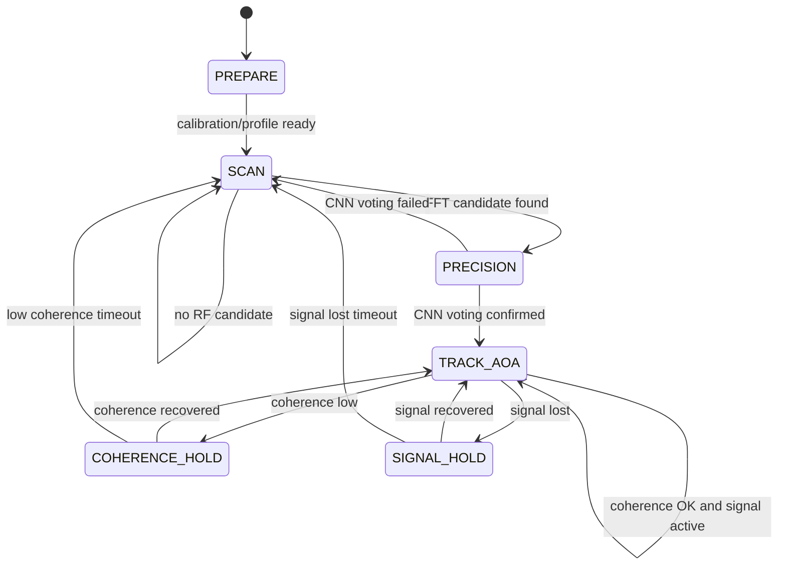

```mermaid
stateDiagram-v2
    [*] --> PREPARE

    PREPARE --> SCAN: calibration/profile ready

    SCAN --> SCAN: no RF candidate
    SCAN --> PRECISION: FFT candidate found

    PRECISION --> SCAN: CNN voting failed
    PRECISION --> TRACK_AOA: CNN voting confirmed

    TRACK_AOA --> TRACK_AOA: coherence OK and signal active
    TRACK_AOA --> COHERENCE_HOLD: coherence low
    TRACK_AOA --> SIGNAL_HOLD: signal lost

    COHERENCE_HOLD --> TRACK_AOA: coherence recovered
    COHERENCE_HOLD --> SCAN: low coherence timeout

    SIGNAL_HOLD --> TRACK_AOA: signal recovered
    SIGNAL_HOLD --> SCAN: signal lost timeout
```